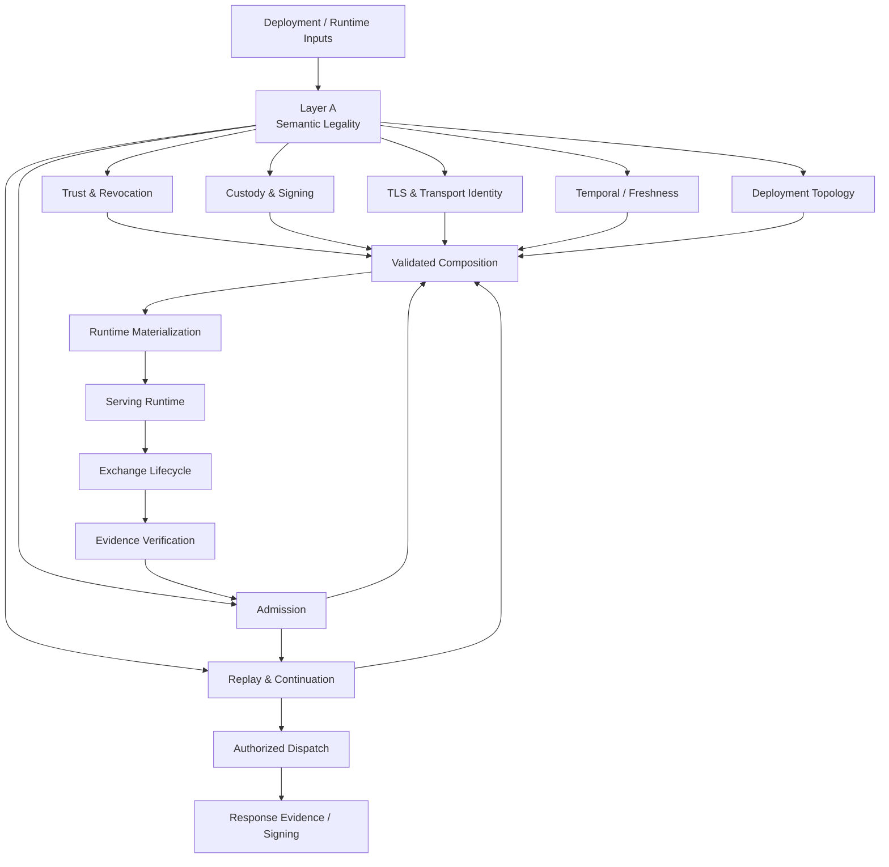
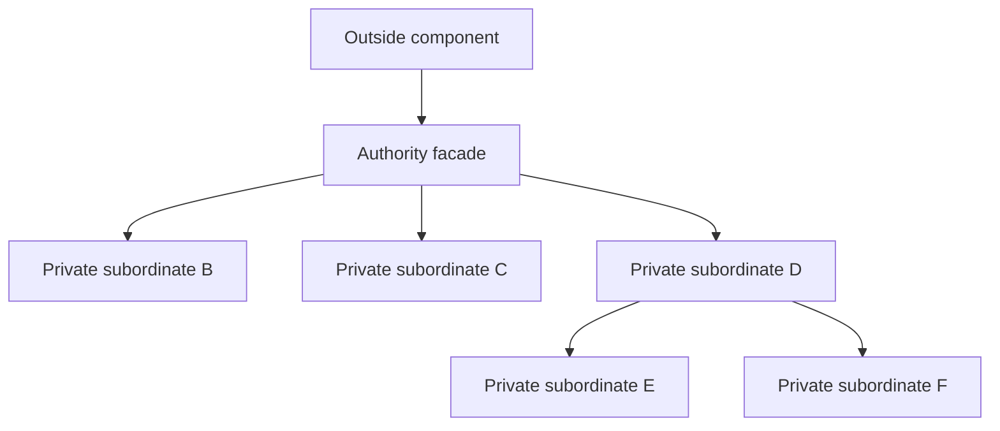
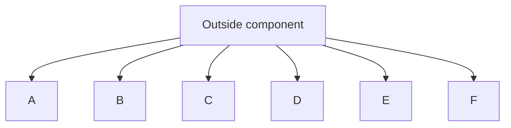

<!-- SPDX-License-Identifier: Apache-2.0 -->

# ADR-MCPRE-061: Hierarchical Authority Architecture, Reviewable Security Design, and Modular Engineering

**Status:** DRAFT — repository working document, not yet published as a GitHub Discussion.

**Supersedes:** draft ADR-MCPRE-060 as the governing design for modular decomposition. ADR-060 is retained as historical capture material and was never ratified.

**Relates to:** ADR-MCPRE-055, ADR-MCPRE-056, ADR-MCPRE-057, ADR-MCPRE-058, ADR-MCPRE-059.

## 1. Decision summary

MCP-RE SHALL be designed and maintained as a hierarchy of small, cohesive authority domains. Each authority exposes a narrow facade and hides subordinate implementation authorities behind compiler-enforced visibility wherever possible.

Reviewability, clean structure, coherent style, understandable control flow, and aesthetic simplicity are engineering properties of a well-designed system. Security correctness does not replace them; it depends on them being strong enough that reviewers can understand what the system claims and where those claims are established.

Source size is a mandatory discovery signal. Large production functions and files are presumed architecturally suspect until investigated. Small files are not presumed architecturally sound: flat horizontal diffusion, excessive fan-out, and helper-module soup are also design smells.

The objective is not minimum line count. The objective is **minimum cognitive surface at each level of abstraction**, with one authority per reviewable unit and explicit composition between units.

## 2. Why this ADR exists

MCP-RE has repeatedly found security and assurance defects while investigating oversized functions and modules. The recurring defect classes include:

- duplicated semantic authority;
- invariants enforced only at remembered construction sites;
- raw validated inputs reinterpreted downstream;
- unreachable branches and retained capabilities with ambiguous status;
- test-only consumers widening production interfaces;
- structured security facts collapsed to prose and reconstructed later;
- inconsistent copies of one fact inside composition plans;
- verification or build lanes that appeared green while measuring the wrong thing;
- public APIs whose type names overstate the assurance actually established.

This is empirical project evidence that concentration of security semantics is a high-yield discovery signal. The architectural response must therefore make deep investigation mandatory, not optional.

## 3. Governing architectural model

### 3.1 Authority hierarchy



This diagram names authorities and control relationships, not files. A component may be implemented by a private Rust module subtree spanning several files.

### 3.2 One authority, multiple consumers

When there should be one fact, represent one fact.

A fact may have multiple consumers but SHALL NOT have multiple authorities. Consumers receive owner-defined projections or capabilities. They SHALL NOT reconstruct the owner's semantics from representation details or raw request values.

### 3.3 Hierarchical authority

A subordinate module exists to implement authority owned by an ancestor. It SHALL NOT become an alternative entry point around that ancestor unless it represents an explicitly separate supported capability.

Desired shape:



Undesired shape:



The second structure is modular only physically. Architecturally it is a flat namespace of independently callable mechanisms.

## 4. Rust mapping

A Rust source file is normally one module node. An MCP-RE architectural component may be a module subtree.

The preferred visibility hierarchy is:

- `fn` / private items — local implementation;
- `pub(super)` — visible only to the parent authority;
- `pub(in crate::path)` — visible only inside a declared ancestor subtree;
- `pub(crate)` — crate-wide capability; use only when crate-wide access is genuinely intended;
- `pub` — external API capability; must correspond to an explicitly supported contract.

Visibility is part of the architecture. Tests SHALL NOT widen production visibility merely to inspect an internal representation.

## 5. Size-triggered mandatory investigation

### 5.1 Baseline thresholds

The current mandatory review thresholds are:

- function: more than 60 production lines;
- Rust source file/module: more than 200 production lines, excluding unit tests.

These thresholds are discovery triggers. Crossing one creates a review obligation that cannot be dismissed with the statement that line count alone does not determine architecture.

### 5.2 Presumption

A security-sensitive unit above threshold is presumed to contain excessive review surface until an architectural investigation establishes otherwise.

Invalid reasons for closing the investigation include:

- "LOC is not architecture";
- "the logic is complicated";
- "tests are green";
- "the functions inside the file are individually small";
- "splitting is not the goal";
- "the module has always been this size".

### 5.3 Priority bands

The following bands guide investigation priority, not automatic splitting:

- >200 production lines: mandatory review;
- >500: high-priority shallow-module investigation;
- >1,000: architectural hotspot; authority census required before substantial new functionality;
- >2,000: exceptional review surface; strong presumption that multiple hidden authorities or harnesses exist.

These bands may be revised by a later decision if measurement shows better thresholds.

## 6. Small can also be wrong

Tiny modules are not automatically good architecture. The following are design smells even when every file is short:

- many peer modules that all know about one another;
- orchestrators that expose all subordinate helpers publicly;
- one conceptual operation distributed across many 10-20 line wrappers with no owning abstraction;
- excessive fan-out from a top-level component;
- trivial types created only to satisfy a file-size metric;
- forwarding layers that relocate code but remove no authority or complexity.

The target is hierarchical depth, not fragmentation.

## 7. Shallow-module investigation protocol

For every oversized or suspicious unit, the review SHALL answer:

1. What single security/control fact does this unit own?
2. How many independently describable authorities exist inside it?
3. What does it decide?
4. What does it merely execute?
5. What does it merely transport?
6. What facts does it reconstruct that another owner already decided?
7. What security relationship exists only through call ordering or local variables?
8. What public interface exists only because tests need it?
9. What branches are unreachable under the current legality model?
10. What facts are represented more than once?
11. What inconsistent values can callers construct?
12. Which test/build/proof lane actually establishes each claimed property?

The question "what does this module own?" is a first-class diagnostic. An answer that requires a long list joined by "and" is evidence of a shallow authority boundary.

## 8. Decomposition acceptance criteria

A successful decomposition is not measured only by moved line count. It should normally remove one or more of:

- duplicate validation;
- raw semantic rereads;
- consistency checks between copies of one fact;
- unreachable branches;
- test-only public interfaces;
- stringly typed semantic recovery;
- independently constructible invalid combinations;
- repeated policy decisions;
- hidden lifecycle obligations.

A split that only moves code into additional files while preserving the same flat authority structure is incomplete.

## 9. Clean engineering and measured optimization

MCP-RE aims for code that is correct, secure, reviewable, structurally clear, stylistically coherent, and aesthetically understandable.

Performance optimization follows measurement. A focused optimization may legitimately make a local implementation less elegant when all of the following are recorded:

- the measured bottleneck;
- why the optimization is necessary;
- the invariant that must remain true;
- the simpler design it replaces or bypasses;
- the benchmark or evidence that detects regression.

Performance exceptions SHALL remain behind an established authority boundary rather than distort the system architecture.

## 10. State, ownership, and composition

This ADR incorporates the following standing project laws:

- a constructed value owns its invariant;
- illegal local state cannot be publicly constructed, or construction is explicitly fallible;
- composition roots combine owner-established facts and do not recreate owner semantics;
- defaults are applied only after provenance has served its semantic purpose;
- successful classification retains the witnesses required to prevent downstream reconstruction;
- weaker and stronger assurance levels SHALL NOT share one type when possession would become ambiguous;
- a security proposition is scoped to the evidence that actually establishes it.

## 11. Review, test, and proof hierarchy

The architectural hierarchy SHALL be reflected in assurance:

```text
leaf property tests / local theorems
        -> component relation tests / theorems
            -> composition tests / theorems
                -> whole-system adversarial review
```

Formal verification follows ADR-MCPRE-059. This ADR does not create a second theorem registry or verification pipeline.

A theorem or test should attach to the smallest authority whose proposition it establishes. Composition claims require composition evidence.

## 12. Documentation architecture

The design documentation SHALL mirror the implementation hierarchy.

A top-level ADR defines durable system principles and the authority map. Subordinate component documents define narrower authority boundaries, interfaces, state models, theorems, tests, and implementation maps. A third level is allowed when a component has genuine conceptual depth.

No single design document should require a reader to understand unrelated authority domains simultaneously.

## 13. Exceptions

An oversized unit may remain intact only through an explicit architecture exception that records:

1. the single authority the complete unit owns;
2. why subordinate responsibilities cannot be independently owned;
3. why decomposition would make the security/control argument materially harder;
4. the complete public and internal interface surface;
5. the test and proof evidence compensating for the size;
6. the approving architecture review.

The coding agent investigating the unit may recommend an exception but SHALL NOT self-grant one for an architectural hotspot.

## 14. Relationship to prior ADRs

- **ADR-MCPRE-055** remains authoritative for epoch-bound TLS session resumption.
- **ADR-MCPRE-056** remains authoritative for runtime architecture.
- **ADR-MCPRE-057** remains authoritative for hierarchical runtime/request state machines.
- **ADR-MCPRE-058** remains authoritative for state-driven decomposition. Its "no arbitrary line-count rule" is interpreted as: line count does not prescribe the semantic cut, but it does trigger mandatory investigation.
- **ADR-MCPRE-059** remains authoritative for theorem registry, assurance graph, evidence, and incremental re-verification.

ADR-061 adds the hierarchical authority and reviewability discipline that binds those decisions into one architectural blueprint.

## 15. Adoption and implementation

The current refactoring method is described in [`docs/architecture/implementation-blueprint.md`](../../architecture/implementation-blueprint.md).

Component-specific work is described under [`docs/architecture/components/`](../../architecture/components/).

This ADR is not published or accepted until owner review is complete.
