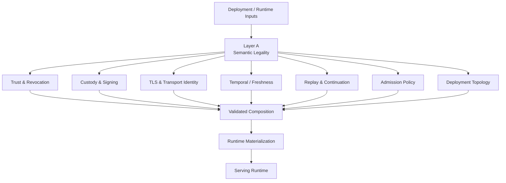
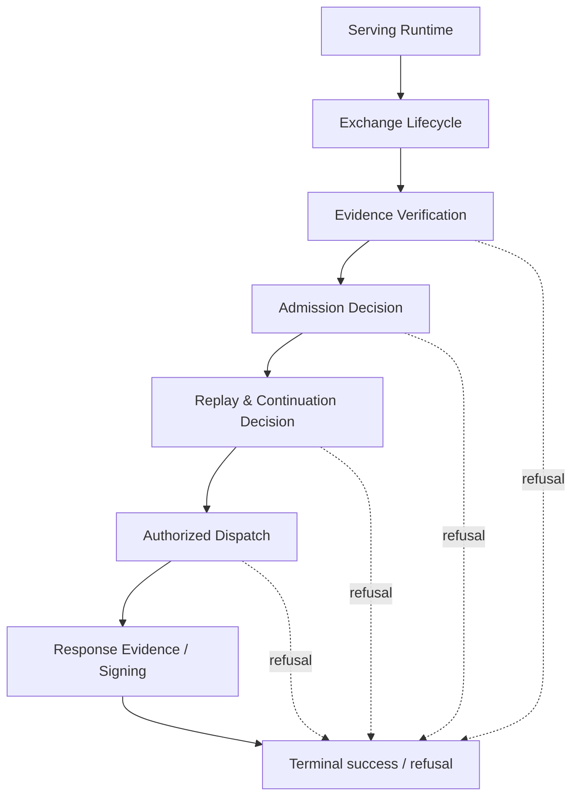
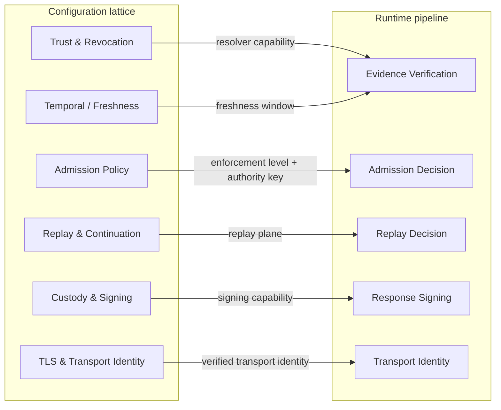
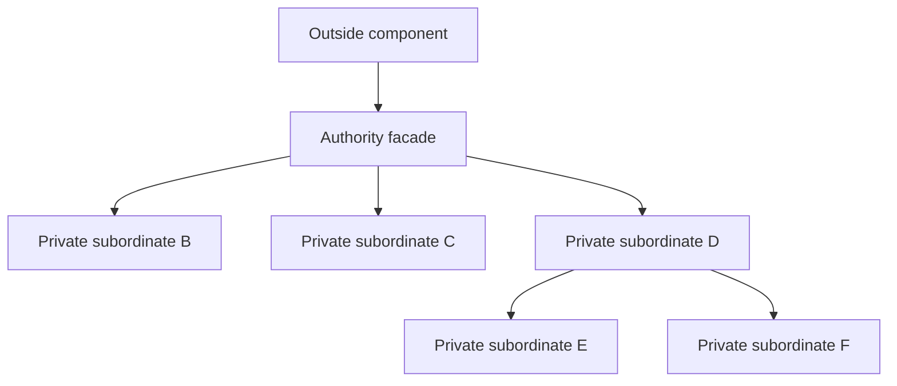
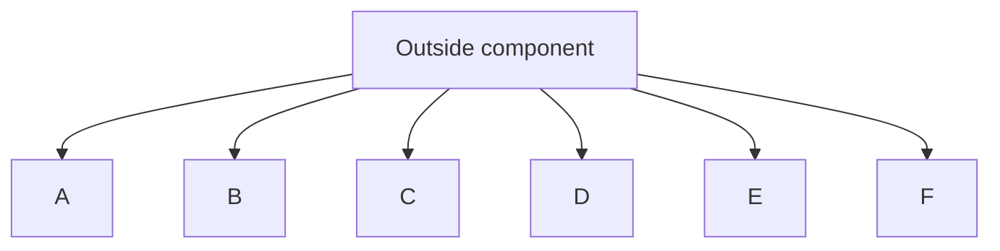

<!-- SPDX-License-Identifier: Apache-2.0 -->

# ADR-MCPRE-061: Hierarchical Authority Architecture, Reviewable Security Design, and Modular Engineering

**Status:** DRAFT — repository working document, not yet published as a GitHub Discussion.

**Supersedes:** draft ADR-MCPRE-060 as the governing design for modular decomposition. ADR-060 is retained as historical capture material and was never ratified. §6.5 records the disposition of every open ruling ADR-060 raised; nothing it decided is dropped silently.

**Relates to:** ADR-MCPRE-055, ADR-MCPRE-056, ADR-MCPRE-057, ADR-MCPRE-058, ADR-MCPRE-059.

## 1. Decision summary

MCP-RE SHALL be designed and maintained as a hierarchy of small, cohesive authority domains. Each authority exposes a narrow facade and hides subordinate implementation authorities behind compiler-enforced visibility wherever possible.

Reviewability, clean structure, coherent style, understandable control flow, and aesthetic simplicity are engineering properties of a well-designed system. Security correctness does not replace them; it depends on them being strong enough that reviewers can understand what the system claims and where those claims are established.

Source size is a mandatory discovery signal. Large production functions and files are presumed architecturally suspect until investigated. Small files are not presumed architecturally sound: flat horizontal diffusion, excessive fan-out, and helper-module soup are also design smells.

The objective is not minimum line count. The objective is **minimum cognitive surface at each level of abstraction**, with one authority per reviewable unit and explicit composition between units.

Judgement alone does not discharge these rules. §6 states which of them are enforced by the toolchain today, which are not, and what it would take to close the gap.

### 1.1 Terminology

This document uses **authority** in three related senses. They are distinguished here once so later sections can be read precisely.

| sense | meaning | where used |
|---|---|---|
| **authority domain** | a named region of the system that owns one class of security decision — trust, custody, TLS, verification | §3 |
| **fact owner** | the single type or module that decides one fact and projects it to consumers | §3.3, §11 |
| **visibility scope** | the Rust module subtree permitted to see an item | §4 |

An authority domain is realized by one or more fact owners; a fact owner is enforced by a visibility scope. When this document says a unit "owns" something, it means the fact-owner sense: *possession of the value is proof of the proposition*, per §11.

## 2. Why this ADR exists

MCP-RE has repeatedly found security and assurance defects while investigating oversized functions and modules. Each defect class below is a class this project has actually hit, with the instance named and its current status. They are cited so this section reads as evidence rather than assertion, and dated so a reader does not act on a defect that is already closed.

Status is as measured on `main` @ `527b1ac`, 2026-08-20.

| # | defect class | instance | status |
|---|---|---|---|
| 1 | duplicated semantic authority | The pre/post-dispatch stage order was stated in four places: `exchange_state::transition()` (the relation), a prose table in the `request_stages.rs` module doc, the `progress.advance(...)` calls in `http_profile_serve::handle`, and per-stage doc comments. The prose table had drifted — it listed `RetentionReserved` and `InnerPlaneAccepted` in the opposite order from `transition()`, about the last two steps before an irreversible dispatch. Nothing detected it, because prose is a claim, not evidence. | **Closed.** The table was deleted rather than corrected; `request_stages.rs` now says where the ordering lives instead of restating it. |
| 2 | invariants enforced only at remembered construction sites | The correspondence between "the stage's work happened" and "the stage's event was emitted" was ~20 individually deletable `progress.advance(...)` statements in one function. `ExchangeProgress` owned transition *legality*; it did not own that correspondence. Apply the R-SEAL operational test — delete one statement and the machine is silently wrong about a served exchange until some later advance happens to be illegal. | **Closed.** `Established<T>` pairs a stage's result with the event it justifies and is `#[must_use]`; `establish()` is the only way to open one. Five direct `advance` calls remain in the assembly, for transitions that are the assembly's own — the dispatch, the retirement, the two terminals — with the reason recorded at the type. |
| 3 | raw validated inputs reinterpreted downstream | Composition code re-read trust semantics out of `DeploymentRequest` instead of consuming the owner's projection. | **Closed, with a standing guard:** `mcp-re-proxy/tests/integration/composition_raw_read_test.rs`. |
| 4 | unreachable branches and retained capabilities with ambiguous status | Five configuration capabilities are refused but still compiled (`--transport-binding attested-ingress`, `lb-assertion`, `--authz reference`, `--revocation-list`, `--client-ocsp require`). Each is gated on a missing decision, not on effort. A sixth, `--replay-cache`, was **deleted** by owner ruling once its only remaining function was to refuse. | **Open by decision.** THM-0013 states the client-OCSP half as a theorem. The ambiguity is resolved by documentation, not by removal — `docs/AGENT_INSTRUCTIONS.md` §9. |
| 5 | test-only consumers widening production interfaces | `replay_plane`'s tests materialized `ReplayPlan::Redis { tier: SingleStoreFailClosed }` — a tier `classify` refuses. The "backend not compiled in" refusal was being proven against a plan no configuration can reach. | **Closed** by sealing `ReplayPlan`. |
| 6 | structured security facts collapsed to prose and reconstructed later | Four of the scope sentences now in `verification/policy/theorems.toml` previously existed only as Rust or TOML comments: read by no tooling, attached to no review, invalidated by nothing. | **Closed** by ADR-MCPRE-059's registry. |
| 7 | inconsistent copies of one fact inside composition plans | `TrustPlan` stored a reload cadence independent of `TrustRevocationState`, so contradictory fixtures were constructible. Separately, `McpTransportContractState::Enforced { versions: vec![] }` was constructible, `is_enforced()` called it true, and the request path had nothing to check against. | **Closed.** `TrustPlan::reload()` is now derived from the revocation posture; both owners are sealed. |
| 8 | verification or build lanes that appeared green while measuring the wrong thing | `tls_load_harness_bench` is gated to the `redis_replay` feature rather than `#[ignore]`, so the documented `-- --ignored` invocation selected **zero** tests, exited 0, and wrote no report — in four documented places. `mcp-re-proxy/tests/async_drain_test.rs` is `#![cfg(feature = "async_serve")]`, so a plain `cargo test --workspace` compiles it to zero tests and says nothing about bounded drain. Separately, seven of eight `test://` evidence URIs named test functions that existed nowhere. | **Structurally open, gated.** Both feature gates are still in place and are correct; what was added is detection — `scripts/slo_invocation_gate.py` fails the build if the bad SLO invocation returns, and the drain property is claimable only from the Bazel lane. The `test://` URIs are fixed. |
| 9 | public APIs whose type names overstate the assurance actually established | `verify_request` (cryptographic floor) and `verify_request_full` (full MCP-RE profile) both return `VerifiedHttpRequestEvidence`. The difference is encoded as `Option` fields documented "`None` on the minimal proof path" — a single type admitting that it proves two different propositions. | **Open.** This is the current head of the work queue. |

Six of nine are closed, and that is the argument rather than a weakening of it: every one was found by investigating a unit that the size trigger selected. The list is kept with statuses precisely because an audit invalidates its own inventory — a defect cited in the present tense long after it was fixed sends the next investigator to a file that no longer has the problem, and costs the credibility of every entry beside it.

This is empirical project evidence that concentration of security semantics is a high-yield discovery signal. The architectural response must therefore make deep investigation mandatory, not optional — and, where a machine can do the looking, must not leave the looking to an author's judgement (§6).

## 3. Governing architectural model

### 3.1 Two graphs, not one

MCP-RE has two distinct authority graphs, and superimposing them produces an apparent cycle. They are drawn separately.

The **configuration lattice** runs once, at startup. Deployment inputs are admitted by Layer A semantic legality, classified into fact owners, composed into a validated plan, and materialized against the environment.



The **runtime pipeline** runs once per exchange. Each stage consumes capabilities the configuration lattice established; it does not re-derive them.



The two graphs meet at named capabilities, not at shared mutable state:



`Admission Policy` and `Admission Decision` are different authorities with related names: the first is a configuration fact owner, the second a runtime stage that consumes its projection. The same holds for replay. Naming them apart is deliberate — collapsing them is what made the single-graph drawing appear to contain a cycle.

`Temporal / Freshness` and `Deployment Topology` are not decorative. Freshness reaches the verifier as the window THM-0001 is stated relative to; topology reaches the serving runtime as the shard/worker plan. An authority that enters the composition and is never consumed downstream is a defect, not a diagram simplification.

### 3.2 Diagrams name authorities, not files

A component may be implemented by a private Rust module subtree spanning several files. Nothing in §3.1 prescribes a file layout.

### 3.3 One authority, multiple consumers

When there should be one fact, represent one fact.

A fact may have multiple consumers but SHALL NOT have multiple authorities. Consumers receive owner-defined projections or capabilities. They SHALL NOT reconstruct the owner's semantics from representation details or raw request values.

### 3.4 Hierarchical authority

A subordinate module exists to implement authority owned by an ancestor. It SHALL NOT become an alternative entry point around that ancestor unless it represents an explicitly separate supported capability.

Desired shape:



Undesired shape:



The second structure is modular only physically. Architecturally it is a flat namespace of independently callable mechanisms.

## 4. Rust mapping

A Rust source file is normally one module node. An MCP-RE architectural component may be a module subtree.

The preferred visibility hierarchy is:

- `fn` / private items — local implementation;
- `pub(super)` — visible only to the parent authority;
- `pub(in crate::path)` — visible only inside a declared ancestor subtree;
- `pub(crate)` — crate-wide capability; use only when crate-wide access is genuinely intended;
- `pub` — external API capability; must correspond to an explicitly supported contract.

Visibility is part of the architecture. Tests SHALL NOT widen production visibility merely to inspect an internal representation.

Two limits on what visibility can buy, established by measurement and recorded in [`docs/dev/sealed-owners.md`](../../dev/sealed-owners.md):

- Privacy is worth adding only where **the owner is the sole legitimate producer**. Where a trait or closure seam lets code outside the module produce the value, a private field only forces a public constructor with the same arguments and the same absence of checking. The question to ask first is *if this value is illegal, whose bug is it?*
- A Verus-proved postcondition outranks a seal. Where a proof already establishes the invariant, adding privacy relocates ceremony without adding a theorem.

## 5. Size-triggered mandatory investigation

### 5.1 Baseline thresholds and how they are measured

The current mandatory review thresholds are:

- function: more than 60 production lines;
- Rust source file/module: more than 200 production lines, excluding unit tests.

**Production lines** are the lines of a file before its first test module. The test module is located with the pattern `^#\[cfg\((all\()?test`, **not** `^#\[cfg\(test\)\]`. This is not pedantry: a first census pass matching only the narrow form reported `mcp-re-proxy/src/app.rs` as 1680 production lines with no tests at all, because its module is `#[cfg(all(test, unix))]`. Its real production half is 1038.

A threshold whose measurement is unspecified is the "green that measured nothing" failure applied to the census itself. Any tool, script, or manual count claiming to apply these thresholds SHALL state the rule it used. `scripts/module_size_gate.py` is that tool for files: it prints the rule and the number of files examined on every run, and its `--selftest` pins the counter against the cases that have actually broken hand-rolled counts here (§6.4).

### 5.2 Presumption

A security-sensitive unit above threshold is presumed to contain excessive review surface until an architectural investigation establishes otherwise.

The investigation is closed by answering §8, by documenting an exception under §14, or by a measurement correction. It is not closed by asserting any of:

- "LOC is not architecture";
- "the logic is complicated";
- "tests are green";
- "the functions inside the file are individually small";
- "decomposition is not the goal of this investigation";
- "the module has always been this size".

The last of these is worth separating from the position this ADR actually holds. §1 says the objective is not minimum line count and §5.3 says the bands do not command a split; both remain true. What is invalid is closing an investigation **without answering §8** — not the claim that splitting is non-automatic.

### 5.3 Priority bands, and what decides the outcome

The following bands guide investigation *order*:

- >200 production lines: mandatory review;
- >500: high-priority shallow-module investigation;
- >1,000: architectural hotspot; authority census required before substantial new functionality;
- >2,000: exceptional review surface; strong presumption that multiple hidden authorities or harnesses exist.

Size orders the queue. It does not decide the outcome. **The outcome is decided by §8 question 2 — how many independently describable authorities the unit contains.** The census demonstrates both directions:

| unit | production | interface | verdict |
|---|---|---|---|
| `mcp-re-proxy/src/exchange_state.rs` | 789 | 17 pub fns, 4 private fns | long and **deep** — a relation and its projections over one tuple; nothing to do |
| `mcp-re-proxy/src/gcp_kms_keysource.rs` | 1149 | 5 pub fns, 44 private fns | small interface, but the implementation is an OAuth token cache, a failed-fetch replay, a single-flight, a retry loop with its own suspension window, a TLS-handshake cooldown, HTTP transport, response parsing, and a test double — **shallow**, decompose |

Neither raw size nor interface width alone separates these. Both bands sent the investigator to the right files; only the authority count told them what to do on arrival.

These bands may be revised by a later decision if measurement shows better thresholds.

## 6. Mechanical enforcement

ADR-MCPRE-060 §1 recorded the governing observation this section exists to honor:

> LLMs respond poorly to vague conversational instructions ("please write clean code"), but respond predictably when compiler/linter rules fail their execution runs.

and, separately, that a remediation campaign which used successive agent rounds over a single large file cost a great deal and ended with a **higher** defect count than it started with. Both halves bind. A rule discharged only by an author's judgement is a rule whose enforcement cost is paid per file, by the least reliable available party.

This ADR therefore states, for each rule it asserts, whether a machine checks it — and holds itself to the standard that a *configured* check is not an *enforced* one.

### 6.1 Configuration is not enforcement

The first draft of this ADR claimed the 60-line function rule was mechanically enforced, on the strength of `/.clippy.toml` carrying `too-many-lines-threshold = 60` while every CI and local lane ran `cargo clippy -- -D warnings`.

That claim was false, and the falsification is reproducible:

```text
80-line fn, too-many-lines-threshold = 60, plain `cargo clippy -- -D warnings`
    -> no warning

same file, `-W clippy::too_many_lines`
    -> "this function has too many lines (80/60)"
```

`clippy::too_many_lines` is allow-by-default. **A threshold in `.clippy.toml` parameterises a lint; it does not switch one on.** The repository had a threshold, a `-D warnings` lane, a documented rule, and zero enforcement — the "green that measured nothing" failure applied to a lint configuration rather than to a test lane. `cognitive-complexity-threshold = 10` sat in the same file and was inert for the same reason.

**The lints do not behave uniformly, and assuming they did was the second error.** They fall into two groups, and the difference decides where a threshold may safely be written:

| lint | default level | consequence of setting its threshold in `/.clippy.toml` |
|---|---|---|
| `too_many_lines`, `unwrap_used`, `expect_used`, `indexing_slicing`, `arithmetic_side_effects`, `cognitive_complexity` | **allow** | none — inert until something enables the lint |
| `excessive_nesting` | **warn** (complexity group, default threshold 5) | enforced **immediately**, against all targets, by every existing `-D warnings` lane |

Writing `excessive-nesting-threshold = 3` into the root config turned the default lane red on the spot — 164 production sites plus test code. So the ADR-MCPRE-061 thresholds live in `config/clippy-strict/.clippy.toml` and are applied only by the ratchet gate, which points `CLIPPY_CONF_DIR` there. The root `/.clippy.toml` stays conservative, because a threshold in it is a change to the lane that must stay green.

The corrected enforcement architecture is:

```text
function size       -> clippy::too_many_lines,     explicitly enabled + ratcheted
nesting depth       -> clippy::excessive_nesting,  thresholded in the gate lane + ratcheted
proof-recovery      -> clippy::unwrap_used / expect_used / indexing_slicing
file/module size    -> scripts/module_size_gate.py (clippy has no file-length lint)
semantic judgement  -> the §8 review protocol
```

A gate that vouches for a lint must prove the lint fires. `scripts/clippy_ratchet_gate.py --activation-probe` compiles a deliberately violating file under the exact flag list the gate measures with, and fails if either rule stops firing. It cannot drift from the gate it vouches for, because both read one list.

### 6.2 What is enforced, and where

| rule | mechanism | value | scope |
|---|---|---|---|
| function length | `clippy::too_many_lines` via `scripts/clippy_ratchet_gate.py` | 60 | production targets |
| nesting depth | `clippy::excessive_nesting` at `excessive-nesting-threshold = 3` (in `config/clippy-strict/`) | > 2 rejected | production targets |
| no production `unwrap` | `clippy::unwrap_used`, denied at zero | 0 | production targets |
| `expect` / indexing debt | `clippy::expect_used`, `clippy::indexing_slicing`, ratcheted | per-crate baseline | production targets |
| file/module length | `scripts/module_size_gate.py` | 200 | all production `.rs` |
| feature-lane identity of tests | `scripts/cargo_test_target_gate.py`, `scripts/slo_invocation_gate.py`, `scripts/bazel_srcs_gate.py` | — | repo |
| evidence-graph freshness | ADR-MCPRE-059 lane + `scripts/verification_trigger_gate.py` | — | repo |
| composition re-reading owner semantics | `mcp-re-proxy/tests/integration/composition_raw_read_test.rs` | — | proxy |

**Why the five lints are not in `[workspace.lints.clippy]`, and the thresholds not in `/.clippy.toml`.** Every clippy lane in this repository — `scripts/local_gate.sh` and four `ci.yml` invocations — runs `--all-targets -- -D warnings`. A workspace-level entry at `warn` is therefore a hard error in CI applied to *all* targets, including the thousands of `unwrap`/`expect`/indexing sites in test code that §6.5's ruling explicitly exempts. Landing them that way is precisely the "turns the build red immediately" failure.

So there are two lanes with two configurations:

| lane | invocation | config | job |
|---|---|---|---|
| default | `cargo clippy --workspace --all-targets -- -D warnings` | `/.clippy.toml` | stays green; the whole tree carries zero warnings |
| ratchet | `scripts/clippy_ratchet_gate.py` → `--lib --bins` + `-W` flags, `CLIPPY_CONF_DIR=config/clippy-strict` | `config/clippy-strict/.clippy.toml` | reports a per-crate **count** that may only fall |

Running the adopted lints in the second lane exempts test code **by construction** rather than by an allowlist somebody has to maintain, and lets a threshold be tightened without breaking a build.

The cost is stated rather than hidden: a bare `cargo clippy` does not surface these five lints. The gate is where they run, and `CLAUDE.md` says so at the point it tells an agent to run clippy.

### 6.3 What is still not enforced

| rule | status |
|---|---|
| visibility hierarchy (§4) | Judgement only. No lint distinguishes a legitimate `pub(crate)` from a lazy one; §8 question 8 and review are the control. |
| §8 investigation actually performed | Judgement only. A gate can flag the unit; it cannot verify that anyone thought about it. |
| the §7 small-module smells | Judgement only, and they have no size trigger — a campaign driven by the §5.3 bands will not find them. |
| `arithmetic_side_effects` | Measured at 124 production sites; not adopted, awaiting a ruling (§6.5). |

Listing a rule here is not a decision to leave it unenforced. It is a refusal to let an unenforced rule read as an enforced one.

### 6.4 Ratchet, not a cliff

Where a mechanical rule cannot go from unenforced to enforced without a large immediate breakage, the enforcement lands as a ratchet: the gate is introduced with a baseline of current violations at an exact SHA, the baseline may only shrink, and each removal is a decomposition or a §14 exception.

This is why the ratchets land **now**, during the refactoring campaign rather than after it. Otherwise the campaign fixes yesterday's debt while new debt is created at the same rate.

Two registries carry it:

| registry | holds | gate |
|---|---|---|
| `config/module-size-debt.toml` | files over 200 production lines: `path`, `baseline_prod_loc`, `baseline_sha`, `status`, optional `exception_ref` | `scripts/module_size_gate.py` |
| `config/clippy-debt.toml` | per-crate counts of the ratcheted lints | `scripts/clippy_ratchet_gate.py` |

Both enforce the same five transitions:

```text
new unit over threshold              -> FAIL
registered unit grows                -> FAIL
registered unit shrinks              -> PASS  (module size) / FAIL until the baseline is lowered (clippy)
registered unit reaches threshold    -> FAIL until the entry is removed
reviewed large unit                  -> entry carries a §14 exception_ref
```

The asymmetry on "shrinks" is deliberate. A file's exact line count changes constantly, so requiring an update on every improvement would be noise; a crate's lint count changes rarely and deliberately, so an unrecorded drop is silent headroom for a future regression.

An entry means **"over the threshold and not yet investigated"**. The registry is a debt register, not an exception mechanism — that distinction is what stops it rotting into a permanent allowlist, and it is why an entry that no longer describes reality is an error rather than a shrug.

**Measurement integrity.** `module_size_gate.py` counts production lines by the §5.1 rule, prints the rule it applied, prints how many files it examined, and **fails on an empty scope** — a `tests/` glob once silently exempted an entire crate from `scripts/bazel_srcs_gate.py` for a whole campaign while it printed OK. Its `--selftest` pins seven counter cases including `#[cfg(all(test, unix))]`, production code appearing *after* a test region, and multiple test regions in one file. That is not hypothetical precision: a hand-rolled counter that stopped at the first `#[cfg(test)]` reported `trust_plane.rs` as 134 production lines when it is 690, turning a band-2 unit into a rounding error.

### 6.5 Disposition of ADR-060's open rulings

ADR-MCPRE-060 §10 recorded nine conflicts for owner ruling. All are now dispositioned; one remains open by decision.

| id | conflict | disposition |
|---|---|---|
| C-1 | function threshold: 50 vs 60 vs 100 | **Resolved: 60.** Enforced by `clippy::too_many_lines`; `CLAUDE.md` and `.clippy.toml` agree. Measured: 27 production functions over 60. |
| C-2 | file threshold: 200 vs 250 | **Resolved: 200**, excluding unit tests, measured per §5.1. Measured: 100 of 167 production files over the threshold. |
| C-3 | `clippy::module_lines` does not exist | **Resolved as a substitution, landed.** `scripts/module_size_gate.py` (§6.4). The lint name must never appear in a `[workspace.lints.clippy]` block — an unknown lint name there is itself a build error. |
| C-4 | four safety lints at `deny` | **Resolved, and deliberately not as one decision.** See the table below. |
| C-5 | `clippy::excessive_nesting` | **Resolved: ADOPT**, at `excessive-nesting-threshold = 3`. The threshold names the depth that is *rejected*, so "deeper than two levels" is 3, not 2. Enforcement is not claimed without the negative control required by the ruling: `--nesting-probe` asserts depth 2 accepted **and** depth 3 rejected, and fails on both sides of a misconfigured threshold. Measured: 164 production sites. |
| C-5b | is `cognitive_complexity = 10` a meaningful architectural mechanism? | **Resolved: no — dropped.** The ruling's condition was independent value, and measurement refutes it: **7** production sites, **6** of which `too_many_lines` already reports. The 7th (`app.rs:402`) is independent only because `too_many_lines` is locally allowed there, so the genuinely independent signal is **zero**. The threshold is removed from `.clippy.toml` and the lint is not adopted. |
| C-6 | §7.1 Verus directives overlap ADR-MCPRE-059 | **Resolved: #527 is the authority.** §12 creates no second theorem registry and no second verification pipeline. |
| C-7 | ADR-MCPRE-058 §5 "No Arbitrary Line-Count Rule" | **Resolved as both.** §5's flatness rule is the review standard; the thresholds are the discovery trigger. §15 states the reading. |
| C-8 | ADR-MCPRE-058 was not followed; its authority unsettled | **Resolved: ADR-058 retains authority** for state-driven decomposition (§15). |
| C-8' | when the file-size gate lands | **Resolved: now, as a ratchet.** Baselined at 100 files; the gate is wired into `scripts/local_gate.sh` stage 1. The campaign proceeds while the ratchet prevents new debt. |
| C-9 | identity and publication of ADR-060 | **Resolved:** ADR-060 is superseded before ratification and stays a repository draft. §13 states where each kind of rule terminally lives. |

**C-4 in detail.** The four lints are four decisions, not one:

| lint | production sites | ruling | landed as |
|---|---:|---|---|
| `unwrap_used` | **0** | ADOPT | denied at zero — it costs nothing today and refuses the first one tomorrow |
| `expect_used` | 60 | ADOPT, ratcheted per crate | per-crate baseline; a justified production `expect` carries a local `#[allow(clippy::expect_used)]` naming the invariant |
| `indexing_slicing` | 69 | ADOPT, ratcheted per crate | per-crate baseline; explicit exceptions where bounded indexing is itself established |
| `arithmetic_side_effects` | 124 | **MEASURE FIRST** — measured, returned for ruling | not adopted; not in the gate's lint set |

The first three are exactly the implicit proof-recovery sites this architecture wants exposed: in production code an `unwrap` is an unstated proof obligation, where in a test it is an assertion. That `unwrap_used` measured **zero** across all production code is the single most useful number in this section — the rule was already being followed, and now it cannot be un-followed.

`arithmetic_side_effects` at 124 sites is broad enough that a blanket adoption could damage clarity rather than improve it. The measurement is done; the decision is not this ADR's to take.

## 7. Small can also be wrong

Tiny modules are not automatically good architecture. The following are design smells even when every file is short:

- many peer modules that all know about one another;
- orchestrators that expose all subordinate helpers publicly;
- one conceptual operation distributed across many 10-20 line wrappers with no owning abstraction;
- excessive fan-out from a top-level component;
- trivial types created only to satisfy a file-size metric;
- forwarding layers that relocate code but remove no authority or complexity.

The target is hierarchical depth, not fragmentation.

These smells have no size trigger, and none of them is mechanically detected (§6.3). They are found by §8 question 2 applied in the other direction: *this unit owns a fraction of one authority, and no unit owns the whole of it.* A campaign driven only by the §5.3 bands will not find them, which is a known limit of this ADR's enforcement story rather than a claim that they do not matter.

## 8. Shallow-module investigation protocol

For every oversized or suspicious unit, the review SHALL answer:

1. What single security/control fact does this unit own?
2. How many independently describable authorities exist inside it?
3. What does it decide?
4. What does it merely execute?
5. What does it merely transport?
6. What facts does it reconstruct that another owner already decided?
7. What security relationship exists only through call ordering or local variables?
8. What public interface exists only because tests need it?
9. What branches are unreachable under the current legality model?
10. What facts are represented more than once?
11. What inconsistent values can callers construct?
12. Which test/build/proof lane actually establishes each claimed property?

The question "what does this module own?" is a first-class diagnostic. An answer that requires a long list joined by "and" is evidence of a shallow authority boundary.

## 9. Decomposition acceptance criteria

A successful decomposition is not measured only by moved line count. It should normally remove one or more of:

- duplicate validation;
- raw semantic rereads;
- consistency checks between copies of one fact;
- unreachable branches;
- test-only public interfaces;
- stringly typed semantic recovery;
- independently constructible invalid combinations;
- repeated policy decisions;
- hidden lifecycle obligations.

A split that only moves code into additional files while preserving the same flat authority structure is incomplete.

## 10. Clean engineering and measured optimization

MCP-RE aims for code that is correct, secure, reviewable, structurally clear, stylistically coherent, and aesthetically understandable.

Performance optimization follows measurement. A focused optimization may legitimately make a local implementation less elegant when all of the following are recorded:

- the measured bottleneck;
- why the optimization is necessary;
- the invariant that must remain true;
- the simpler design it replaces or bypasses;
- the benchmark or evidence that detects regression;
- the approving review, on the same terms as §14.

The measurement comes from the ADR-MCPRE-051 §7 SLO lane via `scripts/local_slo_lane.sh`, on a quiet box. The lane is owner-triggered: it co-locates the load generator with the proxy, so an unrelated build on the same machine halves throughput and produces an environmental FAIL that says nothing about the code. A number obtained with the lane's noise refusal overridden is not evidence and SHALL NOT be quoted as the measured bottleneck.

Performance exceptions SHALL remain behind an established authority boundary rather than distort the system architecture.

## 11. State, ownership, and composition

This ADR incorporates the following standing project laws:

- a constructed value owns its invariant;
- illegal local state cannot be publicly constructed, or construction is explicitly fallible;
- composition roots combine owner-established facts and do not recreate owner semantics;
- defaults are applied only after provenance has served its semantic purpose;
- successful classification retains the witnesses required to prevent downstream reconstruction;
- weaker and stronger assurance levels SHALL NOT share one type when possession would become ambiguous;
- a security proposition is scoped to the evidence that actually establishes it.

The operational test for the first two is: *can the check be deleted and still leave an invalid value unconstructible?* If yes, the value owns it. If deleting a check elsewhere brings an invalid inhabitant into existence, the check was being remembered, not owned.

## 12. Review, test, and proof hierarchy

The architectural hierarchy SHALL be reflected in assurance:

```text
leaf property tests / local theorems
        -> component relation tests / theorems
            -> composition tests / theorems
                -> whole-system adversarial review
```

Formal verification follows ADR-MCPRE-059. This ADR does not create a second theorem registry or verification pipeline; `verification/policy/theorems.toml` remains the only theorem authority and `unit://` remains the only unit vocabulary.

A theorem or test should attach to the smallest authority whose proposition it establishes. Composition claims require composition evidence.

Every claimed property SHALL name the build/feature lane it is established in. A property is not established by a lane that compiles its test to zero tests (§2, class 8).

## 13. Documentation architecture

The design documentation SHALL mirror the implementation hierarchy.

A top-level ADR defines durable system principles and the authority map. Subordinate component documents define narrower authority boundaries, interfaces, state models, theorems, tests, and implementation maps. A third level is allowed when a component has genuine conceptual depth.

No single design document should require a reader to understand unrelated authority domains simultaneously.

### 13.1 One fact, one document

The rule of §3.3 applies to documentation. Two documents that describe the same ownership are two authorities over one fact, and they will drift — that is defect class 1 and class 6, applied to prose.

The split, stated in both places:

| document | owns |
|---|---|
| [`docs/dev/sealed-owners.md`](../../dev/sealed-owners.md) | the **current** sealed state: which owners are sealed today, the exact projections each exposes, which owners are deliberately unsealed and why, and the procedure for sealing the next one |
| [`docs/architecture/components/`](../../architecture/components/) | the **target** design: what each authority domain should own, its intended hierarchy and visibility, its theorem and test inventory, and its implementation map |

A component blueprint's "Known deviations" section is exactly the diff between the two. Neither document restates the other's content; each links to it.

### 13.2 Where each kind of rule terminally lives

ADR-060 §10 C-9 observed that a GitHub Discussion is not read by an agent mid-task, while `CLAUDE.md` is. That applies to this ADR more strongly than to ADR-060, because §4, §5, and §8 are agent execution rules.

| content | terminal home |
|---|---|
| the durable decision (this ADR) | a GitHub Discussion in the ADRs category, per `docs/adr/README.md` |
| agent execution rules — thresholds, visibility hierarchy, the §8 questions | `CLAUDE.md` and `docs/AGENT_INSTRUCTIONS.md`, which agents read |
| component blueprints and the refactoring method | `docs/architecture/`, in-tree, because they are implementation contracts consumed during work |
| current sealed state | `docs/dev/sealed-owners.md`, in-tree |

Publishing this ADR without landing §4/§5/§8 in `CLAUDE.md` would leave the rules where the party bound by them does not read them. That mirroring is **done**: `CLAUDE.md` now carries the visibility ladder with its two measured limits, the twelve questions with the list of answers that do not close an investigation, and each threshold annotated with the gate that enforces it.

The mirror is operational, not a copy. `CLAUDE.md` states what an agent must do; this ADR states the decision and why. Neither is the other's summary, and the ownership is:

```text
ADR-061                        durable architectural decision + rationale
CLAUDE.md                      executable instructions to coding agents
mechanical gates               machine detection/enforcement
docs/architecture/components/  target component design
docs/dev/sealed-owners.md      current implementation state
```

When this ADR is published, `docs/architecture/README.md` must be retargeted from the draft path to the Discussion URL, or the link breaks on the same commit that removes the draft.

## 14. Exceptions

An oversized unit may remain intact only through an explicit architecture exception that records:

1. the single authority the complete unit owns;
2. why subordinate responsibilities cannot be independently owned;
3. why decomposition would make the security/control argument materially harder;
4. the complete public and internal interface surface;
5. the test and proof evidence compensating for the size;
6. the approving architecture review.

The coding agent investigating the unit may recommend an exception but SHALL NOT self-grant one for an architectural hotspot.

An exception is recorded once, referenced from the debt registry entry (§6.4), and re-examined when the unit changes materially. Note what an exception costs: using one where a sensible decomposition exists weakens the rule exactly where it was working.

**The worked example already exists in the tree.** `mcp-re-proxy/src/app.rs::run_validated` carries an `#[allow(clippy::too_many_lines)]` whose comment states all six items: what the function owns after every classification moved out to `startup_plan` and `config_state` ("what remains is the assembly itself — the part whose content IS the order and the ownership"), why the remaining responsibilities cannot be separated, what most recently *did* leave and why, and the three pieces of evidence that compensate for the size — the startup-transcript harness taken from the real binary, `app_startup_characterization_test`, and the plans' own unit tests.

It also gets the placement right, in a sentence worth generalising:

> The allowance is on this function alone rather than on the module, so anything else here that grows past the threshold is still reported.

A module-scoped `allow` is an exception that silently covers code not yet written. Scope every exception to the unit it was granted for.

## 15. Relationship to prior ADRs

- **ADR-MCPRE-055** remains authoritative for epoch-bound TLS session resumption.
- **ADR-MCPRE-056** remains authoritative for runtime architecture.
- **ADR-MCPRE-057** remains authoritative for hierarchical runtime/request state machines, including the model-as-value encoding. Re-arguing typestate against it is arguing encoding against a settled decision.
- **ADR-MCPRE-058** remains authoritative for state-driven decomposition. Its "no arbitrary line-count rule" is interpreted as: line count does not prescribe the semantic cut, but it does trigger mandatory investigation. §5's flatness rule is the review standard above the threshold, not an alternative to it.
- **ADR-MCPRE-059** remains authoritative for theorem registry, assurance graph, evidence, and incremental re-verification.

ADR-061 adds the hierarchical authority and reviewability discipline that binds those decisions into one architectural blueprint, and the enforcement account (§6) that says which parts of it a machine checks.

## 16. Adoption and implementation

The current refactoring method is described in [`docs/architecture/implementation-blueprint.md`](../../architecture/implementation-blueprint.md).

Component-specific work is described under [`docs/architecture/components/`](../../architecture/components/).

One open item requires an owner ruling before this ADR is complete: whether **`clippy::arithmetic_side_effects`** is adopted, and if so at what strictness. It is measured at 124 production sites (§6.5, C-4) and is deliberately not in the gate's lint set until ruled on. Every other conflict ADR-060 raised is dispositioned in §6.5, and the mechanisms behind each `SHALL` in this document are either landed or listed as unenforced in §6.3.

On numbering: ADR-MCPRE-060 was never published, so the Discussions sequence will skip from 059 to 061. `docs/adr/README.md` records the gap and the reason; the number is not reused.

This ADR is not published or accepted until owner review is complete.
