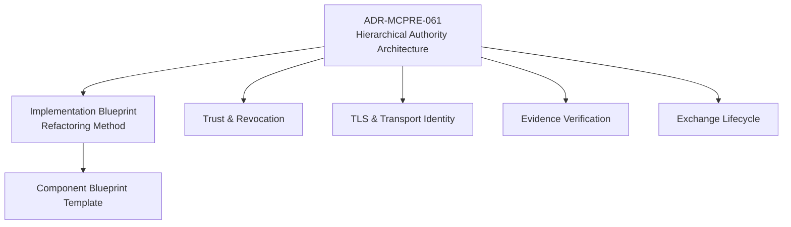
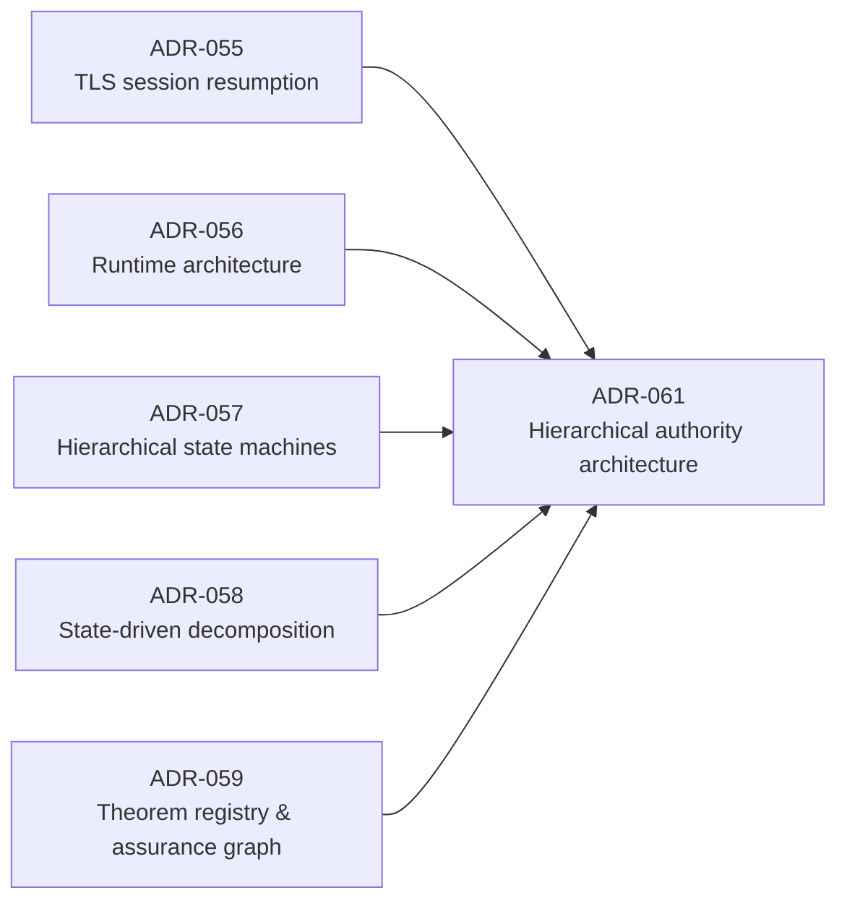

<!-- SPDX-License-Identifier: Apache-2.0 -->

# MCP-RE Architecture Blueprint

This directory is the hierarchical architectural map for MCP-RE. It is intentionally structured like the implementation we want: one concise top-level authority document, subordinate component blueprints with narrow responsibility, and deeper documents only when a component genuinely needs another level.

The purpose is not to replace accepted ADRs. Existing ADRs remain authoritative for the decisions they own. This blueprint connects them into one reviewable architecture and supplies the implementation contracts needed for continued refactoring.

## Document hierarchy



## Top-level documents

- [**ADR-MCPRE-061**](https://github.com/matssun/mcp-re/discussions/567) — the durable architectural decision. ✅ Accepted 2026-08-20; the Discussion is the source of truth (`docs/adr/README.md`).
- [`implementation-blueprint.md`](implementation-blueprint.md) — current execution method for the refactoring campaign.
- [`component-blueprint-template.md`](component-blueprint-template.md) — standard anatomy for subordinate component design documents.
- [`exceptions.md`](exceptions.md) — the ADR-061 §14 review register: the records `config/module-size-debt.toml`'s `review_ref` fields point at, granted and declined alike, and the disposition lifecycle they move through.

## Initial component blueprints

- [`components/trust-and-revocation.md`](components/trust-and-revocation.md)
- [`components/tls-and-transport-identity.md`](components/tls-and-transport-identity.md)
- [`components/evidence-verification.md`](components/evidence-verification.md)
- [`components/exchange-lifecycle.md`](components/exchange-lifecycle.md)

These are first-pass architectural documents, not declarations that every boundary is already final. The shallow-module census and subsequent investigation may refine the tree. Refinement must preserve the governing rule: **one authority, narrow facade, private subordinate implementation tree**.

## Current campaign order

The component blueprints are not a work queue. The order below is the ruled one; each step
is DESIGN-only until it receives its own Go. The backlog that carries it is
[**#589 — MCPRE-153**](https://github.com/matssun/mcp-re/issues/589).

0. **Reconcile the review ledger before it drives work.** A registry introduced to
   distinguish unreviewed debt from reviewed exceptions may not open the campaign
   misclassifying its own review state — [`exceptions.md`](exceptions.md).
1. **Evidence verification — split the cryptographic floor from the full profile.**
   [`components/evidence-verification.md`](components/evidence-verification.md) §2. This is
   the blocking step: the theorem and negative-control gaps in that component all follow
   from one product type carrying two propositions.
2. **TLS — make the listener-lifetime security state an explicit owner.**
   [`components/tls-and-transport-identity.md`](components/tls-and-transport-identity.md) §5.
3. **TLS — relocate the blocking mTLS/HTTP-1 harness out of the security authority.**
   Same document, §8.

Trust & revocation and exchange lifecycle are documented here because their boundaries are
settled enough to state, not because work on them is scheduled next.

## This directory describes the target; `sealed-owners.md` describes the present

Two documents describing the same ownership are two authorities over one fact, and they drift. The split is fixed by ADR-061 §13.1 and stated in both places:

| document | owns |
|---|---|
| [`docs/dev/sealed-owners.md`](../dev/sealed-owners.md) | the **current** sealed state — which owners are sealed today, the exact projections each exposes, which are deliberately unsealed and why, and the procedure for sealing the next one |
| this directory's `components/` | the **target** design — what each authority domain should own, its intended hierarchy and visibility, its theorem and test inventory, and its implementation map |

Each component blueprint's **Known deviations** section is the diff between the two. Neither document restates the other's tables; each links to it.

## Measurements in these documents

Production-line counts quoted in the component blueprints are measured by the ADR-061 §5.1 rule — every line **not inside a test region**, where a region opens at `^#\[cfg\((all\()?test` and closes with its module, counting resuming afterwards — on `main` at commit `fede93b`. They will drift; re-measure before acting on one. A blueprint quoting a number without stating the rule and the commit is quoting nothing.

Re-measure with the gate's counter, not by hand:

```sh
python3 -c "import sys; sys.path.insert(0,'scripts'); from module_size_gate import production_lines; \
            from pathlib import Path; print(production_lines(Path('<file>').read_text()))"
```

A hand-rolled count that stops at the first `#[cfg(test)]` reported `trust_plane.rs` as **134** production lines; it is **690**, because the file has production code after that region. Every count in these documents was corrected against `scripts/module_size_gate.py` for exactly that reason.

## Current inventory — re-verified on `main` @ `a735e8c`

Re-measured after the ADR-061 merge, per the ADR's own procedure: **merge → establish the
exact new main SHA → re-measure the architecture inventory → begin the ruled component.**
Re-measuring refreshes the census; it does **not** reset either ratchet or grant existing
debt new headroom. Both gates pass at their pre-merge baselines on this SHA.

`python3 scripts/module_size_gate.py --emit-registry` at `a735e8c` produces **100 entries
with byte-identical counts** to the registry baselined at `d1fc5fa`: nothing grew, nothing
shrank, nothing crossed the threshold in either direction. `git diff --name-only 527b1ac
a735e8c -- '*/src/*.rs'` returns **zero files**, which is why.

The registry's `baseline_sha` fields therefore stay at `d1fc5fa`. That field records where
a number was *established*, not where it was last confirmed; advancing it on a
zero-drift re-measurement would overwrite real provenance with a timestamp.

| §5.3 band | files |
|---|---:|
| >2,000 — exceptional review surface | 1 |
| >1,000 — architectural hotspot | 9 |
| >500 — high-priority shallow-module investigation | 26 |
| >200 — mandatory review | 64 |
| **total in the debt registry** | **100** |

The units the bands select first, with interface width, since ADR-061 §5.3 is explicit that
size orders the queue while §8 question 2 decides the outcome:

| prod | pub fn | pub ty | priv fn | unit |
|---:|---:|---:|---:|---|
| 2127 | 11 | 2 | 44 | `mcp-re-proxy/src/http_profile_serve.rs` — the only band-4 unit |
| 1907 | 23 | 9 | 100 | `mcp-re-proxy/src/tls.rs` |
| 1640 | 23 | 4 | 15 | `mcp-re-http-profile/src/verify.rs` — **the ruled first component** |
| 1629 | 25 | 12 | 70 | `mcp-re-http-profile/src/scitt.rs` — band 3, no blueprint yet |
| 1305 | 25 | 21 | 73 | `mcp-re-proxy/src/transport.rs` — band 3, no blueprint yet |
| 1271 | 14 | 3 | 91 | `mcp-re-proxy/src/ocsp.rs` — band 3, no blueprint yet |
| 1177 | 6 | 0 | 184 | `mcp-re-proxy/src/cli.rs` — **unreviewed**; ADR-058 ruled on `parse_args`, not on the file |
| 1149 | 5 | 7 | 105 | `mcp-re-proxy/src/gcp_kms_keysource.rs` |
| 1114 | 32 | 12 | 44 | `mcp-re-client-core/src/response.rs` — band 3, no blueprint yet |
| 1037 | 3 | 0 | 31 | `mcp-re-proxy/src/app.rs` — **reviewed-action-required**; census complete, disposition *decompose first* ([EX-002](exceptions.md), remediation #592) |

**Six** band-3 hotspots have no component blueprint: `scitt.rs`, `transport.rs`, `ocsp.rs`,
`cli.rs`, `response.rs`, and the two KMS key sources — one census covering both backends,
since the question there is the shared authority structure. They are named here so their
absence is a recorded gap rather than an implied claim of coverage.

`cli.rs` was previously left off this list as a reviewed exception. It was not one: ADR-058
ruled on the `parse_args` function, and the file states of itself that it carries three
pipeline responsibilities — CLI parsing, the Layer-A validation boundary, and key-source
materialization. Review granularity equals exception granularity, so it re-joins the queue.

## Existing ADRs this hierarchy composes



ADR-061 does not restate those decisions. It defines how their responsibilities are arranged into a reviewable hierarchy.

## Navigation principle

A reviewer should be able to move top-down:

```text
system architecture
    -> authority domain
        -> subordinate authority
            -> implementation module
                -> theorem / test / evidence
```

No reviewer should have to begin by reading a thousand-line implementation file to discover what the component is supposed to mean.
