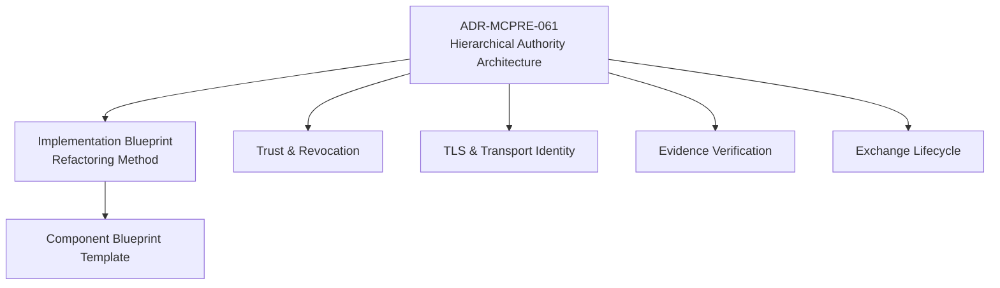
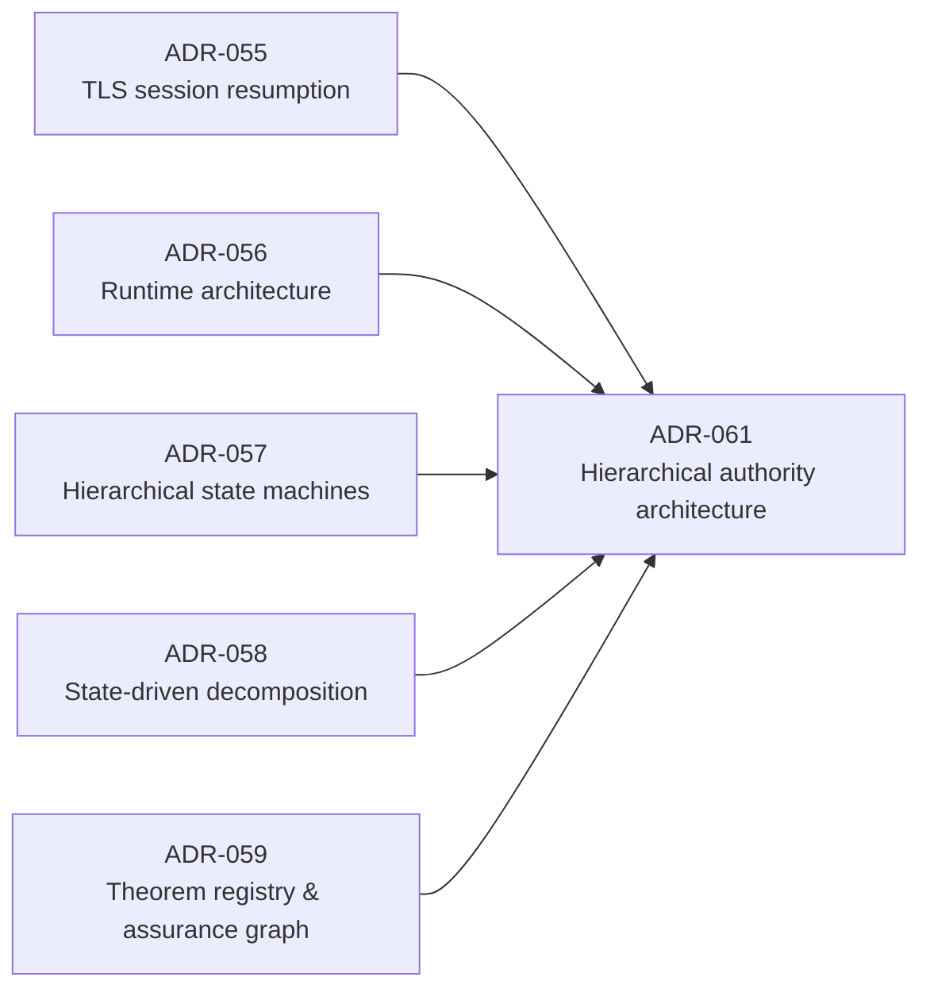

<!-- SPDX-License-Identifier: Apache-2.0 -->

# MCP-RE Architecture Blueprint

This directory is the hierarchical architectural map for MCP-RE. It is intentionally structured like the implementation we want: one concise top-level authority document, subordinate component blueprints with narrow responsibility, and deeper documents only when a component genuinely needs another level.

The purpose is not to replace accepted ADRs. Existing ADRs remain authoritative for the decisions they own. This blueprint connects them into one reviewable architecture and supplies the implementation contracts needed for continued refactoring.

## Document hierarchy



## Top-level documents

- [`ADR-MCPRE-061-hierarchical-authority-architecture.md`](../adr/drafts/ADR-MCPRE-061-hierarchical-authority-architecture.md) — proposed durable architectural decision.
- [`implementation-blueprint.md`](implementation-blueprint.md) — current execution method for the refactoring campaign.
- [`component-blueprint-template.md`](component-blueprint-template.md) — standard anatomy for subordinate component design documents.

## Initial component blueprints

- [`components/trust-and-revocation.md`](components/trust-and-revocation.md)
- [`components/tls-and-transport-identity.md`](components/tls-and-transport-identity.md)
- [`components/evidence-verification.md`](components/evidence-verification.md)
- [`components/exchange-lifecycle.md`](components/exchange-lifecycle.md)

These are first-pass architectural documents, not declarations that every boundary is already final. The shallow-module census and subsequent investigation may refine the tree. Refinement must preserve the governing rule: **one authority, narrow facade, private subordinate implementation tree**.

## Existing ADRs this hierarchy composes



ADR-061 does not restate those decisions. It defines how their responsibilities are arranged into a reviewable hierarchy.

## Navigation principle

A reviewer should be able to move top-down:

```text
system architecture
    -> authority domain
        -> subordinate authority
            -> implementation module
                -> theorem / test / evidence
```

No reviewer should have to begin by reading a thousand-line implementation file to discover what the component is supposed to mean.
