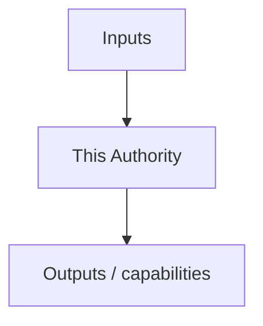
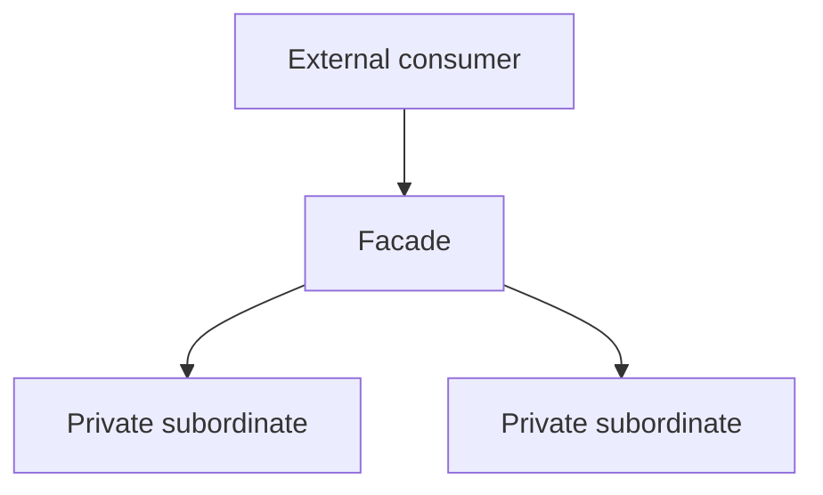

<!-- SPDX-License-Identifier: Apache-2.0 -->

# Component Blueprint Template

Use this template for a subordinate authority document. Delete sections that are genuinely inapplicable; do not fill them with boilerplate.

## 1. Purpose

What proposition does this component exist to establish?

## 2. Authority

### Owns

- Facts/state/relationships this component is authoritative for.

### Explicitly does not own

- Neighboring facts that must remain under another authority.

## 3. Position in the system

## 4. Hierarchy and visibility

Document intended Rust visibility (`private`, `pub(super)`, `pub(in ...)`, `pub(crate)`, `pub`) for each boundary.

## 5. Inputs

For each input:

- semantic meaning;
- owner;
- provenance/defaulting status;
- whether it is raw input, validated fact, or runtime evidence.

## 6. Outputs and capabilities

For each projection/capability:

- proposition it carries;
- authorized consumers;
- whether it is a witness, control value, or descriptive value.

## 7. State model

States, legal construction, guards, transitions, and impossible combinations.

## 8. Control flow

How execution travels through the authority and subordinate units.

## 9. Failure and refusal model

- refusal conditions;
- ordering/precedence;
- fail-closed behavior;
- retry/indeterminate semantics where applicable.

## 10. Composition contracts

- assumptions received from neighbors;
- guarantees exported to neighbors;
- relations that require a separate composition theorem or audit.

## 11. Theorem inventory

| Proposition | Scope | Evidence/unit | Status |
|---|---|---|---|
| | | | |

Do not claim more than the supporting evidence closure establishes.

## 12. Test/evidence inventory

| Property | Test/evidence | Lane | Negative control |
|---|---|---|---|
| | | | |

## 13. Implementation map

Current files/modules and target files/modules.

## 14. Known deviations

Where current code still differs from the target architecture.

## 15. Completion criteria

Concrete conditions for declaring the component architecturally closed.
