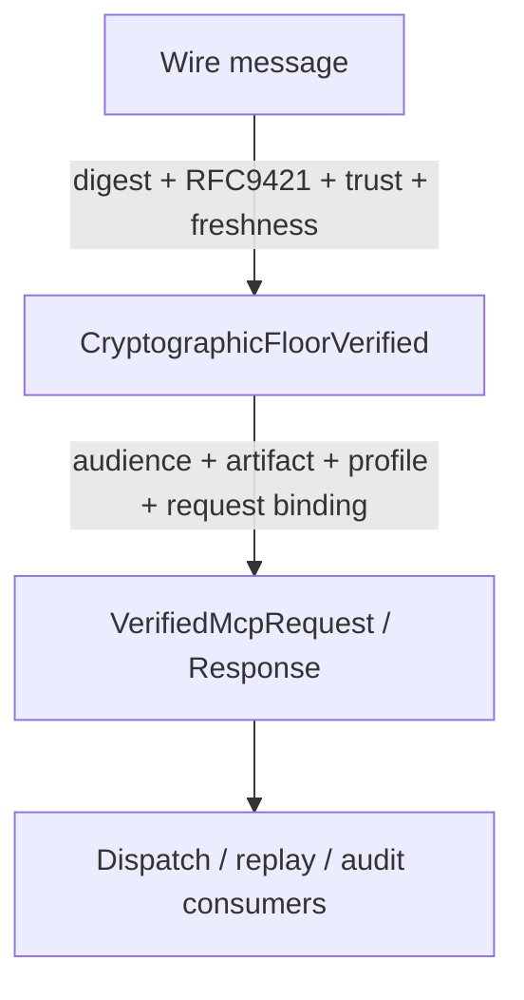
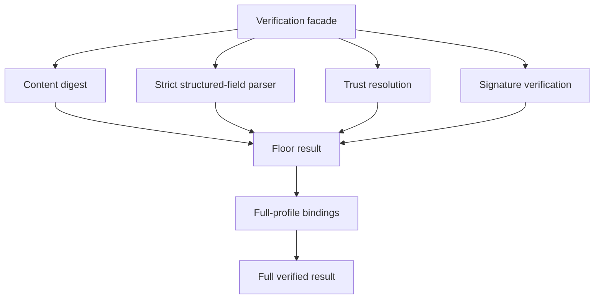

<!-- SPDX-License-Identifier: Apache-2.0 -->

# Component Blueprint: HTTP Evidence Verification

**Status:** First-pass design. Target is the RFC 9421 + RFC 9530 HTTP profile governed by ADR-MCPRE-050.

**Scope split:** this document owns the **target** design. Current sealed state lives in [`docs/dev/sealed-owners.md`](../../dev/sealed-owners.md) (ADR-061 §13.1). §11 is the diff.

## 1. Purpose

Verify HTTP evidence in explicit assurance stages so possession of a value states exactly what has been established.

## 2. Core design issue

A cryptographic floor and full MCP-RE semantic verification are different propositions. They SHALL NOT inhabit one ambiguous `Verified...` type if external or internal consumers can confuse the assurance level.

Target type progression:



Names are provisional; the assurance separation is not.

## 3. Authority

### Cryptographic floor owns

- content-digest agreement;
- signature-input parsing and closed component rules;
- verifier-local algorithm/freshness policy;
- trust resolution for the appropriate signer slot;
- RFC 9421 signature verification;
- exact signature-base/evidence handle.

### Full profile owns

- MCP-RE evidence-block validation;
- audience equality and target binding;
- artifact-binding enforcement;
- explicit response-to-request evidence binding;
- delegated-response credential semantics where applicable.

### Does not own

- transport mTLS verification;
- replay admission;
- serving lifecycle;
- raw trust-store implementation.

## 4. Hierarchy



Parser helpers should remain subordinate implementation, not become alternate public verification APIs.

## 5. Assurance-type rule

Possession must be proof-like:

```text
hold FloorVerifiedRequest
    => cryptographic floor proposition holds

hold VerifiedMcpRequest
    => full MCP-RE request proposition holds
```

A stronger type may contain or consume a weaker type; the reverse must be impossible.

## 6. Public API policy

Low-level floor functions may remain public only if MCP-RE intentionally supports them as a distinct external capability and their weaker assurance is explicit in names and types. Zero production callers alone is not sufficient reason to delete them, but ambiguous public assurance is a defect.

## 7. Theorem/test hierarchy

- parser canonical-spelling properties;
- content-digest binding;
- trust-slot resolution;
- signature verification under selected algorithm;
- floor result theorem;
- audience/artifact relation theorem;
- response request-binding theorem;
- delegated credential composition theorem;
- full verified result theorem.

Formal claims must be scoped to the exact stage they establish.

## 8. Theorem inventory

Registry: [`verification/policy/theorems.toml`](../../../verification/policy/theorems.toml). This table references it; it does not restate the statements, and it creates no second registry (ADR-061 §12).

| proposition | scope | evidence/unit | status |
|---|---|---|---|
| Admitted request parameters imply a current freshness window | floor | THM-0001 · `unit://http_profile.freshness_window` | in registry |
| RFC 3339 parsing is total and range-bounded | floor (leaf) | THM-0002 · `unit://core.time_rfc3339` | in registry |
| Presenter binding | full profile | THM-0006 · `unit://http_profile.admission_currency` | in registry |
| A typed artifact verifier admits only its own type | full profile | THM-0007 · `unit://http_profile.artifact_typing` | in registry |
| No untyped artifact binding leaves the verifier as verified | full profile | THM-0008 · `unit://http_profile.artifact_typing` | in registry |
| A presented continuation cannot bypass verification | full profile | THM-0009 · `unit://http_profile.continuation_unbypassability` | in registry |
| Continuation handles match their presented inputs in role | full profile | THM-0010 · `unit://http_profile.continuation_binding` | in registry |
| **Floor result theorem** — possession of the floor product implies digest agreement, RFC 9421 verification under an allowed algorithm, and trust resolution in the correct signer slot | floor (composition of the above) | **none — no registry entry** | **gap** |
| **Full result theorem** — possession of the full product implies the floor proposition *and* audience equality, artifact binding, and (for responses) request binding | full profile (composition) | **none — no registry entry** | **gap** |

The two gaps are the point of §2. Today no theorem distinguishes the two products, because there is only one product type to state a theorem about. The type split is a precondition for stating them, not a consequence of it.

## 9. Test/evidence inventory

| property | test/evidence | lane | negative control |
|---|---|---|---|
| RFC 9421 known-answer vectors | `mcp-re-http-profile/tests/rfc9421_kat.rs` | `cargo test -p mcp-re-http-profile`; `//mcp-re-http-profile:rfc9421_kat` | KAT mismatch fails |
| Structured-field strictness (canonical spelling, closed components) | `tests/structured_fields_strictness_test.rs` | default | rejects non-canonical spellings |
| Algorithm confusion | `tests/algorithm_confusion_test.rs` | default | signature valid under wrong alg is refused |
| Full-profile bindings (audience, artifact, request binding) | `tests/full_profile_test.rs` | default | mismatched audience/artifact refused |
| Binding identifier semantics | `tests/binding_identifier_test.rs` | default | — |
| Chain reconstruction | `tests/chain_reconstruction_test.rs` | default | — |
| Delegated credential composition | `tests/delegation_e2e_test.rs`, `tests/delegated_202_test.rs` | default | — |
| Trust seam is caller-supplied (see §11) | `tests/signer_seam_test.rs` | default | — |
| Proof-path coverage | `tests/proof_path_test.rs` | default | — |
| Serving path consumes the full product, not the floor | `mcp-re-proxy/tests/integration_async/rfc9421_round_trip_test.rs` | `--features async_serve`; `//mcp-re-proxy:integration_async_test` | — |
| **Floor product is not accepted where the full product is required** | **none** | — | **gap — not expressible until §2 lands** |

Lane identity is part of each property (ADR-061 §12). `mcp-re-http-profile` tests run under the crate's default features; the serving-path rows require `async_serve` and are only non-vacuous in the Bazel lane or an explicit `--features` cargo run.

## 10. Implementation map

Measured by the ADR-061 §5.1 rule on `main` @ `527b1ac`. `prod` = production lines.

| file | prod | current role | target role |
|---|---:|---|---|
| `mcp-re-http-profile/src/verify.rs` | 1640 | the whole verifier: floor, full profile, response, bound response, delegated response, unbound variants — 17 public items | facade only; floor and full-profile stages become private subordinate modules with distinct products |
| `mcp-re-http-profile/src/sigbase.rs` | 306 | signature-base reconstruction | private subordinate of the floor |
| `mcp-re-http-profile/src/digest.rs` | 65 | content-digest | private subordinate of the floor |
| `mcp-re-http-profile/src/block.rs` | 647 | evidence blocks, `ResolvedActor` | shared: `ResolvedActor` is a seam value (§14), blocks are a full-profile subordinate |
| `mcp-re-http-profile/src/envelope.rs` | 280 | envelope vocabulary | unchanged |
| `mcp-re-http-profile/src/artifact.rs` | 173 | artifact binding + typing | full-profile subordinate (owns THM-0007/0008) |
| `mcp-re-http-profile/src/chain.rs` | 660 | chain reconstruction | full-profile subordinate |
| `mcp-re-http-profile/src/delegation.rs` | 384 | delegated credential semantics | full-profile subordinate |
| `mcp-re-http-profile/src/keyid.rs` | 45 | keyid parsing | private subordinate of the floor |
| `mcp-re-http-profile/src/policy.rs` | 240 | `VerifierPolicy` (algorithm allowlist, skew) | floor input; unchanged |

`verify.rs` at 1640 production lines is a §5.3 band-3 hotspot (>1,000): authority census required before substantial new functionality.

The seventeen public items in `verify.rs` today:

```text
VerifiedHttpRequestEvidence          VerifiedHttpResponseEvidence
DelegationExpectations

verify_request                       verify_request_with_policy
verify_request_full                  verify_request_full_with_policy
verify_response                      verify_response_with_policy
verify_response_full
verify_response_bound_full           verify_response_bound_full_with_policy
verify_response_unbound              verify_response_unbound_with_policy
verify_delegated_response_full
verify_delegated_response_bound_full
verify_delegated_response_unbound
```

Four axes are multiplied into a flat function list: floor vs full, request vs response, bound vs unbound, default policy vs explicit policy, plus a delegated variant of three of them. That is ADR-061 §8 question 2 answered by the interface itself.

## 11. Known deviations

1. **One product type, two propositions.** `verify_request` (floor) and `verify_request_full` both return `VerifiedHttpRequestEvidence`. The assurance difference is carried in `Option` fields whose doc comments read "`None` on the minimal proof path; `Some` after `verify_request_full`" — `audience`, `audience_hash`, `request_block`. `VerifiedHttpResponseEvidence` has the same shape in `bound_request_evidence`, `body_request_evidence`, and `server_signer` ("`None` on the seam-only path"). This is ADR-061 §2 class 9, and it is the blocking item: the theorem gaps in §8 and the missing negative control in §9 both follow from it.

2. **`ResolvedActor` is deliberately unsealed and must stay that way.** It looks like a verdict — *the trust layer authorized this actor for this slot* — but the trust seam is a caller-supplied resolver, so every in-process and test resolver is a legitimate producer. `sealed-owners.md` records the measurement and the rule: sealing it would relocate ceremony without moving authority. Any decomposition here must not "fix" it.

3. **`chain.rs` has no test module** (660 production lines, 660 total). Its properties are established from `tests/chain_reconstruction_test.rs` only. Not necessarily wrong — but it is a `CLAUDE.md` testing-requirement deviation and should be recorded rather than discovered again.

## 12. Completion criteria

- floor and full assurance products are distinct types;
- full-profile consumers cannot accept a floor-only value, and a test proves it;
- the two composition theorems in §8 exist in `verification/policy/theorems.toml` with correct scope sentences;
- public API names/types state assurance level accurately;
- floor functions are public only when intentionally supported;
- verification parsing/crypto/binding subcomponents are privately hierarchical;
- the `_with_policy` / bound / unbound / delegated axes are no longer multiplied into a flat public function list;
- current conformance, profile, live-KMS, and serving lanes prove the intended stages non-vacuously, each lane named per §9.
