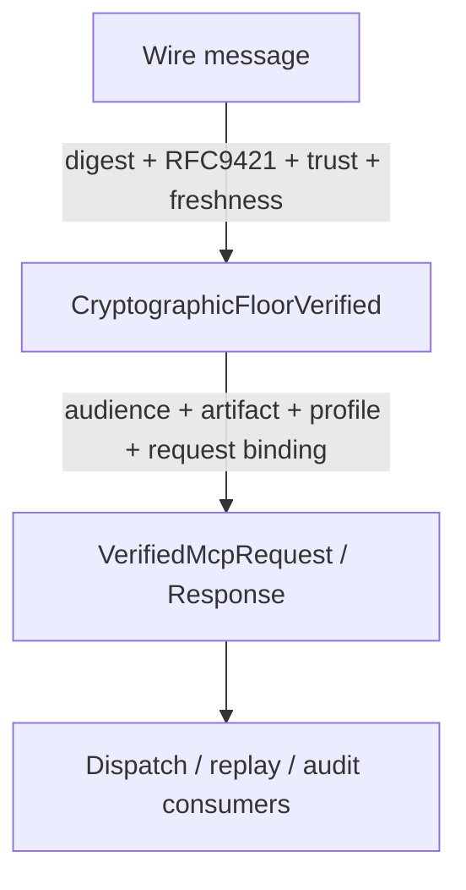
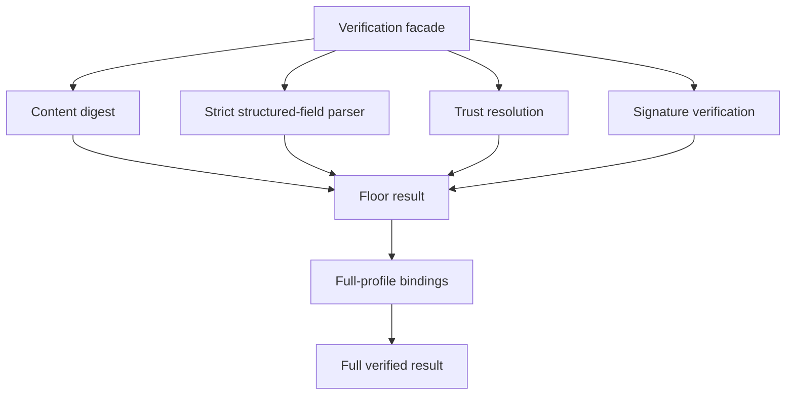

<!-- SPDX-License-Identifier: Apache-2.0 -->

# Component Blueprint: HTTP Evidence Verification

**Status:** First-pass design. Target is the RFC 9421 + RFC 9530 HTTP profile governed by ADR-MCPRE-050.

**Scope split:** this document owns the **target** design. Current sealed state lives in [`docs/dev/sealed-owners.md`](../../dev/sealed-owners.md) (ADR-061 §13.1). §11 is the diff.

## 1. Purpose

Verify HTTP evidence in explicit assurance stages so possession of a value states exactly what has been established.

## 2. Core design issue

A cryptographic floor and full MCP-RE semantic verification are different propositions. They SHALL NOT inhabit one ambiguous `Verified...` type if external or internal consumers can confuse the assurance level.

Target type progression:



Names are provisional; the assurance separation is not.

## 3. Authority

### Cryptographic floor owns

- content-digest agreement;
- signature-input parsing and closed component rules;
- verifier-local algorithm/freshness policy;
- trust resolution for the appropriate signer slot;
- RFC 9421 signature verification;
- exact signature-base/evidence handle.

### Full profile owns

- MCP-RE evidence-block validation;
- audience equality and target binding;
- artifact-binding enforcement;
- explicit response-to-request evidence binding;
- delegated-response credential semantics where applicable.

### Does not own

- transport mTLS verification;
- replay admission;
- serving lifecycle;
- raw trust-store implementation.

## 4. Hierarchy



Parser helpers should remain subordinate implementation, not become alternate public verification APIs.

## 5. Assurance-type rule

Possession must be proof-like:

```text
hold FloorVerifiedRequest
    => cryptographic floor proposition holds

hold VerifiedMcpRequest
    => full MCP-RE request proposition holds
```

A stronger type may contain or consume a weaker type; the reverse must be impossible.

## 6. Public API policy

Low-level floor functions may remain public only if MCP-RE intentionally supports them as a distinct external capability and their weaker assurance is explicit in names and types. Zero production callers alone is not sufficient reason to delete them, but ambiguous public assurance is a defect.

## 7. Theorem/test hierarchy

- parser canonical-spelling properties;
- content-digest binding;
- trust-slot resolution;
- signature verification under selected algorithm;
- floor result theorem;
- audience/artifact relation theorem;
- response request-binding theorem;
- delegated credential composition theorem;
- full verified result theorem.

Formal claims must be scoped to the exact stage they establish.

## 8. Theorem inventory

Registry: [`verification/policy/theorems.toml`](../../../verification/policy/theorems.toml). This table references it; it does not restate the statements, and it creates no second registry (ADR-061 §12).

| proposition | scope | evidence/unit | status |
|---|---|---|---|
| Admitted request parameters imply a current freshness window | floor | THM-0001 · `unit://http_profile.freshness_window` | in registry |
| RFC 3339 parsing is total and range-bounded | floor (leaf) | THM-0002 · `unit://core.time_rfc3339` | in registry |
| Presenter binding | full profile | THM-0006 · `unit://http_profile.admission_currency` | in registry |
| A typed artifact verifier admits only its own type | full profile | THM-0007 · `unit://http_profile.artifact_typing` | in registry |
| No untyped artifact binding leaves the verifier as verified | full profile | THM-0008 · `unit://http_profile.artifact_typing` | in registry |
| A presented continuation cannot bypass verification | full profile | THM-0009 · `unit://http_profile.continuation_unbypassability` | in registry |
| Continuation handles match their presented inputs in role | full profile | THM-0010 · `unit://http_profile.continuation_binding` | in registry |
| **Request floor** — a successful `verify_request_floor` establishes digest, signature, freshness and Request-slot trust resolution | floor | THM-0014 · `unit://http_profile.verifier_results` | in registry |
| **Full request** — the floor, plus block validation, audience/target equality and declared artifact enforcement | full profile | THM-0015 | in registry |
| **Bound response facts** — digest, current parameters, and a signature over a base whose `;req` resolved against the supplied request, under the accepted signer's key | floor (shared) | THM-0021 | in registry |
| **Unbound response facts** — the same, over response components only, with `;req` refused as malformed | floor (shared) | THM-0022 | in registry |
| **Bound response floor** — the bound facts, plus **trust-seam** authorization of the signer in the Response slot | floor | THM-0016 | in registry |
| **Unbound response floor** — the unbound facts, plus trust-seam authorization | floor | THM-0017 | in registry |
| **Full bound response** — the seam-authorized bound floor, plus signer correspondence and equality with the expected handle | full profile | THM-0018 | in registry |
| **Delegated bound response** — the bound facts, plus **credential-chain** authorization and the block agreement | full profile | THM-0019 | in registry |
| **Delegated unbound response** — the unbound facts, plus credential-chain authorization, and never a binding | full profile | THM-0020 | in registry |

Nine claims over one review unit: seven public operations, plus the two propositions two
operations each genuinely share.

```text
request floor (0014) ─────────> full request (0015)

                  ┌──> seam-authorized bound floor (0016) ──> full bound response (0018)
bound facts (0021)┤
                  └──> delegation-authorized bound response (0019)

                    ┌──> seam-authorized unbound floor (0017)
unbound facts (0022)┤
                    └──> delegation-authorized unbound response (0020)
```

### Why the delegated claims do not inherit the direct ones

The first version of this family had THM-0019 depend on THM-0018 and THM-0020 on THM-0017,
because `VerifiedDelegatedMcpResponse` contained a `VerifiedMcpResponse`. **That inheritance
was false**, and the containment was the reason it looked true.

THM-0016 says *the presented keyid was resolved through the trust seam for the Response
slot*. On the delegated path it was not. The seam is queried for the credential's **root
issuer kid**; the signing key is a delegated key that appears in no trust map, and what
authorizes it is the credential chain (ADR-MCPRE-052 §3). Nesting the seam-authorized
product inside the delegated one made the delegated product carry a value whose documented
meaning is false of it — a defect in the types, not only in the dependency edge.

So the response products were rebuilt around what the two paths actually share:

| type | what it carries |
|---|---|
| `AcceptedResponseSigner` | the identity and key the signature was accepted under — **WHO, never WHY** |
| `BoundResponseSignatureFacts` | that signer, plus the response signature-base handle, for a `;req`-bound signature |
| `UnboundResponseSignatureFacts` | the same, for a response-only signature |
| `BoundRequestEvidenceAgreement` | the caller's expected handle and the block's, compared equal |

`CryptographicFloorVerifiedBoundResponse` keeps its `ResolvedActor` and projects the shared
facts; the delegated products carry the shared facts and their issuer kid, and there is no
field, projection or conversion from a delegated product back to a seam-authorized one — a
`compile_fail` control in `http_profile.verifier_result_separation` pins that.

### What holds of all nine

They are claims about a **successful return**, not about possession of a Rust value — the
products keep `pub` fields so a Verus postcondition can be stated over them, so nothing
prevents a caller assembling one by hand, and every `scope` says so.

They rest on a **test battery**, not on an `ensures`: the prover reaches `check_params`, not
the operations that call it, so the unit is class V0 and no statement above it may imply
otherwise. Because they are V0, every conjunct carries a negative control that has been
mutation-probed — see §9.1.

Three TCB premises were unregistered before this and are now named, because every one of
the nine is false without them: ASM-0027 (Ed25519 unforgeability), ASM-0028 (SHA-256
second-preimage resistance, which is what makes a digest comparison a claim about bytes),
and ASM-0029 (the trust seam answers its **selector** correctly — for a queried
`(keyid, slot)` the returned identity and key are the deployment-authorized binding; the
assumption `ResolvedActor` being deliberately unsealed makes unavoidable).

The split also removed a hole in an existing theorem. THM-0009's Verus postcondition read `verified.request_block matches Some(block) ==> (block.continuation is Some ==> continuation_verified)`, which is **vacuously true whenever the block is absent** — that is, for exactly a floor-verified request. `prepare_http_dispatch` now takes `VerifiedMcpRequest`, so the antecedent is gone and the obligation is unconditional. `verify-verus` reports PASS over 6 units with the same 15 verified obligations in this crate as before the change.

## 9. Test/evidence inventory

| property | test/evidence | lane | negative control |
|---|---|---|---|
| RFC 9421 known-answer vectors | `mcp-re-http-profile/tests/rfc9421_kat.rs` | `cargo test -p mcp-re-http-profile`; `//mcp-re-http-profile:rfc9421_kat` | KAT mismatch fails |
| Structured-field strictness (canonical spelling, closed components) | `tests/structured_fields_strictness_test.rs` | default | rejects non-canonical spellings |
| Algorithm confusion | `tests/algorithm_confusion_test.rs` | default | signature valid under wrong alg is refused |
| Full-profile bindings (audience, artifact, request binding) | `tests/full_profile_test.rs` | default | mismatched audience/artifact refused |
| Binding identifier semantics | `tests/binding_identifier_test.rs` | default | — |
| Chain reconstruction | `tests/chain_reconstruction_test.rs` | default | — |
| Delegated credential composition | `tests/delegation_e2e_test.rs`, `tests/delegated_202_test.rs` | default | — |
| Trust seam is caller-supplied (see §11) | `tests/signer_seam_test.rs` | default | — |
| Proof-path coverage | `tests/proof_path_test.rs` | default | — |
| Serving path consumes the full product, not the floor | `mcp-re-proxy/tests/integration_async/rfc9421_round_trip_test.rs` | `--features async_serve`; `//mcp-re-proxy:integration_async_test` | — |
| **Floor product is not accepted where the full product is required** | `compile_fail` doctest on `VerifiedMcpRequest` | `cargo test -p mcp-re-http-profile --doc` — **cargo only**, the Bazel lane runs no doctests | **the control was probed**: rewriting the example to pass a `&VerifiedMcpRequest` makes the test FAIL, so it is not passing on a typo |
| **A delegation-authorized response is not a trust-seam-authorized one** | `compile_fail` doctest on `VerifiedDelegatedMcpResponse` | as above | **probed**: rewritten to take a `&VerifiedDelegatedMcpResponse`, the doctest FAILS with *"compiled successfully, but it's marked `compile_fail`"* |

Lane identity is part of each property (ADR-061 §12). `mcp-re-http-profile` tests run under the crate's default features; the serving-path rows require `async_serve` and are only non-vacuous in the Bazel lane or an explicit `--features` cargo run.

### 9.1 The V0 mutation probe

`unit://http_profile.verifier_results` is class **V0**: nothing above it may read as more
than "a test battery passed". A passing battery is not, on its own, evidence that a
production check is load-bearing — so every conjunct THM-0014 … THM-0022 names was probed
by deleting or defanging exactly that check, re-running the declared battery, and observing
which declared member goes red. **26 mutations, each turning at least one declared member
red.**

The probes are **registered and executable**, not remembered:
[`verification/policy/mutation-probes.toml`](../../../verification/policy/mutation-probes.toml)
names each weakening and the declared control(s) it must turn red, and
`tools/verification/verify-mutations` re-applies them all — to a **copy** of the tree,
never the working tree — on every change to this unit, its test evidence or the probe
definitions ([`.github/workflows/mutation-probe.yml`](../../../.github/workflows/mutation-probe.yml)).

It is deliberately **not** a freeze on `verify.rs`. A probe whose anchor no longer matches
exactly one site is reported **STALE**, which is a demand to re-adjudicate the probe against
the new implementation, never to restore the old code. Two matches fails for the same
reason as none: the lane could not say which check it broke, so whatever went red proves
nothing about the conjunct named. Both failure modes, and the "weakening changed nothing"
one, are themselves probed in `tools/verification/test_mutation_lane.py`.

The lane checks the count stated in this section against the registry, so the table below
and the executable set cannot drift.

**A probe passes only on an OBSERVED failure of a control it names exactly.** `expect_red`
carries the canonical `tests/<target>#<symbol>` / `lib#<symbol>` identity, because test
identity here is target plus symbol: two targets may hold a test of the same name, and a
bare-symbol match could be satisfied by a failure in a target the probe never meant to
touch. A named control that is **never reported** is a MEASUREMENT FAILURE with its own
message, not a red result — the lane cannot conclude anything about a check from a test it
did not watch run — and an `ignored` control is not red either. The first version of this
lane got exactly that wrong, reading "anything other than ok" as red, so absence satisfied
a probe.

### 9.2 Mutation evidence is part of the attestation closure

A lane that runs is not the same thing as a lane that is REQUIRED. The unit therefore
declares two evidence classes, and `_evidence.required_lanes` reads every scheme:

```text
evidence = [ "test://…/result_propositions",        did every declared control pass?
             "mutation://…/result_propositions" ]   would any of them NOTICE the check
                                                    its theorem names being deleted?

verify-mutations  ──▶  machine PASS record, bound to the ReviewFingerprint
                            │
                            ▼
                        attest  ──▶  no mutation PASS at the exact fingerprint
                                     = REFUSE ATTESTATION
```

Without the declaration the probe suite would be decoration: the CI job could be deleted,
or quietly shrink, and `http_profile.verifier_results` would keep re-attesting from the
ordinary test evidence alone. With it, `attest` refuses — observed, not asserted:

> `REFUSED  http_profile.verifier_results   the unit claims mutation evidence but no
> mutation record exists for it; absence of measurement is not measurement`

Closing the loop needed **encoding v5**: the probe ENTRIES (each digested whole, so
softening a weakening or widening an `expect_red` moves the fingerprint) and the lane
binary are fingerprint inputs. A closure over a suite that can silently shrink would prove
as little as the v3 test component did. `scripts/verification_trigger_gate.py` derives both
from the manifest, so the workflow filters cannot narrow below them.

| claim | production check removed | declared control that goes red |
|---|---|---|
| THM-0014 | `floor_request` — RFC 9421 signature verification | `authorization_header_is_covered_when_present` **+1 more** |
| THM-0014 | `floor_request` — content-digest agreement | `body_tamper_fails_closed` **+1 more** |
| THM-0014 | `floor_request` — Request-slot trust resolution | `request_signed_by_response_only_actor_fails_actor_binding` **+1 more** |
| THM-0014/21/22 | `check_params` — the algorithm allowlist | `an_ed25519_signature_declaring_ml_dsa_is_rejected` |
| THM-0015 | `full_request` — block validation under the profile tag | `wrong_profile_in_block_fails` |
| THM-0015 | `enforce_full_profile_bindings` — audience-tuple equality | `audience_mismatch_fails` |
| THM-0015 | `enforce_full_profile_bindings` — tuple/`@target-uri` consistency | `a_target_uri_disagreeing_with_the_audience_tuple_fails` |
| THM-0021 | `floor_bound_response` — content-digest agreement | `rejection::tests::tampered_message_does_not_change_the_trusted_wire_code` |
| THM-0021 | `floor_bound_response` — signature over the `;req` base | `rejection::tests::spliced_rejection_onto_a_different_request_fails` |
| THM-0016 | `floor_bound_response` — Response-slot trust resolution | `response_signed_by_request_only_actor_fails_actor_binding` |
| THM-0022 | `floor_unbound_response` — content-digest agreement | `the_unbound_floor_content_digest_check_is_load_bearing` |
| THM-0022 | `floor_unbound_response` — `;req` refused as malformed | `a_req_component_is_refused_on_the_unbound_floor` |
| THM-0022 | `floor_unbound_response` — signature over the response-only base | `the_unbound_floor_signature_check_is_load_bearing` |
| THM-0018 | `full_bound_response` — block `server_signer` keyid == accepted keyid | `a_block_declaring_a_signer_it_did_not_sign_as_fails` |
| THM-0018 | `full_bound_response` — block handle == the caller's handle | `response_request_evidence_mismatch_emits_request_binding_mismatch` |
| THM-0019/20 | `chain_to_root` — the root issuer is resolved for the **Response** slot | `a_block_naming_a_keyid_the_credential_did_not_confirm_is_key_mismatch` **+11 more** |
| THM-0019 | `delegated_bound_response` — wire keyid == the credential's delegated kid | `response_keyid_not_delegated_kid_is_key_mismatch` |
| THM-0019 | `delegated_bound_response` — block keyid == the credential's delegated kid | `a_block_naming_a_keyid_the_credential_did_not_confirm_is_key_mismatch` |
| THM-0019 | `delegated_bound_response` — signature under `cnf.jwk` | `response_signed_by_key_other_than_cnf_is_key_mismatch` |
| THM-0019 | `delegated_bound_response` — block handle == the caller's handle | `a_delegated_response_advertising_another_requests_evidence_is_refused` |
| THM-0022 | `delegated_unbound_response` — content-digest agreement | `an_unbound_receipt_body_tamper_is_caught_by_content_digest` |
| THM-0022 | `delegated_unbound_response` — `;req` refused as malformed | `a_req_component_is_refused_on_the_delegated_unbound_path` |
| THM-0020 | `delegated_unbound_response` — an inline credential is required | `an_unbound_receipt_without_a_credential_is_refused` |
| THM-0020 | `delegated_unbound_response` — signature under `cnf.jwk` | `an_unbound_receipt_signed_by_a_key_other_than_cnf_is_key_mismatch` |
| THM-0020 | `delegated_unbound_response` — block keyid == the credential's delegated kid | `an_unbound_receipt_naming_a_keyid_the_credential_did_not_confirm_is_key_mismatch` |
| THM-0020 | `delegated_unbound_response` — wire keyid == the credential's delegated kid | `an_unbound_receipt_whose_wire_keyid_is_not_the_delegated_kid_is_key_mismatch` |

The probe found **three conjuncts nothing reached**, and each got a control rather than a
softened statement:

1. **The audience-tuple/`@target-uri` consistency conjunct.** `audience_mismatch_fails`
   moves `audience_id`, so it fails on the equality conjunct and survives deleting the
   consistency one. `a_target_uri_disagreeing_with_the_audience_tuple_fails` keeps the
   tuples equal and moves only the request's target.
2. **The `server_signer` correspondence check, on both authorization paths.** The existing
   response negatives move the request evidence or the `;req` base instead. On the delegated
   path the control needs a credential whose SUBJECT BINDING and CONFIRMED KEY name different
   kids — reachable only from a misbehaving issuer, which is precisely who the check defends
   against.
3. **The delegated wire-keyid comparison on the unbound path.** Without it a receipt could
   advertise an unconfirmed keyid — the coordinate a peer caches and pins — while presenting
   a credential for a different one.

One mutation is deliberately coarse and is recorded as such: swapping `chain_to_root`'s
root-issuer resolution to the **Request** slot breaks the whole delegated battery (12
members), because every delegated test then fails to resolve a root. That is a coverage
fact, not an isolation one.


## 10. Implementation map

Measured by the ADR-061 §5.1 rule on `main` @ `fede93b` (`scripts/module_size_gate.py::production_lines`). `prod` = production lines.

| file | prod | current role | target role |
|---|---:|---|---|
| `mcp-re-http-profile/src/verified_request/mod.rs` | 128 | the full-profile product | unchanged; the value owns its own module rather than living beside the procedure that builds it |
| `mcp-re-http-profile/src/verified_request/floor.rs` | 102 | the cryptographic-floor product | split out under ADR-MCPRE-065 Slice 1: two propositions were two types in one file, and the floor now owns the pairing question (`covers_body`) that its digest answers |
| `mcp-re-http-profile/src/verified_response/mod.rs` | 71 | the response-product surface and the two-authorization-propositions argument | unchanged |
| `mcp-re-http-profile/src/verified_response/facts.rs` | 90 | the authorization-INDEPENDENT facts shared by both paths | unchanged |
| `mcp-re-http-profile/src/verified_response/bound.rs` | 177 | the three request-bound products | unchanged |
| `mcp-re-http-profile/src/verified_response/unbound.rs` | 71 | the two unbound products | unchanged |
| `mcp-re-http-profile/src/verifier.rs` | 185 | `Verifier` — one policy authority, one operation per proposition | unchanged |
| `mcp-re-http-profile/src/verify.rs` | 1360 | the stage implementations, now `pub(crate)` behind the facade | floor and full-profile stages become private subordinate modules |
| `mcp-re-http-profile/src/sigbase.rs` | 306 | signature-base reconstruction | private subordinate of the floor |
| `mcp-re-http-profile/src/digest.rs` | 65 | content-digest | private subordinate of the floor |
| `mcp-re-http-profile/src/block.rs` | 647 | evidence blocks, `ResolvedActor` | shared: `ResolvedActor` is a seam value (§14), blocks are a full-profile subordinate |
| `mcp-re-http-profile/src/envelope.rs` | 280 | envelope vocabulary | unchanged |
| `mcp-re-http-profile/src/artifact.rs` | 173 | artifact binding + typing | full-profile subordinate (owns THM-0007/0008) |
| `mcp-re-http-profile/src/chain.rs` | 660 | chain reconstruction | full-profile subordinate |
| `mcp-re-http-profile/src/delegation.rs` | 384 | delegated credential semantics | full-profile subordinate |
| `mcp-re-http-profile/src/keyid.rs` | 45 | keyid parsing | private subordinate of the floor |
| `mcp-re-http-profile/src/policy.rs` | 240 | `VerifierPolicy` (algorithm allowlist, skew) | floor input; unchanged |

`verify.rs` at 1360 production lines is a §5.3 band-3 hotspot (>1,000): authority census required before substantial new functionality. Its census is EX-003.

The seventeen public items in `verify.rs` today:

```text
VerifiedHttpRequestEvidence          VerifiedHttpResponseEvidence
DelegationExpectations

verify_request                       verify_request_with_policy
verify_request_full                  verify_request_full_with_policy
verify_response                      verify_response_with_policy
verify_response_full
verify_response_bound_full           verify_response_bound_full_with_policy
verify_response_unbound              verify_response_unbound_with_policy
verify_delegated_response_full
verify_delegated_response_bound_full
verify_delegated_response_unbound
```

Four axes were multiplied into a flat function list: floor vs full, request vs response, bound vs unbound, default policy vs explicit policy, plus a delegated variant of three of them. That is ADR-061 §8 question 2 answered by the interface itself.

**Resolved (#570, #571), each axis by its own kind of thing rather than by one mechanism:**

| axis | where it lives now |
|---|---|
| floor vs full | the product type |
| bound vs unbound | the product type |
| delegated, where the assurance differs | the product type |
| default vs explicit policy | `Verifier` configuration — the axis is gone from the API |
| whole verified request vs evidence handle | an input. `verify_response_full` was an adapter around the bound form and is deleted; the caller supplies the handle it has |

`Verifier` is the whole public surface: `verify_request_floor`, `verify_request`, `verify_bound_response_floor`, `verify_bound_response`, `verify_unbound_response_floor`, `verify_delegated_bound_response`, `verify_delegated_unbound_response`. A method name may still say `bound`; the requirement is that the distinction must not exist **only** there, and it does not.

## 11. Known deviations

1. **~~One product type, two propositions~~ — closed on the REQUEST side (#570), open on the response side (#571).** `verify_request` now returns `CryptographicFloorVerifiedRequest` and `verify_request_full` returns `VerifiedMcpRequest`; the three `Option` fields that carried the assurance difference are gone, and a full-profile consumer cannot be handed a floor value.

   **Closed on the response side too (#571).** `VerifiedHttpResponseEvidence` no longer exists. Five products replace it — `CryptographicFloorVerifiedBoundResponse`, `CryptographicFloorVerifiedUnboundResponse`, `VerifiedMcpResponse`, `VerifiedDelegatedMcpResponse`, `VerifiedDelegatedUnboundResponse` — and no `Option` among them stands for "this path proved less". There is deliberately **no Cartesian product**: only the combinations the system actually has.

   Bound vs unbound is a security proposition, not an API convenience: the bound path verifies `;req` against a concrete request and compares the block's `request_evidence`; the unbound path forbids `;req` and treats the block's handle as diagnostic. Two types, so a consumer cannot conflate them.

   The client's `bound: bool` went with it. Boundness was stated twice — once by that flag, once by which path produced the evidence — and is now stated once, by `DelegatedResponseEvidence`.

   What the request split deleted rather than moved: `prepare_http_dispatch` carried a runtime guard failing closed on a missing `audience_hash`, commented *"its absence means minimal-path evidence reached the dispatcher"*. Its case is now unconstructible, so the check is gone — the ADR-061 §11 operational test applied to a real check.

5. **The two products are deliberately NOT sealed.** Both carry `pub` fields. Verus rejects private fields on a transparent datatype and cannot call accessors from verified code, and THM-0009's postcondition is stated over `VerifiedMcpRequest::request_block` — so sealing would cost the theorem. This is the second measurement of a rule this project already had: a proved postcondition outranks a seal ([`docs/dev/sealed-owners.md`](../../dev/sealed-owners.md)). The assurance split does not depend on the seal; it is carried by the type distinction.

6. **`sigbase` is still a public module.** `digest`, `keyid`, and `policy` are now private to the crate with their intended items re-exported at the root, but `sigbase`'s module path is a real consumer contract — the conformance KAT oracle reconstructs the exact signature base through it. It becomes properly subordinate when #571 gives the floor stage its own module; narrowing it now would have meant trading module privacy for two lines in an over-threshold `lib.rs`.

2. **`ResolvedActor` is deliberately unsealed and must stay that way.** It looks like a verdict — *the trust layer authorized this actor for this slot* — but the trust seam is a caller-supplied resolver, so every in-process and test resolver is a legitimate producer. `sealed-owners.md` records the measurement and the rule: sealing it would relocate ceremony without moving authority. Any decomposition here must not "fix" it.

3. **`chain.rs` has no test module** (660 production lines, 660 total). Its properties are established from `tests/chain_reconstruction_test.rs` only. Not necessarily wrong — but it is a `CLAUDE.md` testing-requirement deviation and should be recorded rather than discovered again.

## 12. Completion criteria

- ✅ floor and full assurance products are distinct types, on both request and response;
- ✅ full-profile consumers cannot accept a floor-only value, and three probed `compile_fail` controls prove it;
- the two composition theorems in §8 exist in `verification/policy/theorems.toml` with correct scope sentences;
- ✅ public API names/types state assurance level accurately;
- floor functions are public only when intentionally supported;
- verification parsing/crypto/binding subcomponents are privately hierarchical;
- ✅ the `_with_policy` / bound / unbound / delegated axes are no longer multiplied into a flat public function list;
- current conformance, profile, live-KMS, and serving lanes prove the intended stages non-vacuously, each lane named per §9.
