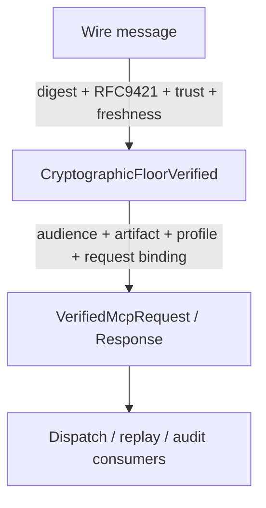
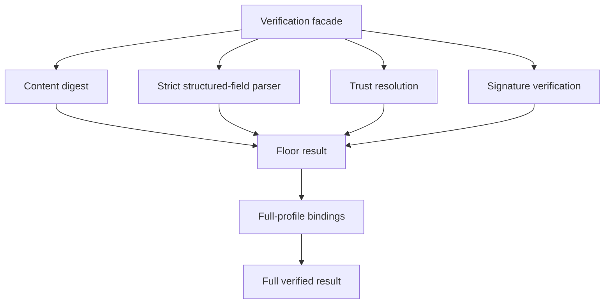

<!-- SPDX-License-Identifier: Apache-2.0 -->

# Component Blueprint: HTTP Evidence Verification

**Status:** First-pass design. Target is the RFC 9421 + RFC 9530 HTTP profile governed by ADR-MCPRE-050.

## 1. Purpose

Verify HTTP evidence in explicit assurance stages so possession of a value states exactly what has been established.

## 2. Core design issue

A cryptographic floor and full MCP-RE semantic verification are different propositions. They SHALL NOT inhabit one ambiguous `Verified...` type if external or internal consumers can confuse the assurance level.

Target type progression:



Names are provisional; the assurance separation is not.

## 3. Authority

### Cryptographic floor owns

- content-digest agreement;
- signature-input parsing and closed component rules;
- verifier-local algorithm/freshness policy;
- trust resolution for the appropriate signer slot;
- RFC 9421 signature verification;
- exact signature-base/evidence handle.

### Full profile owns

- MCP-RE evidence-block validation;
- audience equality and target binding;
- artifact-binding enforcement;
- explicit response-to-request evidence binding;
- delegated-response credential semantics where applicable.

### Does not own

- transport mTLS verification;
- replay admission;
- serving lifecycle;
- raw trust-store implementation.

## 4. Hierarchy



Parser helpers should remain subordinate implementation, not become alternate public verification APIs.

## 5. Assurance-type rule

Possession must be proof-like:

```text
hold FloorVerifiedRequest
    => cryptographic floor proposition holds

hold VerifiedMcpRequest
    => full MCP-RE request proposition holds
```

A stronger type may contain or consume a weaker type; the reverse must be impossible.

## 6. Public API policy

Low-level floor functions may remain public only if MCP-RE intentionally supports them as a distinct external capability and their weaker assurance is explicit in names and types. Zero production callers alone is not sufficient reason to delete them, but ambiguous public assurance is a defect.

## 7. Theorem/test hierarchy

- parser canonical-spelling properties;
- content-digest binding;
- trust-slot resolution;
- signature verification under selected algorithm;
- floor result theorem;
- audience/artifact relation theorem;
- response request-binding theorem;
- delegated credential composition theorem;
- full verified result theorem.

Formal claims must be scoped to the exact stage they establish.

## 8. Completion criteria

- floor and full assurance products are distinct;
- full-profile consumers cannot accept a floor-only value;
- public API names/types state assurance level accurately;
- floor functions are public only when intentionally supported;
- verification parsing/crypto/binding subcomponents are privately hierarchical;
- current conformance, profile, live-KMS, and serving lanes prove the intended stages non-vacuously.
