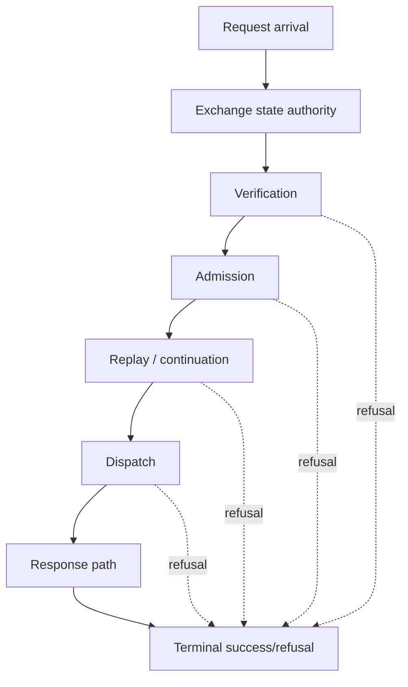

<!-- SPDX-License-Identifier: Apache-2.0 -->

# Component Blueprint: Exchange Lifecycle

**Status:** First-pass design. Builds on the landed hierarchical exchange state machine.

**Scope split:** this document owns the **target** design. Current sealed state lives in [`docs/dev/sealed-owners.md`](../../dev/sealed-owners.md) (ADR-061 §13.1). §11 is the diff.

## 1. Purpose

Make one state authority own the complete request/response exchange lifecycle, including success and refusal paths, so the procedural serving code cannot implement a second ordering beside the machine.

## 2. Governing model

The exchange machine is hierarchical in the semantic sense: parent state constrains the legality of transitions in request and response regions. Object containment is not required.



## 3. Authority

### Owns

- legal phase ordering for one exchange;
- which transitions are possible from each state;
- terminality of successful and refused exchanges;
- relation between request and response regions;
- lifecycle evidence needed to prove no stage is skipped or repeated illegally.

### Does not own

- the internal semantics of verification, admission, replay, dispatch, or signing;
- backend implementation details;
- transport connection lifetime.

## 4. Integration rule

Serving code SHALL be subordinate to the exchange machine. The machine must not be a parallel bookkeeping object that procedural code remembers to advance.

Desired direction:

```text
state operation
    -> authorizes/produces effect request
        -> effect executes
            -> typed transition/result
```

Undesired direction:

```text
procedural code does work
    -> remembers to call advance()
```

### 4.1 The mechanism that carries this rule, and what it does not cover

`ExchangeProgress` owns transition **legality**: it checks `(state, event)` on every advance in every build — not a `debug_assert!` — and latches an anomaly rather than panicking, because a dropped connection has a weaker retry contract than the machine already knows.

Legality alone is not enough. The correspondence between *the work happened* and *the event was emitted* was once ~20 individually deletable `progress.advance(...)` statements inside `http_profile_serve::handle`, which is a remembered invariant in the exact sense of ADR-061 §11: delete one and the machine is silently wrong about a served exchange until some later advance happens to be illegal.

That is now owned. `Established<T>` pairs a stage's value with the event it justifies, is constructed by the stage at the point the work succeeded, is `#[must_use]`, and `ExchangeProgress::establish` is the only way to open one. The assembly consumes transitions instead of asserting them.

**What is deliberately not covered, and why.** Five direct `advance` calls remain in `handle`, and they are correct there:

| site | event | why the assembly owns it |
|---|---|---|
| dispatch | `BackendDispatched` | entered on the way *in*, so a cancelled or panicking dispatch cannot claim nothing happened |
| retirement | `ContinuationRetired` | decided from a `ContinuationState`, not from any stage's success |
| reply classification | `ContinuationNotRequired` | a property of the reply, not of a stage |
| retention | `EvidenceRetained` | — |
| terminals | `TerminalResponseServed` / open-leg terminal | two terminals making different claims; neither is a stage's result |

`Established` cannot express these: several legitimately fire on a stage's *refusing* arm, which a value returned only on success cannot carry. The residue is the honest boundary of the mechanism, not an unfinished migration.

**Not available as a fix: typestate.** ADR-MCPRE-057 §4 and ADR-MCPRE-058 §12 settled the model-as-value encoding. Re-arguing it here would be arguing encoding against a decision.

## 5. Refusal coverage

The lifecycle must begin early enough that every meaningful refusal belongs to the exchange model. A refusal before machine construction is outside the claimed lifecycle and must either move under the machine or be explicitly defined as a pre-exchange transport refusal.

Refusal precedence remains:

```text
existence
 -> local validity / meaningfulness
 -> internal coherence
 -> cross-machine compatibility
 -> build/runtime establishment
```

where applicable to the current layer.

## 6. Tests and theorems

- transition relation completeness;
- illegal transition negative controls;
- all terminal outcomes reachable only through legal paths;
- every admitted request passes required stages exactly as specified;
- refused paths cannot accidentally proceed to dispatch or unsigned response handling;
- machine and production execution have one transition authority, not duplicated tables/orderings.

## 7. Theorem inventory

Registry: [`verification/policy/theorems.toml`](../../../verification/policy/theorems.toml). Referenced, not restated (ADR-061 §12).

| proposition | scope | evidence/unit | status |
|---|---|---|---|
| A presented continuation cannot bypass verification | request region | THM-0009 · `unit://http_profile.continuation_unbypassability` | in registry |
| Continuation handles match their presented inputs in role | request region | THM-0010 · `unit://http_profile.continuation_binding` | in registry |
| The lifecycle record cannot claim a shutdown that did not happen | runtime lifecycle (neighbouring authority) | THM-0012 · `unit://proxy.runtime_lifecycle` | in registry |
| **Emitted transitions correspond to work performed** — the machine's state implies the stages it names actually executed | exchange machine ↔ serving path | `Established<T>` + `establish()` in `exchange_state.rs`; no registry entry | **structural, not stated.** The mechanism holds it for stage-owned transitions; no theorem asserts it, and the five assembly-owned transitions of §4.1 are outside whatever it would assert |
| **Every production refusal is inside the lifecycle or is a declared pre-exchange transport refusal** | composition | **none** | **gap — see §5** |

The first row is the interesting one. The property is now structurally true for stage-owned transitions and has no theorem, so nothing states its exact scope — in particular that the five assembly-owned transitions are excluded. A theorem here would be worth more than more mechanism.

## 8. Test/evidence inventory

| property | test/evidence | lane | negative control |
|---|---|---|---|
| Transition ownership — one transition authority, not a duplicated table | `mcp-re-proxy/tests/integration/exchange_transition_ownership_test.rs` | `//mcp-re-proxy:integration_test` | asserts tests derive from the same relation |
| Illegal transitions are refused | unit tests in `mcp-re-proxy/src/exchange_state.rs` | `//mcp-re-proxy:proxy_unit_test` | illegal `(state, event)` latches an anomaly |
| Serving path advances the machine | `mcp-re-proxy/tests/integration_async/*` | `--features async_serve`; `//mcp-re-proxy:integration_async_test` | — |
| Bounded drain and teardown ordering | `mcp-re-proxy/tests/async_drain_test.rs` | **Bazel only** — `//mcp-re-proxy:async_drain_test` (`crate_features = ["async_serve"]`, `RUST_TEST_THREADS=1`) | — |
| MRT continuation across replicas | `tests/integration_async/mrt_continuation_serving_test.rs` | `async_serve` | — |
| A stage cannot omit the event it justifies | `Established<T>` is `#[must_use]`; `establish()` is the only opener | compile-time, every lane | dropping the value warns |
| **An assembly-owned `advance` (§4.1) that is deleted is detected** | **none** | — | **gap** |

`async_drain_test.rs` is `#![cfg(feature = "async_serve")]`. A plain `cargo test --workspace` compiles it to **zero** tests and reports green, so cargo says nothing whatsoever about bounded drain or teardown ordering. Before citing a drain or lifecycle result, confirm it came from the Bazel lane. This is ADR-061 §2 class 8 in this component.

## 9. Implementation map

Measured by the ADR-061 §5.1 rule on `main` @ `fede93b` (`scripts/module_size_gate.py::production_lines`).

| file | prod | current role | target role |
|---|---:|---|---|
| `mcp-re-proxy/src/exchange_state.rs` | 789 | the transition relation and its projections — 17 pub fns, 4 private fns | unchanged. Long and **deep**; the census verdict is *nothing to do here*, recorded as [EX-001](../review-dispositions.md) and carried in the debt registry as `reviewed-exception` |
| `mcp-re-proxy/src/request_stages.rs` | 159 | stage vocabulary + a prose ordering table | vocabulary only; the prose table is deleted, not corrected (§11) |
| `mcp-re-proxy/src/http_profile_serve.rs` | 2127 | serving assembly **plus** six other authorities (§11) | the assembly only, consuming stage-returned transitions |
| `mcp-re-proxy/src/async_serve.rs` | 898 | async serving runtime | subordinate to the same machine |
| `mcp-re-proxy/src/stage_timers.rs` | 275 | per-stage timing | subordinate |
| `mcp-re-proxy/src/http_profile_dispatch.rs` | 188 | dispatch | subordinate |

`http_profile_serve.rs` at 2127 production lines is the only ADR-061 §5.3 band-4 unit (>2,000): *exceptional review surface; strong presumption that multiple hidden authorities or harnesses exist.* The presumption holds — see §11.

## 10. What `http_profile_serve.rs` actually contains

Answering ADR-061 §8 question 2 for the band-4 unit, from its item inventory on `main` @ `527b1ac`:

| # | authority | evidence |
|---|---|---|
| A | proxy construction/config | `new_delegated` + 7 `with_*` builders |
| B | admission degraded-window machine | `AdmissionEnforcer`, own state, own 4 tests |
| C | refusal vocabulary | `Refusal`, `RefusalPosture`, 3 constructors |
| D | signed-refusal receipt minting | `refuse` / `rejection` / `response_rejection` / `signed_rejection` / `unsigned_error` + 4 tests |
| E | the 17 pipeline stages | `*_stage` |
| F | the assembly | `handle`, ~370 lines |
| G | proxy-owned `_meta` handling | `forwarded_body`, `Forwarded`, `extract_request_state` |
| H | reply classification | `ReplyClass`, `classify_reply_stage` |

B and D in particular are independent authorities with their own tests living inside the serving file. Only F belongs to this component; the rest are candidates for their own owners.

## 11. Known deviations

Measured on `main` @ `527b1ac`. Two items the earlier census reported here are **closed** and are recorded as closed rather than deleted, so a reader who arrives with the census in hand knows not to act on them:

- ~~the stage order stated four times~~ — the prose table in `request_stages.rs` was **deleted** rather than corrected, and the module doc now says where the ordering lives. Correcting a second statement of a relation preserves the defect; deleting it removes the authority.
- ~~the work/event correspondence unowned~~ — closed by `Established<T>` (§4.1). Five assembly-owned transitions remain by design.

Open:

1. **Six authorities share the serving file** — §10. `http_profile_serve.rs` is the only ADR-061 §5.3 band-4 unit in the repository, and the presumption that band states holds.

2. **No theorem states the §4.1 correspondence or its exact scope.** The mechanism is structural; the claim about *what it does not cover* exists only in prose, here and at the type. That is defect class 6 in miniature.

3. **The §5 refusal-coverage question is unanswered.** No inventory says which production refusals occur before machine construction, so "every meaningful refusal belongs to the exchange model" is currently an aspiration rather than a measured property.

4. ~~**`stage_timers.rs` and `http_profile_dispatch.rs` have no test module**~~ — **CLOSED** by MCPRE-152 / #588. `stage_timers.rs` gained 7 tests pinning the discriminant↔slot↔name correspondence (the hand-written discriminants are used directly as array subscripts, so a duplicate silently folds two stages into one report column) and the off-path's no-clock-read property. `http_profile_dispatch.rs` gained 5, including a witness cache that makes *refused before the store is touched* observable, and the #308 AT4 case: a deployment declaring `Linearizable` while wiring a single-process store is still refused by the core gate beneath.

## 12. Completion criteria

- ✅ no independent procedural ordering duplicates the exchange relation, and the prose table is gone rather than corrected;
- ✅ a stage that establishes a state returns that fact; `handle` cannot emit a stage transition the work did not earn;
- the §7 correspondence theorem exists, names a real unit, and states in its scope sentence that the five assembly-owned transitions are excluded;
- the §5 refusal inventory exists, so refusal coverage is measured rather than asserted;
- every production request/refusal is either inside the exchange lifecycle or explicitly classified as pre-exchange transport handling;
- authorities B, C, D, G, and H from §10 have owners outside the serving file, or a recorded ADR-061 §14 exception says why not;
- tests derive from the same transition authority rather than duplicating a second transition table;
- composition theorems can attach to stable transition boundaries;
- serving code becomes simpler because legality is owned by the machine rather than remembered by the orchestrator.
