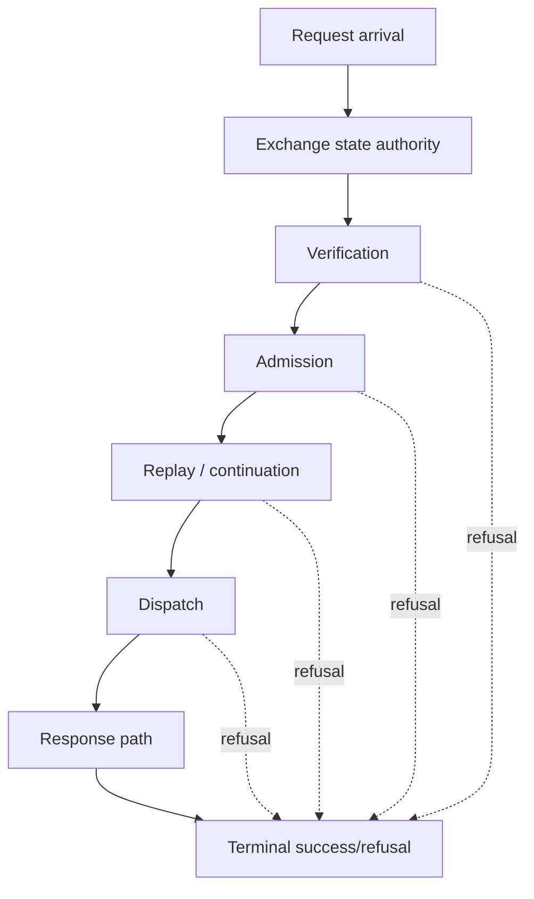

<!-- SPDX-License-Identifier: Apache-2.0 -->

# Component Blueprint: Exchange Lifecycle

**Status:** First-pass design. Builds on the landed hierarchical exchange state machine.

## 1. Purpose

Make one state authority own the complete request/response exchange lifecycle, including success and refusal paths, so the procedural serving code cannot implement a second ordering beside the machine.

## 2. Governing model

The exchange machine is hierarchical in the semantic sense: parent state constrains the legality of transitions in request and response regions. Object containment is not required.



## 3. Authority

### Owns

- legal phase ordering for one exchange;
- which transitions are possible from each state;
- terminality of successful and refused exchanges;
- relation between request and response regions;
- lifecycle evidence needed to prove no stage is skipped or repeated illegally.

### Does not own

- the internal semantics of verification, admission, replay, dispatch, or signing;
- backend implementation details;
- transport connection lifetime.

## 4. Integration rule

Serving code SHALL be subordinate to the exchange machine. The machine must not be a parallel bookkeeping object that procedural code remembers to advance.

Desired direction:

```text
state operation
    -> authorizes/produces effect request
        -> effect executes
            -> typed transition/result
```

Undesired direction:

```text
procedural code does work
    -> remembers to call advance()
```

## 5. Refusal coverage

The lifecycle must begin early enough that every meaningful refusal belongs to the exchange model. A refusal before machine construction is outside the claimed lifecycle and must either move under the machine or be explicitly defined as a pre-exchange transport refusal.

Refusal precedence remains:

```text
existence
 -> local validity / meaningfulness
 -> internal coherence
 -> cross-machine compatibility
 -> build/runtime establishment
```

where applicable to the current layer.

## 6. Tests and theorems

- transition relation completeness;
- illegal transition negative controls;
- all terminal outcomes reachable only through legal paths;
- every admitted request passes required stages exactly as specified;
- refused paths cannot accidentally proceed to dispatch or unsigned response handling;
- machine and production execution have one transition authority, not duplicated tables/orderings.

## 7. Completion criteria

- no independent procedural ordering duplicates the exchange relation;
- every production request/refusal is either inside the exchange lifecycle or explicitly classified as pre-exchange transport handling;
- tests derive from the same transition authority rather than duplicating a second transition table;
- composition theorems can attach to stable transition boundaries;
- serving code becomes simpler because legality is owned by the machine rather than remembered by the orchestrator.
