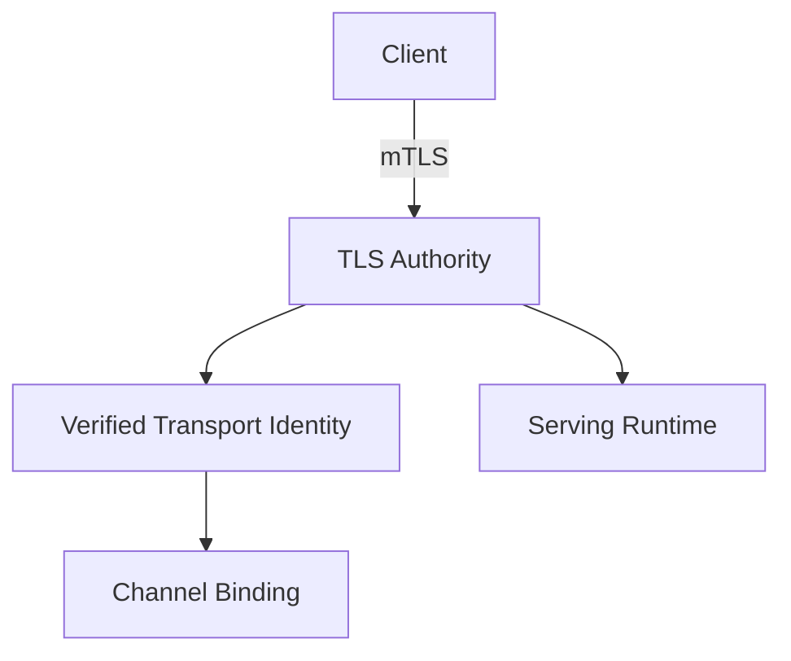
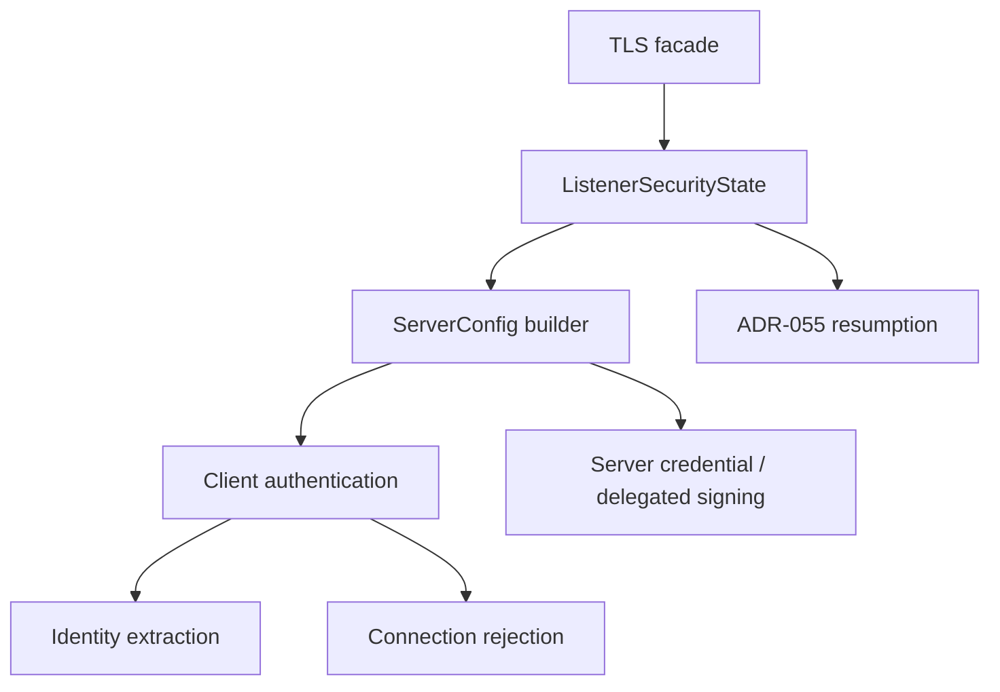

<!-- SPDX-License-Identifier: Apache-2.0 -->

# Component Blueprint: TLS & Transport Identity

**Status:** First-pass design. Incorporates ADR-MCPRE-055 by reference rather than restating it.

**Scope split:** this document owns the **target** design. Current sealed state lives in [`docs/dev/sealed-owners.md`](../../dev/sealed-owners.md) (ADR-061 §13.1). §13 is the diff.

## 1. Purpose

Establish authenticated transport channels, verified client-certificate identity, credential lifetime limits, client revocation posture, and listener-lifetime TLS security state.

## 2. Authority

### Owns

- rustls server configuration construction;
- client-certificate verification posture;
- direct locally terminated mTLS identity extraction;
- connection admission/rejection predicates that belong to TLS credentials;
- listener-lifetime session-resumption state as governed by ADR-MCPRE-055;
- delegated server-credential TLS construction where configured.

### Does not own

- HTTP evidence verification;
- application dispatch;
- replay/admission decisions unrelated to TLS;
- request identity from arbitrary forwarded headers;
- a blocking test harness merely because it uses TLS (`blocking_mtls_harness`, §8).

## 3. Position in the system



## 4. Internal hierarchy



## 5. Listener-lifetime authority

The listener lifetime, not an individual `ServerConfig` build, is the natural authority for session-resumption state and any other security mechanism that must survive config rebuilds.

**Resolved in MCPRE-137 by removal rather than by distinction.** This section previously said a one-shot builder had "weaker lifecycle semantics" and that the API should make the distinction explicit. The EX-004 census found there was no second capability to distinguish: *no production code called any of the four one-shot builders* — every caller was a test, some cross-crate. So the ambiguity is gone because the second family is gone. `TlsListenerSecurityState::new(anchors)` establishes a listener's state and every config is built through it; a caller wanting a single config creates a state and builds once, which is unmistakable because it is the only shape there is.

Candidate target shape:

```text
TlsListenerSecurityState
    -> build exported-key config
    -> rebuild exported-key config
    -> build delegated-key config
    -> rebuild delegated-key config
```

The exact type/API remains to be designed. This is step 2 of the ruled campaign order and is DESIGN-only until its own Go.

## 6. Transport identity

Production transport identity comes from the locally verified client certificate. No supported identity strategy may derive the authenticated transport identity from an arbitrary request header.

Identity extraction and channel binding should remain separate propositions:

```text
TLS certificate verification
    -> verified transport identity
        -> signer <-> identity binding
```

## 7. Connection credential window

The TLS authority must preserve the established relation that a connection cannot outlive the credential that authenticated it. Configuration types should own this relation rather than relying on a distant cross-machine comparison that can be bypassed by re-pairing raw durations.

`ClientCredentialWindow` is already sealed for this, projecting `cert_lifetime()`, `connection_age()`, and `exposure_window()`.

## 8. Blocking harness boundary

The blocking mTLS + hand-rolled HTTP/1 harness is not the shipped MCP-RE serving path. It lives in `mcp-re-proxy/src/blocking_mtls_harness/`, outside the TLS security authority — **done, MCPRE-138 (#574)**.

Relocation was justified by ownership, not by LOC reduction. `serve`, `serve_once` and `serve_once_with_assertion` have no in-crate production caller — every caller is a test or an external embedder — which is what makes them a harness rather than a serving path. It is not on its own a reason to delete them (ADR-061 §2 class 4 — zero production callers is not a deletion argument), so they are retained and still exported from the crate root, with `blocking_mtls_harness` as their provenance.

What moved is the capability, whole: the entry points, the accept loop, the per-connection sequence, the deadline wrapper and the HTTP/1 framing. What did **not** move is any authentication policy. The harness holds the live `ServerConnection`, so it is the only code that can produce a peer chain from one, but every decision taken from that chain is called here: `resolve_identity_from_leaf`, `cert_lifetime_rejection_for_chain`, `ocsp_rejection_for_chain`, `routing_header_rejection`, `assertion_header`. `ocsp_rejection` was reshaped to its chain form rather than moved, precisely so the online-OCSP fail-closed policy stayed in the authority.

Every per-request decision in this component now takes the chain as an argument, so the blocking and async paths reach the same verdict from the same input, and who holds the connection is not part of the decision. The measurement is EX-004's post-#574 re-census.

## 9. Assurance hierarchy

- local: every verifier construction denies unknown revocation status;
- local: identity extraction uses one configured certificate field with no fallback;
- relation: connection age <= client credential lifetime where the credential window is enabled;
- ADR-055: resumption is valid only while the authentication epoch remains current;
- composition: serving obtains transport identity only from the TLS authority.

## 10. Theorem inventory

Registry: [`verification/policy/theorems.toml`](../../../verification/policy/theorems.toml). Referenced, not restated (ADR-061 §12).

| proposition | scope | evidence/unit | status |
|---|---|---|---|
| No validated deployment enables online OCSP client-certificate revocation | configuration legality | THM-0013 · `unit://proxy.online_ocsp_reachability` | in registry |
| Fail-closed revocation is a property of the verifier type, not a constructor argument | local | type-level — a verifier that admits unknown revocation status is unconstructible | structural, no registry entry |
| **Resumption is offered only while the authentication epoch is current** (ADR-055) | listener lifetime | `EpochBoundSessionStore` + `TlsAuthEpoch::compute`; test below | **structural + tested, not stated as a theorem** |
| **A connection cannot outlive the credential that authenticated it** | relation | `ClientCredentialWindow` projections | **sealed, no registry entry** |
| **Transport identity is derived only from the verified client certificate** | composition | none | **gap** |

Three of five are real properties with no registry entry. That is the honest state, and it is what ADR-061 §12's "attach the theorem to the smallest authority that establishes it" is for — not a reason to weaken the claims, a list of theorems worth writing.

## 11. Test/evidence inventory

| property | test/evidence | lane | negative control |
|---|---|---|---|
| mTLS handshake, client-cert verification, rejection | `mcp-re-proxy/tests/integration/tls_test.rs` | `//mcp-re-proxy:integration_test` | unverified client rejected |
| Store-level epoch binding (ADR-055 threat, retained by ADR-062) | `src/tls_listener_state/resumption_acceptance.rs` | `//mcp-re-proxy:proxy_unit_test` | resumption refused after epoch change — a claim about the STORE |
| Listener-scoped resumption (ADR-062) | `src/tls_listener_state/mod.rs` tests, probes T01–T04 | `//mcp-re-proxy:proxy_unit_test`; `tools/verification/verify-mutations` | a different anchor set gets its own empty store; each probe turns a declared control red |
| Channel binding to transport identity | `tests/integration/mtls_transport_binding_test.rs` | `//mcp-re-proxy:integration_test` (uses the `test-fixtures` dev feature) | binding mismatch refused |
| Client leg end to end | `tests/integration_async/mtls_client_leg_e2e_test.rs` | `async_serve`; `//mcp-re-proxy:integration_async_test` | — |
| Per-request revocation | `tests/integration_async/per_request_revocation_test.rs` | `async_serve` | revoked client refused |
| CRL freshness / posture | unit tests in `mcp-re-proxy/src/tls.rs` | `//mcp-re-proxy:proxy_unit_test` | stale CRL refused |
| OCSP responder end to end | `tests/integration_ext/ocsp_e2e_test.rs` | `_PROXY_EXT_FEATURES`; `//mcp-re-proxy:integration_ext_test` | — |
| Deliberate client-verification break is detected | `tests/fault_injection_test.rs` | `fault_accept_any_client`; `//mcp-re-proxy:fault_injection_test` | **this is the negative control for the whole component** — never enabled in the default `bazel test //...` |
| Throughput of the real listener | `tests/tls_load_harness_bench.rs` | `#![cfg(feature = "redis_replay")]` — run via `scripts/local_slo_lane.sh` **only** | `scripts/slo_invocation_gate.py` fails the build if the `-- --ignored` form returns |

The last row is ADR-061 §2 class 8 in this component: the harness is not `#[ignore]`d, so `-- --ignored` selects zero tests and exits 0. Never cite an SLO number that did not come from `scripts/local_slo_lane.sh` on a quiet box.

## 12. Implementation map

Re-measured by the ADR-061 §5.1 rule after MCPRE-138 (`scripts/module_size_gate.py::production_lines`), not carried forward.

| file | prod | current role | target role |
|---|---:|---|---|
| `mcp-re-proxy/src/tls.rs` | 1068 | the six authorities EX-004's re-census names | TLS authority facade over a private subtree |
| `mcp-re-proxy/src/blocking_mtls_harness/` | 554 | the blocking mTLS + HTTP/1 harness, four modules, all under the threshold | as-is — a consumer of the authority, not part of it |
| `mcp-re-proxy/src/tls_listener_state/auth_epoch.rs` | 270 | `TlsAuthEpoch`, `SharedTlsAuthEpoch`, `EpochBoundSessionStore` | private subordinate of the listener-lifetime state — pre-existing debt, still unreviewed |
| `mcp-re-proxy/src/tls_plane.rs` | 623 | seeds and rebuilds through `TlsListenerSecurityState` | as-is |
| `mcp-re-proxy/src/delegated_tls.rs` | 313 | delegated server-credential resolver | private subordinate |
| `mcp-re-proxy/src/transport.rs` | 1305 | transport binding and identity | separate authority; band-3 hotspot in its own right |
| `mcp-re-proxy/src/handshake_quota.rs` | 178 | handshake admission quota | private subordinate |
| `mcp-re-proxy/src/client_revocation.rs` | 263 | CRL plan consumption | private subordinate |
| `mcp-re-proxy/src/ocsp.rs` | 1271 | full RFC 6960 responder + client | separate authority behind `online_ocsp`; band-3 hotspot |

`tls.rs` at 1068 production lines (1907 before MCPRE-137, 1565 before MCPRE-138) is still an ADR-061 §5.3 band-3 hotspot (>1,000): authority census required before substantial new functionality, and EX-004's re-census is that census. `transport.rs` and `ocsp.rs` are the same band and are *not* covered by this blueprint's target; each needs its own.

## 13. Known deviations

1. ~~**The listener-lifetime authority is implicit.**~~ **CLOSED by MCPRE-137.** `TlsListenerSecurityState` owns the anchors, the epoch they digest to, the epoch-tagged session cache and the handshake-signature budget. The seal is a module TREE — `assembly`, `auth_epoch`, `client_verifier`, `resumption_binding` and the handshake acceptance all live BENEATH the owner as `pub(super)`, because `pub(crate)` seals against nobody when every consumer is in the crate. The census record is EX-004 in [`../review-dispositions.md`](../review-dispositions.md); the owner, its projections and the one residual are in [`../../dev/sealed-owners.md`](../../dev/sealed-owners.md).

   The guarantee is about CONSTRUCTION: no MCP-RE path can build a config whose cache is unrelated to the anchors its verifier was built from. `rustls::ServerConfig::session_storage` is a public field of a foreign type, so a holder of a config can still overwrite it — that lies outside the guarantee and is recorded rather than papered over.

   **What the census found that this section did not say.** Within a production listener the anchor set is IMMUTABLE, so the authentication epoch is a construction-time constant and `republish`'s change branch never fires outside a test. What protects an anchor-set change is that new anchors make a new listener with a new, empty store — cache non-continuity, not epoch advance. Three propositions must therefore be kept apart, and only the first two have evidence today:

   | | proposition | established by |
   |---|---|---|
   | 1 | if the current epoch changes, sessions tagged with the old one are not returned | `tls_listener_state::auth_epoch`, and the real-handshake acceptance in `tls_listener_state::resumption_acceptance` — moved INSIDE the seal, because keeping it an integration test would have kept the subordinates `pub` |
   | 2 | replacing the anchor set replaces the listener and therefore the store | `tls_listener_state::tests` |
   | 3 | a production listener's epoch ADVANCES when its anchors change | **nothing — no anchor-reload path exists** |

   Proposition 1 is a claim about the store and must never be read as evidence for proposition 3.

   **The lifecycle is now RULED.** [ADR-MCPRE-062](https://github.com/matssun/mcp-re/discussions/599) supersedes ADR-055 and selects **immutable listener / store replacement**: a resumption store is scoped to exactly one immutable client-trust-anchor set, and changing that set establishes a new listener security state with a new store. Three states must stay distinct in every later document:

   ```text
   ADR-062 DECISION      A is accepted
   MCPRE-137 (#573)      conforms to A structurally; exposes no epoch mutation
                         does NOT retire ADR-055's dormant live-epoch machinery
   #598 REMAINING        retire/re-scope that machinery, and its theorem consequences
   ```

2. **`transport.rs` (1305) and `ocsp.rs` (1271) are band-3 units with no blueprint.** They are named here so their absence is a recorded gap rather than an implied claim of coverage.

3. **Three properties in §10 have no theorem.** Structural and tested is not the same as stated.

## 14. Completion criteria

- ~~listener-lifetime security state is explicitly owned by a type~~ — done, `TlsListenerSecurityState` (MCPRE-137);
- ~~one-shot vs rebuildable semantics are impossible to confuse in the API~~ — done, by removing the one-shot family the census found had no production caller (MCPRE-137);
- ~~blocking harness is outside the TLS authority if retained~~ — done, `blocking_mtls_harness` (MCPRE-138);
- ~~no test-only consumer forces a misleading production export~~ — done, the harness entry points are exported from their own module (MCPRE-138);
- TLS authority has a narrow facade and private subordinate implementation tree;
- the resumption property and the credential-window relation are stated in the theorem registry with correct scope — under ADR-062 the resumption row is listener/store NON-CONTINUITY, not live epoch advancement (see the #581 note);
- exact cargo/Bazel feature lanes cover exported-key, delegated-key, revocation, resumption, and async serving paths, each named per §11.
