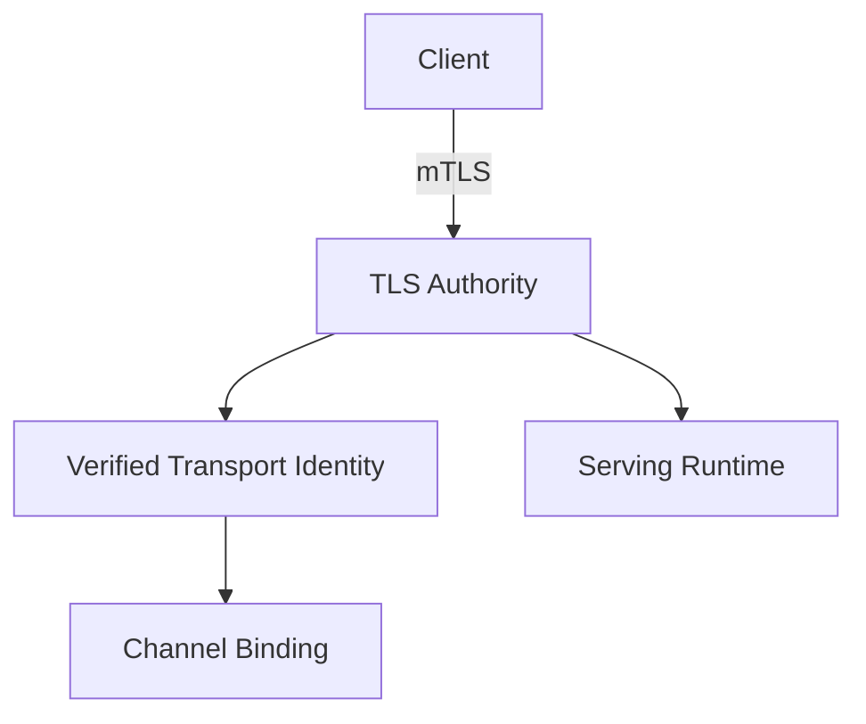
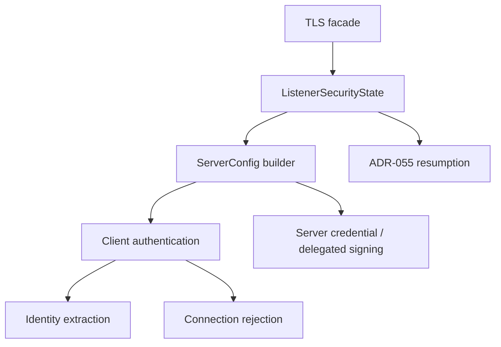

<!-- SPDX-License-Identifier: Apache-2.0 -->

# Component Blueprint: TLS & Transport Identity

**Status:** First-pass design. Incorporates ADR-MCPRE-055 by reference rather than restating it.

**Scope split:** this document owns the **target** design. Current sealed state lives in [`docs/dev/sealed-owners.md`](../../dev/sealed-owners.md) (ADR-061 §13.1). §13 is the diff.

## 1. Purpose

Establish authenticated transport channels, verified client-certificate identity, credential lifetime limits, client revocation posture, and listener-lifetime TLS security state.

## 2. Authority

### Owns

- rustls server configuration construction;
- client-certificate verification posture;
- direct locally terminated mTLS identity extraction;
- connection admission/rejection predicates that belong to TLS credentials;
- listener-lifetime session-resumption state as governed by ADR-MCPRE-055;
- delegated server-credential TLS construction where configured.

### Does not own

- HTTP evidence verification;
- application dispatch;
- replay/admission decisions unrelated to TLS;
- request identity from arbitrary forwarded headers;
- a blocking test harness merely because it uses TLS.

## 3. Position in the system



## 4. Internal hierarchy



## 5. Listener-lifetime authority

The listener lifetime, not an individual `ServerConfig` build, is the natural authority for session-resumption state and any other security mechanism that must survive config rebuilds.

A one-shot builder that creates a fresh empty resumption state is conservative but has weaker lifecycle semantics. The API should make this distinction explicit rather than allowing an obvious builder name to obscure it.

Candidate target shape:

```text
TlsListenerSecurityState
    -> build exported-key config
    -> rebuild exported-key config
    -> build delegated-key config
    -> rebuild delegated-key config
```

The exact type/API remains to be designed. This is step 2 of the ruled campaign order and is DESIGN-only until its own Go.

## 6. Transport identity

Production transport identity comes from the locally verified client certificate. No supported identity strategy may derive the authenticated transport identity from an arbitrary request header.

Identity extraction and channel binding should remain separate propositions:

```text
TLS certificate verification
    -> verified transport identity
        -> signer <-> identity binding
```

## 7. Connection credential window

The TLS authority must preserve the established relation that a connection cannot outlive the credential that authenticated it. Configuration types should own this relation rather than relying on a distant cross-machine comparison that can be bypassed by re-pairing raw durations.

`ClientCredentialWindow` is already sealed for this, projecting `cert_lifetime()`, `connection_age()`, and `exposure_window()`.

## 8. Blocking harness boundary

The legacy blocking mTLS + hand-rolled HTTP/1 harness is not the shipped MCP-RE serving path. If retained for cross-crate tests or embedding, it belongs in a semantically named harness/compatibility component rather than inside the TLS security authority.

Relocation is justified by ownership, not by LOC reduction. Measured on `main` @ `527b1ac`: `serve`, `serve_once`, and `serve_once_with_assertion` are re-exported from `lib.rs` and have **no in-crate production caller** — every caller is a test or an external embedder. That is what makes them a harness rather than a serving path; it is not on its own a reason to delete them (ADR-061 §2 class 4 — zero production callers is not a deletion argument).

This is step 3 of the ruled campaign order.

## 9. Assurance hierarchy

- local: every verifier construction denies unknown revocation status;
- local: identity extraction uses one configured certificate field with no fallback;
- relation: connection age <= client credential lifetime where the credential window is enabled;
- ADR-055: resumption is valid only while the authentication epoch remains current;
- composition: serving obtains transport identity only from the TLS authority.

## 10. Theorem inventory

Registry: [`verification/policy/theorems.toml`](../../../verification/policy/theorems.toml). Referenced, not restated (ADR-061 §12).

| proposition | scope | evidence/unit | status |
|---|---|---|---|
| No validated deployment enables online OCSP client-certificate revocation | configuration legality | THM-0013 · `unit://proxy.online_ocsp_reachability` | in registry |
| Fail-closed revocation is a property of the verifier type, not a constructor argument | local | type-level — a verifier that admits unknown revocation status is unconstructible | structural, no registry entry |
| **Resumption is offered only while the authentication epoch is current** (ADR-055) | listener lifetime | `EpochBoundSessionStore` + `TlsAuthEpoch::compute`; test below | **structural + tested, not stated as a theorem** |
| **A connection cannot outlive the credential that authenticated it** | relation | `ClientCredentialWindow` projections | **sealed, no registry entry** |
| **Transport identity is derived only from the verified client certificate** | composition | none | **gap** |

Three of five are real properties with no registry entry. That is the honest state, and it is what ADR-061 §12's "attach the theorem to the smallest authority that establishes it" is for — not a reason to weaken the claims, a list of theorems worth writing.

## 11. Test/evidence inventory

| property | test/evidence | lane | negative control |
|---|---|---|---|
| mTLS handshake, client-cert verification, rejection | `mcp-re-proxy/tests/integration/tls_test.rs` | `//mcp-re-proxy:integration_test` | unverified client rejected |
| Epoch-bound resumption (ADR-055) | `tests/integration/tls_epoch_resumption_test.rs` | `//mcp-re-proxy:integration_test` | resumption refused after epoch change |
| Channel binding to transport identity | `tests/integration/mtls_transport_binding_test.rs` | `//mcp-re-proxy:integration_test` (uses the `test-fixtures` dev feature) | binding mismatch refused |
| Client leg end to end | `tests/integration_async/mtls_client_leg_e2e_test.rs` | `async_serve`; `//mcp-re-proxy:integration_async_test` | — |
| Per-request revocation | `tests/integration_async/per_request_revocation_test.rs` | `async_serve` | revoked client refused |
| CRL freshness / posture | unit tests in `mcp-re-proxy/src/tls.rs` | `//mcp-re-proxy:proxy_unit_test` | stale CRL refused |
| OCSP responder end to end | `tests/integration_ext/ocsp_e2e_test.rs` | `_PROXY_EXT_FEATURES`; `//mcp-re-proxy:integration_ext_test` | — |
| Deliberate client-verification break is detected | `tests/fault_injection_test.rs` | `fault_accept_any_client`; `//mcp-re-proxy:fault_injection_test` | **this is the negative control for the whole component** — never enabled in the default `bazel test //...` |
| Throughput of the real listener | `tests/tls_load_harness_bench.rs` | `#![cfg(feature = "redis_replay")]` — run via `scripts/local_slo_lane.sh` **only** | `scripts/slo_invocation_gate.py` fails the build if the `-- --ignored` form returns |

The last row is ADR-061 §2 class 8 in this component: the harness is not `#[ignore]`d, so `-- --ignored` selects zero tests and exits 0. Never cite an SLO number that did not come from `scripts/local_slo_lane.sh` on a quiet box.

## 12. Implementation map

Measured by the ADR-061 §5.1 rule on `main` @ `fede93b` (`scripts/module_size_gate.py::production_lines`).

| file | prod | current role | target role |
|---|---:|---|---|
| `mcp-re-proxy/src/tls.rs` | 1907 | everything below, in one module — 18 public items | TLS authority facade over a private subtree |
| `mcp-re-proxy/src/tls_auth_epoch.rs` | 270 | `TlsAuthEpoch`, `SharedTlsAuthEpoch`, `EpochBoundSessionStore` | private subordinate of the listener-lifetime state |
| `mcp-re-proxy/src/tls_plane.rs` | 679 | holds the resumption state across rebuilds — the de facto listener lifetime | the explicit `TlsListenerSecurityState` owner of §5 |
| `mcp-re-proxy/src/delegated_tls.rs` | 313 | delegated server-credential resolver | private subordinate |
| `mcp-re-proxy/src/transport.rs` | 1305 | transport binding and identity | separate authority; band-3 hotspot in its own right |
| `mcp-re-proxy/src/handshake_quota.rs` | 178 | handshake admission quota | private subordinate |
| `mcp-re-proxy/src/client_revocation.rs` | 263 | CRL plan consumption | private subordinate |
| `mcp-re-proxy/src/ocsp.rs` | 1271 | full RFC 6960 responder + client | separate authority behind `online_ocsp`; band-3 hotspot |

`tls.rs` at 1907 production lines is an ADR-061 §5.3 band-3 hotspot (>1,000): authority census required before substantial new functionality. `transport.rs` and `ocsp.rs` are the same band and are *not* covered by this blueprint's target; each needs its own.

## 13. Known deviations

1. **The listener-lifetime authority is implicit.** `tls_plane.rs:108` calls `tls::new_resumption_state(&client_ca)` and holds the result across rebuilds — so the listener lifetime *is* the resumption authority in practice, but no type says so. Meanwhile `RustlsDirectProvider::build_server_config` creates its **own** fresh state internally, and the function that does it carries a doc comment admitting the consequence: a state created per build "pairs a fresh epoch with a fresh empty cache, which discards every resumable session on each rebuild and leaves the epoch unable to move." Two builders with near-identical names differ in whether ADR-055's epoch is a live lever or a constant. That is §5, stated by the code against itself.

2. **The blocking harness is inside the security authority** — §8.

3. **`transport.rs` (1305) and `ocsp.rs` (1271) are band-3 units with no blueprint.** They are named here so their absence is a recorded gap rather than an implied claim of coverage.

4. **Three properties in §10 have no theorem.** Structural and tested is not the same as stated.

## 14. Completion criteria

- listener-lifetime security state is explicitly owned by a type, not by whichever caller happens to hold the `Arc`;
- one-shot vs rebuildable semantics are impossible to confuse in the API;
- blocking harness is outside the TLS authority if retained;
- no test-only consumer forces a misleading production export;
- TLS authority has a narrow facade and private subordinate implementation tree;
- the ADR-055 resumption property and the credential-window relation are stated in the theorem registry with correct scope;
- exact cargo/Bazel feature lanes cover exported-key, delegated-key, revocation, resumption, and async serving paths, each named per §11.
