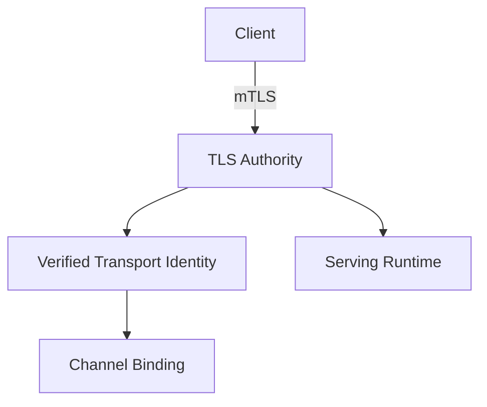
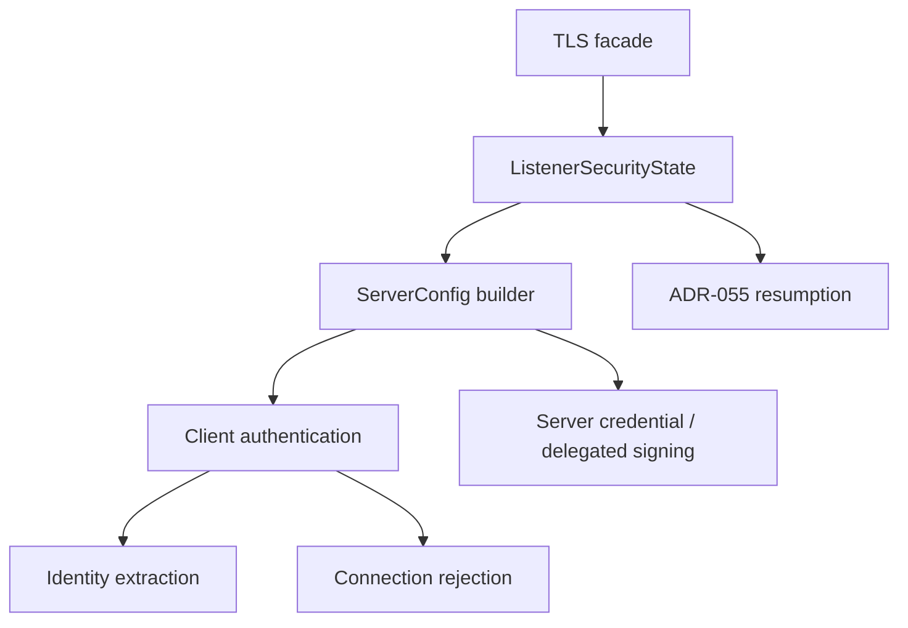

<!-- SPDX-License-Identifier: Apache-2.0 -->

# Component Blueprint: TLS & Transport Identity

**Status:** First-pass design. Incorporates ADR-MCPRE-055 by reference rather than restating it.

## 1. Purpose

Establish authenticated transport channels, verified client-certificate identity, credential lifetime limits, client revocation posture, and listener-lifetime TLS security state.

## 2. Authority

### Owns

- rustls server configuration construction;
- client-certificate verification posture;
- direct locally terminated mTLS identity extraction;
- connection admission/rejection predicates that belong to TLS credentials;
- listener-lifetime session-resumption state as governed by ADR-MCPRE-055;
- delegated server-credential TLS construction where configured.

### Does not own

- HTTP evidence verification;
- application dispatch;
- replay/admission decisions unrelated to TLS;
- request identity from arbitrary forwarded headers;
- a blocking test harness merely because it uses TLS.

## 3. Position in the system



## 4. Internal hierarchy



## 5. Listener-lifetime authority

The listener lifetime, not an individual `ServerConfig` build, is the natural authority for session-resumption state and any other security mechanism that must survive config rebuilds.

A one-shot builder that creates a fresh empty resumption state is conservative but has weaker lifecycle semantics. The API should make this distinction explicit rather than allowing an obvious builder name to obscure it.

Candidate target shape:

```text
TlsListenerSecurityState
    -> build exported-key config
    -> rebuild exported-key config
    -> build delegated-key config
    -> rebuild delegated-key config
```

The exact type/API remains to be designed.

## 6. Transport identity

Production transport identity comes from the locally verified client certificate. No supported identity strategy may derive the authenticated transport identity from an arbitrary request header.

Identity extraction and channel binding should remain separate propositions:

```text
TLS certificate verification
    -> verified transport identity
        -> signer <-> identity binding
```

## 7. Connection credential window

The TLS authority must preserve the established relation that a connection cannot outlive the credential that authenticated it. Configuration types should own this relation rather than relying on a distant cross-machine comparison that can be bypassed by re-pairing raw durations.

## 8. Blocking harness boundary

The legacy blocking mTLS + hand-rolled HTTP/1 harness is not the shipped MCP-RE serving path. If retained for cross-crate tests or embedding, it belongs in a semantically named harness/compatibility component rather than inside the TLS security authority.

Relocation is justified by ownership, not by LOC reduction.

## 9. Assurance hierarchy

- local: every verifier construction denies unknown revocation status;
- local: identity extraction uses one configured certificate field with no fallback;
- relation: connection age <= client credential lifetime where the credential window is enabled;
- ADR-055: resumption is valid only while the authentication epoch remains current;
- composition: serving obtains transport identity only from the TLS authority.

## 10. Completion criteria

- listener-lifetime security state is explicitly owned;
- one-shot vs rebuildable semantics are impossible to confuse in the API;
- blocking harness is outside the TLS authority if retained;
- no test-only consumer forces a misleading production export;
- TLS authority has a narrow facade and private subordinate implementation tree;
- exact cargo/Bazel feature lanes cover exported-key, delegated-key, revocation, resumption, and async serving paths.
