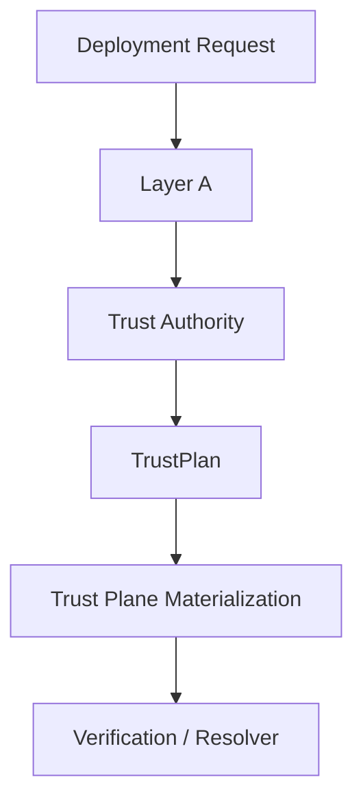
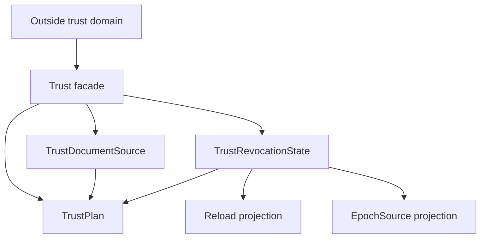

<!-- SPDX-License-Identifier: Apache-2.0 -->

# Component Blueprint: Trust & Revocation

**Status:** First-pass design. Refine against current `main` before implementation work.

## 1. Purpose

Establish which request/response signing authorities are trusted, how revocation and trust changes propagate, and what validated trust capabilities runtime composition may consume.

## 2. Authority

### Owns

- trust-document locator semantics as a validated source fact;
- trust-revocation posture and required witnesses;
- reload cadence semantics owned by the revocation state;
- networked epoch-source legality and paired locator/key witness;
- owner-defined `TrustPlan` projection.

### Does not own

- filesystem existence or trust-document contents before materialization;
- response-signing custody;
- replay semantics;
- generic deployment topology;
- the runtime success of external stores or files.

## 3. Position in the system



## 4. Internal hierarchy



Subordinate classification and projection helpers should be private to the trust subtree. Consumers should receive `TrustPlan` or narrow projections, not raw representations.

## 5. Key ownership rules

- `TrustRevocationState` owns whether a reload cadence is required and the normalized cadence itself.
- `TrustPlan` must derive reload semantics from the revocation owner; it must not store a separately editable copy.
- Trust locator and revocation posture are independently owned facts that may be composed, but once composed their relationship must not be freely re-widened.
- Epoch URL and epoch key are a paired semantic source when networked epoch mode is selected.

## 6. Materialization boundary

Layer A establishes legal trust configuration. Materialization establishes environmental/runtime facts such as file readability, parseability, and backend reachability.

Do not claim that a `TrustDocumentSource` proves the file exists or contains valid trust anchors.

## 7. Assurance hierarchy

Candidate theorem/test structure:

```text
local: successful TrustRevocationState construction implies its required witnesses hold
local: networked epoch state always carries paired URL + key
relation: TrustPlan reload behavior is a projection of TrustRevocationState, never a second authority
composition: trust materialization consumes only TrustPlan/owner projections
system: verification resolves actors only through the materialized trust authority
```

## 8. Known current lessons

The previous design allowed `TrustPlan` to store a reload value independent from the revocation state, permitting contradictory fixtures. That defect class must remain impossible by construction.

## 9. Completion criteria

- no composition code rereads trust semantics from `DeploymentRequest`;
- no independently editable reload copy exists downstream of `TrustRevocationState`;
- trust source and revocation state have explicit owners;
- materialization/environmental failures remain distinct from Layer-A legality;
- public/crate-visible APIs expose only intentional trust capabilities;
- theorem and test mappings identify exact evidence lanes.
