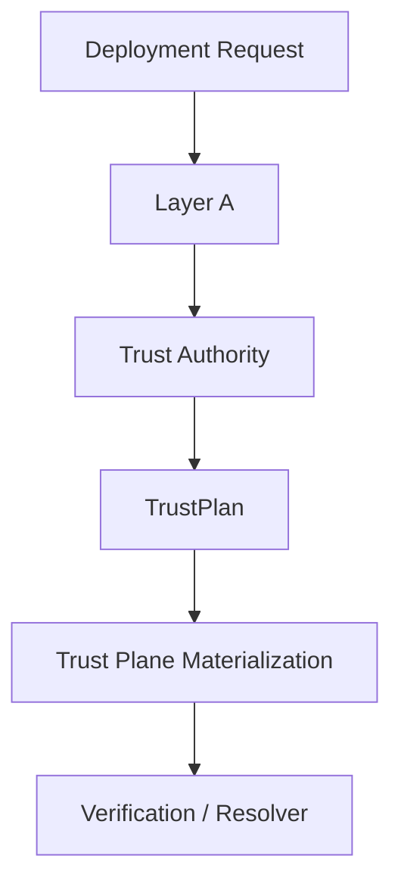
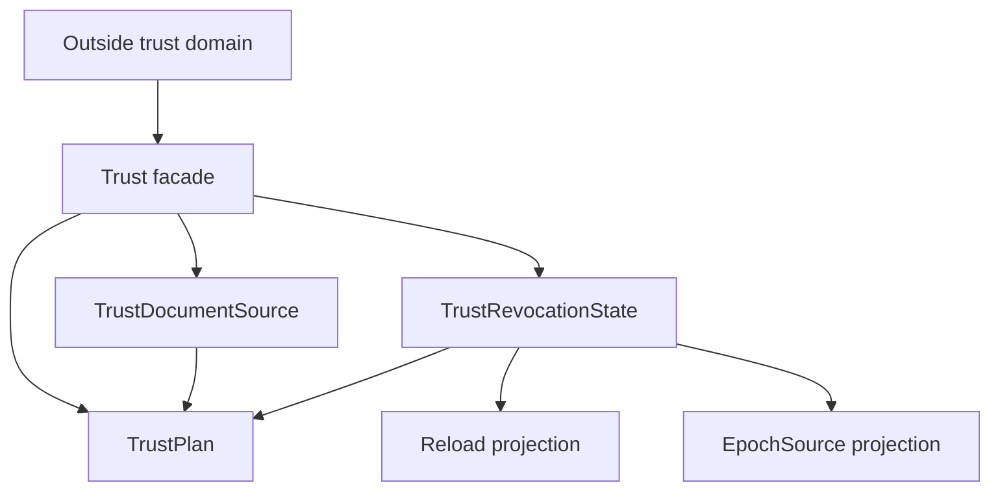

<!-- SPDX-License-Identifier: Apache-2.0 -->

# Component Blueprint: Trust & Revocation

**Status:** First-pass design. Refine against current `main` before implementation work.

**Scope split:** this document owns the **target** design. Current sealed state lives in [`docs/dev/sealed-owners.md`](../../dev/sealed-owners.md) (ADR-061 §13.1). §11 is the diff.

## 1. Purpose

Establish which request/response signing authorities are trusted, how revocation and trust changes propagate, and what validated trust capabilities runtime composition may consume.

## 2. Authority

### Owns

- trust-document locator semantics as a validated source fact;
- trust-revocation posture and required witnesses;
- reload cadence semantics owned by the revocation state;
- networked epoch-source legality and paired locator/key witness;
- owner-defined `TrustPlan` projection.

### Does not own

- filesystem existence or trust-document contents before materialization;
- response-signing custody;
- replay semantics;
- generic deployment topology;
- the runtime success of external stores or files.

## 3. Position in the system



## 4. Internal hierarchy



Subordinate classification and projection helpers should be private to the trust subtree. Consumers should receive `TrustPlan` or narrow projections, not raw representations.

## 5. Key ownership rules

- `TrustRevocationState` owns whether a reload cadence is required and the normalized cadence itself.
- `TrustPlan` must derive reload semantics from the revocation owner; it must not store a separately editable copy.
- Trust locator and revocation posture are independently owned facts that may be composed, but once composed their relationship must not be freely re-widened.
- Epoch URL and epoch key are a paired semantic source when networked epoch mode is selected.

## 6. Materialization boundary

Layer A establishes legal trust configuration. Materialization establishes environmental/runtime facts such as file readability, parseability, and backend reachability.

Do not claim that a `TrustDocumentSource` proves the file exists or contains valid trust anchors.

## 7. Assurance hierarchy

Candidate theorem/test structure:

```text
local: successful TrustRevocationState construction implies its required witnesses hold
local: networked epoch state always carries paired URL + key
relation: TrustPlan reload behavior is a projection of TrustRevocationState, never a second authority
composition: trust materialization consumes only TrustPlan/owner projections
system: verification resolves actors only through the materialized trust authority
```

## 8. Theorem inventory

Registry: [`verification/policy/theorems.toml`](../../../verification/policy/theorems.toml). Referenced, not restated (ADR-061 §12).

| proposition | scope | evidence/unit | status |
|---|---|---|---|
| No validated deployment enables online OCSP client-certificate revocation | configuration legality | THM-0013 · `unit://proxy.online_ocsp_reachability` | in registry |
| **Successful `TrustRevocationState` construction implies its required witnesses hold** | local | sealed constructor + `classify_and_validate` | **structural, no registry entry** |
| **Networked epoch state always carries a paired URL and key** | local | `EpochSource<'a>` projects `url()` and `key()` together; neither is separately reachable | **structural, no registry entry** |
| **`TrustPlan` reload is a projection, never a second authority** | relation | `TrustPlan::reload()` calls `trust_reload_plan(&self.revocation)` | **structural, no registry entry** |
| **Trust materialization consumes only owner projections** | composition | `tests/integration/composition_raw_read_test.rs` | tested, no registry entry |
| **Verification resolves actors only through the materialized trust authority** | system | none | **gap** |

Four of six are true by construction and unstated. `TrustRevocationState`'s sealing is the reason the first three hold; a theorem would add the *scope sentence* — what each does **not** establish — which is where this project has previously over-claimed.

## 9. Test/evidence inventory

| property | test/evidence | lane | negative control |
|---|---|---|---|
| Composition does not re-read trust semantics from the raw request | `mcp-re-proxy/tests/integration/composition_raw_read_test.rs` | `//mcp-re-proxy:integration_test` | a raw re-read fails the test |
| Configuration legality and refusal precedence | `tests/integration/config_legality_characterization_test.rs`, `config_refusal_precedence_test.rs` | `//mcp-re-proxy:integration_test` | illegal combinations refused in the stated order |
| Revocation wiring reaches the serving path | `tests/integration/revocation_serving_wiring_test.rs` | `//mcp-re-proxy:integration_test` | — |
| Per-request revocation | `tests/integration_async/per_request_revocation_test.rs` | `async_serve` | revoked signer refused |
| Shared trust epoch over Redis | `tests/integration_ext/redis_trust_epoch_e2e_test.rs` | `_PROXY_EXT_FEATURES`; `//mcp-re-proxy:integration_ext_test` — needs a live Redis | — |
| Root authority manifest / root-key lifecycle | `tests/integration_async/root_authority_manifest_test.rs`, `root_key_lifecycle_test.rs` | `async_serve` | — |
| Classifier witnesses | unit tests in `config_state/trust_revocation.rs` | `//mcp-re-proxy:proxy_unit_test` | contradictory witnesses refused |
| **Reload cadence cannot contradict the revocation tier** | `TrustPlan` has no reload field to set | compile-time | **the check was deleted, and that is the point** (ADR-061 §11 operational test) |

## 10. Implementation map

Measured by the ADR-061 §5.1 rule on `main` @ `527b1ac`.

| file | prod | current role | target role |
|---|---:|---|---|
| `mcp-re-proxy/src/config_state/trust_revocation.rs` | 433 | `TrustRevocationState`, `EpochSource`, `classify_and_validate` | the revocation fact owner — unchanged, already sealed |
| `mcp-re-proxy/src/config_state/trust_document.rs` | 83 | `TrustDocumentSource` | the locator fact owner — unchanged, already sealed |
| `mcp-re-proxy/src/startup_plan.rs` | 476 | hosts `TrustPlan` among other plans | `TrustPlan` moves to live **with its owner**; `startup_plan` re-exports |
| `mcp-re-proxy/src/trust_plane.rs` | 134 | materialization entry | trust facade |
| `mcp-re-proxy/src/trust_cache.rs` | 442 | cached resolution | private subordinate |
| `mcp-re-proxy/src/trust_epoch.rs` | 451 | shared epoch mechanism | private subordinate |
| `mcp-re-proxy/src/live_trust.rs` | 134 | live document reads | private subordinate |
| `mcp-re-proxy/src/push_trust.rs` | 244 | push channel | private subordinate |
| `mcp-re-proxy/src/reloading_trust.rs` | 182 | cadence-driven reload | private subordinate |
| `mcp-re-proxy/src/revocation_resolver.rs` | 78 | resolver seam | private subordinate |
| `mcp-re-proxy/src/revocation_tier.rs` | 186 | tier vocabulary | shared with TLS |

No file in this component is above the ADR-061 §5.3 mandatory-review threshold by a wide margin, and none is a hotspot. The open work here is **interface width and placement**, not size — this is the §7-of-ADR-061 case where a size-driven campaign would find nothing.

The measured fan-out is the signal instead: nine subordinate modules expose 51 public or `pub(crate)` items between them, and consumers reach several of them directly rather than through a facade.

## 11. Known deviations

1. **`TrustPlan` lives in `startup_plan.rs`, not with its owner.** The rule established by the sealing campaign is that a plan produced by an owner lives with that owner and `startup_plan` re-exports it; building it in the planner was the planner restating the owner's semantics. `TrustPlan` is the one composition in the sealed-owner table and is still in the planner file.

2. **No facade.** `trust_plane.rs` is the natural facade at 134 production lines, but `trust_cache`, `trust_epoch`, `live_trust`, `push_trust`, and `reloading_trust` are reachable independently. This is ADR-061 §3.4's undesired shape: modular physically, flat architecturally.

3. **Four structural properties have no theorem** — §8.

4. **The Redis trust-epoch lane needs a live backend**, so it is absent from a plain `cargo test --workspace`. A trust-propagation claim citing only the default lane is citing nothing (ADR-061 §2 class 8).

## 12. Historical note

The previous design allowed `TrustPlan` to store a reload value independent from the revocation state, permitting contradictory fixtures. That is **closed**: `TrustPlan::reload()` now derives the plan from the posture that decides it, and there is no field to set. Recorded here because the defect class must remain impossible by construction, not because it is open.

## 13. Completion criteria

- ✅ no composition code rereads trust semantics from `DeploymentRequest` (guarded by a test);
- ✅ no independently editable reload copy exists downstream of `TrustRevocationState`;
- ✅ trust source and revocation state have explicit owners;
- `TrustPlan` lives with its owner;
- the trust subtree has one facade and the nine subordinates are private to it;
- materialization/environmental failures remain distinct from Layer-A legality;
- public/crate-visible APIs expose only intentional trust capabilities;
- the four structural properties of §8 are stated in the theorem registry with correct scope sentences;
- theorem and test mappings identify exact evidence lanes.
