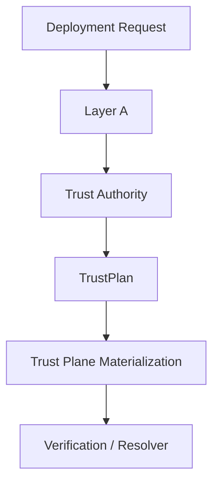
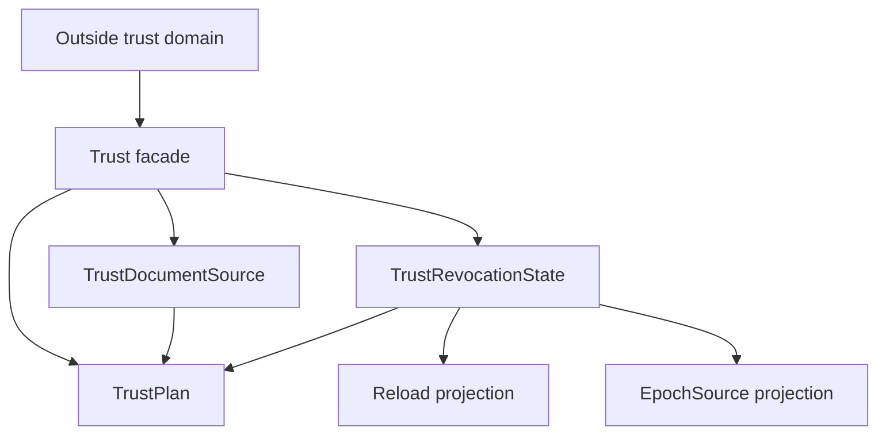

<!-- SPDX-License-Identifier: Apache-2.0 -->

# Component Blueprint: Trust & Revocation

**Status:** First-pass design. Refine against current `main` before implementation work.

**Scope split:** this document owns the **target** design. Current sealed state lives in [`docs/dev/sealed-owners.md`](../../dev/sealed-owners.md) (ADR-061 §13.1). §11 is the diff.

## 1. Purpose

Establish which request/response signing authorities are trusted, how revocation and trust changes propagate, and what validated trust capabilities runtime composition may consume.

## 2. Authority

### Owns

- trust-document locator semantics as a validated source fact;
- trust-revocation posture and required witnesses;
- reload cadence semantics owned by the revocation state;
- networked epoch-source legality and paired locator/key witness;
- owner-defined `TrustPlan` projection.

### Does not own

- filesystem existence or trust-document contents before materialization;
- response-signing custody;
- replay semantics;
- generic deployment topology;
- the runtime success of external stores or files.

## 3. Position in the system



## 4. Internal hierarchy



Subordinate classification and projection helpers should be private to the trust subtree. Consumers should receive `TrustPlan` or narrow projections, not raw representations.

## 5. Key ownership rules

- `TrustRevocationState` owns whether a reload cadence is required and the normalized cadence itself.
- `TrustPlan` must derive reload semantics from the revocation owner; it must not store a separately editable copy.
- Trust locator and revocation posture are independently owned facts that may be composed, but once composed their relationship must not be freely re-widened.
- Epoch URL and epoch key are a paired semantic source when networked epoch mode is selected.

## 6. Materialization boundary

Layer A establishes legal trust configuration. Materialization establishes environmental/runtime facts such as file readability, parseability, and backend reachability.

Do not claim that a `TrustDocumentSource` proves the file exists or contains valid trust anchors.

## 7. Assurance hierarchy

Candidate theorem/test structure:

```text
local: successful TrustRevocationState construction implies its required witnesses hold
local: networked epoch state always carries paired URL + key
relation: TrustPlan reload behavior is a projection of TrustRevocationState, never a second authority
composition: trust materialization consumes only TrustPlan/owner projections
system: verification resolves actors only through the materialized trust authority
```

## 8. Theorem inventory

Registry: [`verification/policy/theorems.toml`](../../../verification/policy/theorems.toml). Referenced, not restated (ADR-061 §12).

| proposition | scope | evidence/unit | status |
|---|---|---|---|
| No validated deployment enables online OCSP client-certificate revocation | configuration legality | THM-0013 · `unit://proxy.online_ocsp_reachability` | in registry |
| **Successful `TrustRevocationState` construction implies its required witnesses hold** | local | **THM-0035** · `unit://proxy.trust_configuration_state` | **in registry** |
| **Networked epoch state always carries a paired URL and key** | local | **THM-0036** · `unit://proxy.trust_configuration_state` | **in registry** |
| **`TrustPlan` reload is a projection, never a second authority** | relation | **THM-0037** · `unit://proxy.trust_plan` | **in registry** |
| **Trust materialization consumes only owner projections** | composition | **THM-0038** · `unit://proxy.trust_composition_root` | **in registry** |
| **Verification resolves actors only through the materialized trust authority** | system | none | **gap — still open** |

The four local and relational propositions were stated in MCPRE-146 / #582. What the entries
added is not the truth of the properties — the sealing already gives that — but the **scope
sentence**: what each does *not* establish. Every one of the four states, explicitly, that it
says nothing about the trust document existing, being readable, parsing, or holding a key this
deployment trusts. Layer A establishes legal trust **configuration**; materialization
establishes environmental facts, and the boundary between them is now written into the claims
rather than assumed by their readers.

Two of the four are worth reading for their *shape* rather than their content:

- **THM-0037's operative fact is an absence.** `TrustPlan` has no reload field, so there is
  nothing to set and no constructor through which a caller could supply a cadence beside a
  state that disagrees with it. The ADR-061 §11 operational test applies: deleting a check
  elsewhere cannot bring a contradictory inhabitant into existence, because the contradictory
  inhabitant is not representable. This one had already drifted once — a fixture naming a 30s
  reload beside a state carrying 5s — which is why it is stated as a structural claim and not
  a tested one.
- **THM-0038's evidence includes its own detection.** The composition guard is a source-text
  inventory, and `the_rule_would_catch_a_new_raw_read` is part of the declared battery: a rule
  that cannot detect the thing it forbids passes vacuously. Its scope says plainly that it is a
  source-text property and not a runtime one, and that a raw read reached through an alias, a
  helper in another file, or a macro is outside what it measures.

### The system-level proposition is still a gap, and was re-checked

*Verification resolves actors only through the materialized trust authority* has **no theorem
and no evidence**, re-confirmed against `main` at the time of writing. `http_profile_serve`
takes `resolve_actor: ActorResolver` as an injected seam, `app.rs` supplies one from
`build_actor_resolver`, and **no control in any default lane establishes that the resolver the
serving path receives is the one the materialized trust authority produced.** The only test in
the tree that touches `resolve_actor` at all is
`tests/integration_ext/redis_trust_epoch_e2e_test.rs`, which requires a live Redis and is
therefore not evidence a default lane can cite.

**The four entries above do not close it, and must not be read as narrowing it.** Each is
local, relational or composition-scoped; none reaches the wiring. Recording the obligation is
the honest outcome — a theorem whose evidence does not exist is precisely what the registry
exists to prevent — and closing it is implementation work that needs its own review, not a
by-product of this one.

## 9. Test/evidence inventory

| property | test/evidence | lane | negative control |
|---|---|---|---|
| Composition does not re-read trust semantics from the raw request | `mcp-re-proxy/tests/integration/composition_raw_read_test.rs` | `//mcp-re-proxy:integration_test` | a raw re-read fails the test |
| Configuration legality and refusal precedence | `tests/integration/config_legality_characterization_test.rs`, `config_refusal_precedence_test.rs` | `//mcp-re-proxy:integration_test` | illegal combinations refused in the stated order |
| Revocation wiring reaches the serving path | `tests/integration/revocation_serving_wiring_test.rs` | `//mcp-re-proxy:integration_test` | — |
| Per-request revocation | `tests/integration_async/per_request_revocation_test.rs` | `async_serve` | revoked signer refused |
| Shared trust epoch over Redis | `tests/integration_ext/redis_trust_epoch_e2e_test.rs` | `_PROXY_EXT_FEATURES`; `//mcp-re-proxy:integration_ext_test` — needs a live Redis | — |
| Root authority manifest / root-key lifecycle | `tests/integration_async/root_authority_manifest_test.rs`, `root_key_lifecycle_test.rs` | `async_serve` | — |
| Classifier witnesses | unit tests in `config_state/trust_revocation.rs` | `//mcp-re-proxy:proxy_unit_test` | contradictory witnesses refused |
| **Reload cadence cannot contradict the revocation tier** | `TrustPlan` has no reload field to set | compile-time | **the check was deleted, and that is the point** (ADR-061 §11 operational test) |

## 10. Implementation map

Measured by the ADR-061 §5.1 rule on `main` @ `fede93b` (`scripts/module_size_gate.py::production_lines`).

| file | prod | current role | target role |
|---|---:|---|---|
| `mcp-re-proxy/src/config_state/trust_revocation.rs` | 429 | `TrustRevocationState`, `EpochSource`, `classify_and_validate` | the revocation fact owner — unchanged, already sealed |
| `mcp-re-proxy/src/config_state/trust_document.rs` | 83 | `TrustDocumentSource` | the locator fact owner — unchanged, already sealed |
| `mcp-re-proxy/src/startup_plan.rs` | 476 | hosts `TrustPlan` among other plans | `TrustPlan` moves to live **with its owner**; `startup_plan` re-exports |
| `mcp-re-proxy/src/trust_plane.rs` | 690 | materialization entry | trust facade |
| `mcp-re-proxy/src/trust_cache.rs` | 442 | cached resolution | private subordinate |
| `mcp-re-proxy/src/trust_epoch.rs` | 451 | shared epoch mechanism | private subordinate |
| `mcp-re-proxy/src/live_trust.rs` | 134 | live document reads | private subordinate |
| `mcp-re-proxy/src/push_trust.rs` | 244 | push channel | private subordinate |
| `mcp-re-proxy/src/reloading_trust.rs` | 182 | cadence-driven reload | private subordinate |
| `mcp-re-proxy/src/revocation_resolver.rs` | 78 | resolver seam | private subordinate |
| `mcp-re-proxy/src/revocation_tier.rs` | 186 | tier vocabulary | shared with TLS |

One file is an ADR-061 §5.3 band-2 unit: `trust_plane.rs` at 690 production lines (>500, high-priority shallow-module investigation). Nothing here is a band-3 hotspot. The open work is mostly **interface width and placement** rather than size — largely the ADR-061 §7 case, where a campaign driven only by the size bands would under-report.

The measured fan-out is the signal instead: nine subordinate modules expose 51 public or `pub(crate)` items between them, and consumers reach several of them directly rather than through a facade.

## 11. Known deviations

1. **`TrustPlan` lives in `startup_plan.rs`, not with its owner.** The rule established by the sealing campaign is that a plan produced by an owner lives with that owner and `startup_plan` re-exports it; building it in the planner was the planner restating the owner's semantics. `TrustPlan` is the one composition in the sealed-owner table and is still in the planner file.

2. **No facade, and the candidate is itself a band-2 unit.** `trust_plane.rs` is the natural facade, but at 690 production lines it is not currently a thin one, and `trust_cache`, `trust_epoch`, `live_trust`, `push_trust`, and `reloading_trust` are reachable independently of it. This is ADR-061 §3.4's undesired shape: modular physically, flat architecturally.

   This number is also a measurement lesson. A first pass reported `trust_plane.rs` as **134** production lines by stopping at its first `#[cfg(test)]` attribute; the file has production code after that region, and the real figure is 690. `scripts/module_size_gate.py` counts every non-test region and its `--selftest` pins that case, because a counter that silently undercounts turns a band-2 unit into a rounding error.

3. **Four structural properties have no theorem** — §8.

4. **The Redis trust-epoch lane needs a live backend**, so it is absent from a plain `cargo test --workspace`. A trust-propagation claim citing only the default lane is citing nothing (ADR-061 §2 class 8).

## 12. Historical note

The previous design allowed `TrustPlan` to store a reload value independent from the revocation state, permitting contradictory fixtures. That is **closed**: `TrustPlan::reload()` now derives the plan from the posture that decides it, and there is no field to set. Recorded here because the defect class must remain impossible by construction, not because it is open.

## 13. Completion criteria

- ✅ no composition code rereads trust semantics from `DeploymentRequest` (guarded by a test);
- ✅ no independently editable reload copy exists downstream of `TrustRevocationState`;
- ✅ trust source and revocation state have explicit owners;
- `TrustPlan` lives with its owner;
- the trust subtree has one facade and the nine subordinates are private to it;
- materialization/environmental failures remain distinct from Layer-A legality;
- public/crate-visible APIs expose only intentional trust capabilities;
- the four structural properties of §8 are stated in the theorem registry with correct scope sentences;
- theorem and test mappings identify exact evidence lanes.
