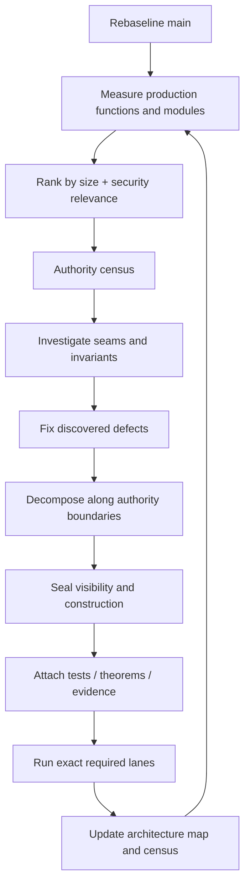
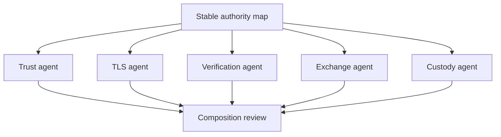

<!-- SPDX-License-Identifier: Apache-2.0 -->

# MCP-RE Hierarchical Refactoring Implementation Blueprint

**Status:** Working blueprint. This document describes the current method for moving the implementation toward ADR-MCPRE-061. It is deliberately separate from the durable ADR so refactoring sequence can evolve without rewriting the architectural constitution.

## 1. Objective

Reduce the maximum amount of security semantics a reviewer must understand simultaneously while preserving or strengthening executable guarantees.

The campaign does not optimize for file count or raw LOC reduction. It uses size aggressively to locate architectural hotspots, then decomposes them according to authority, lifecycle, and assurance boundaries.

## 2. Iterative cycle



## 2.1 Re-measure at the top of every cycle

An audit invalidates its own inventory. Step A (rebaseline) and step B (measure) are not
ceremony: a census taken on a working branch describes a tree that the next merge changes,
and a finding cited in the present tense after it has been fixed sends the next
investigator to a file that no longer has the problem.

Two instances from this campaign's own census, both closed on `main` before the blueprint
citing them was written:

- the stage order stated four times, with a drifted prose table — the table was deleted;
- the work/event correspondence carried by ~20 deletable `advance` calls — now carried by
  `Established<T>`, with five assembly-owned transitions remaining by design.

The rule that follows: **a finding is quoted with the commit it was measured on, and
re-checked against `main` before it is acted on.** A component blueprint that cites a
number without naming the rule and the commit is citing nothing.

## 3. Investigation order

Priority is determined by a combination of:

1. production size;
2. security consequence;
3. number of independently describable authorities;
4. public API surface;
5. lifecycle/state complexity;
6. evidence weakness or feature-lane ambiguity;
7. known duplication or reconstruction of semantic facts.

A large security module is not skipped because another metric is more sophisticated. Size is the initial searchlight when little else is known.

## 4. Authority census format

For each candidate, record:

```text
module/function:
production LOC:
total LOC:
public surface:
production callers:
test-only callers:

candidate authorities:
- ...
- ...

facts owned:
facts consumed:
facts reconstructed:
state/lifecycle obligations:
unreachable branches:
test-widened interfaces:
formal evidence:
feature/build lanes:

recommendation:
- decompose
- investigate further
- reviewed exception
```

The census must correct earlier measurements openly when call-site or feature analysis changes the result.

## 5. Decomposition method

For each surviving authority:

1. Name the proposition the authority exists to establish.
2. Identify raw inputs and owner-established inputs.
3. Define its legal state/value representation.
4. Make invalid construction impossible or explicitly fallible.
5. Define narrow semantic projections or capabilities.
6. Restrict subordinate visibility to the smallest ancestor that legitimately needs it.
7. Move tests with the owner rather than widening production APIs for inspection.
8. Replace duplicate downstream decisions with owner projections.
9. Prove or test the property at the smallest meaningful boundary.
10. Re-run composition tests and exact feature/build lanes.

## 6. No cosmetic split rule

A refactoring that only relocates code is not automatically wrong, but it must have a semantic reason such as separating a harness, lifecycle boundary, or subordinate authority from a security decision module.

A split is incomplete when:

- all previous helpers remain independently callable;
- orchestration still reconstructs owner semantics;
- tests still require widened production visibility;
- the same consistency checks remain;
- callers can still construct invalid combinations;
- the original module remains the real semantic authority despite files moving elsewhere.

## 7. Compiler-enforced hierarchy

Preferred visibility:

```text
private            implementation detail
pub(super)         parent authority only
pub(in path)       explicit ancestor subtree
pub(crate)         intentional crate-wide capability
pub                supported external API
```

Whenever a security-relevant item is `pub(crate)` or `pub`, the review must answer why the broader authority is legitimate.

Two limits, measured and recorded in [`docs/dev/sealed-owners.md`](../dev/sealed-owners.md):
privacy buys nothing where a seam lets code outside the module produce the value, and a
Verus-proved postcondition outranks a seal. Ask *if this value is illegal, whose bug is
it?* before adding a private field.

### 7.1 What the toolchain checks, and what it does not

ADR-MCPRE-061 §6 is the authority; §6.2 lists what is enforced and §6.3 what is not.

Two ratchets run on every gate invocation and are the reason this campaign can proceed
without new debt accumulating behind it:

| gate | stage | holds |
|---|---|---|
| `scripts/module_size_gate.py` | 1 (no build) | 200 production lines per file, baselined in `config/module-size-debt.toml` |
| `scripts/clippy_ratchet_gate.py` | 2 (with the build) | `unwrap_used` at zero; `expect_used`, `indexing_slicing`, `too_many_lines`, `excessive_nesting` at per-crate baselines in `config/clippy-debt.toml` |

Two things about them are load-bearing for this method:

- **A configured lint is not an enforced lint.** `.clippy.toml` parameterises; it does not
  switch allow-by-default lints on. The gate runs `--activation-probe` and `--nesting-probe`
  before it measures, so a lint that silently stopped firing fails the build instead of
  reporting a clean count.
- **Do not read an unenforced rule as an enforced one.** Where this blueprint says a step is
  required, the check is a human reading a diff unless §6.2 lists a mechanism. Visibility
  (§4), the twelve questions (§8), and every §7 small-module smell are in that category.

## 8. Tests and proofs

Each component should have:

- leaf unit tests for local invariants;
- property/negative controls for parser, bounds, and state legality;
- relation tests for subordinate composition;
- integration tests for the component facade;
- theorem mappings where formal support exists;
- exact build/feature lane identity;
- negative controls proving the measurement mechanism fails when the property is broken.

A passing command that selected zero tests is no evidence.

## 9. Parallel-agent execution

Parallel work begins only after the top-level authority map and component boundaries are sufficiently stable.

Each agent receives exactly one vertical authority seam with:

- component blueprint;
- permitted implementation subtree;
- public facade contract;
- dependencies and assumptions;
- theorem obligations;
- test/evidence obligations;
- prohibited cross-boundary actions.

If two agents conclude they must own the same fact, neither silently proceeds. The conflict is escalated as an architecture decision.



## 10. Completion criteria for a refactoring round

A round is complete when:

- every investigated hotspot has a documented disposition;
- discovered security defects are fixed or explicitly tracked;
- new owner boundaries are compiler-enforced where possible;
- no tests widened production APIs merely for inspection;
- architecture and component documents match current code;
- theorem/evidence references are current;
- exact required cargo/Bazel/feature lanes are green and non-vacuous;
- the shallow-module census is rebaselined on the resulting main commit.
