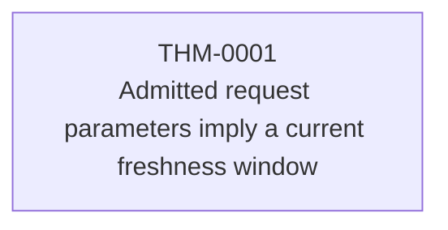
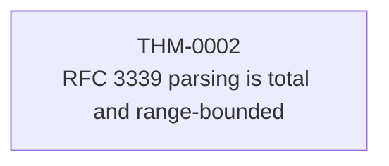
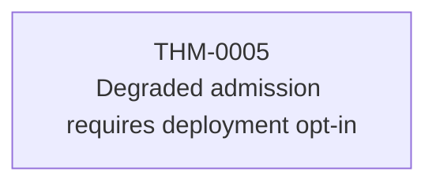
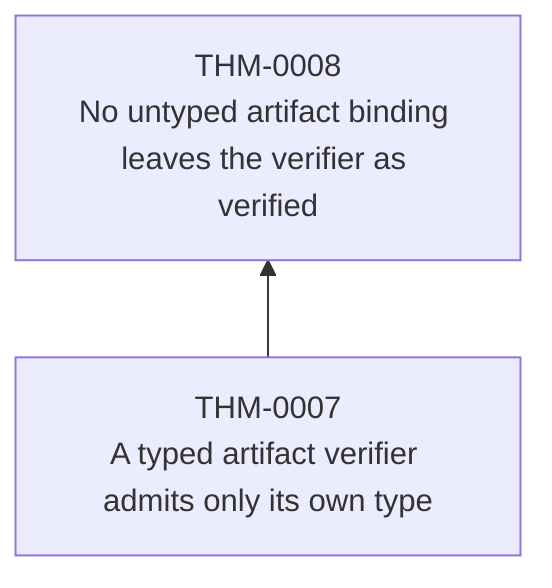
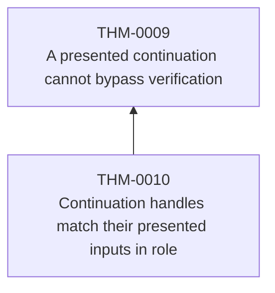
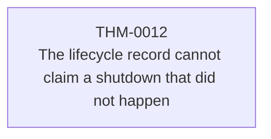

<!-- SPDX-License-Identifier: Apache-2.0 -->
<!-- GENERATED FILE — DO NOT EDIT.
     Regenerate with: tools/verification/generate-views
     Gated by:        tools/verification/check-generated
     Derived from:
       verification/policy/theorems.toml
       verification/policy/verification.toml
       verification/policy/assumptions.toml
-->

# Theorem dependency graph

Which claims rest on which. Rendered as one diagram per connected component —
a single global diagram is unreadable at the size where it would matter.

## Component 1

## Component 2

## Component 3

## Component 4

## Component 5

## Component 6

## Component 7

## Component 8

