<!-- SPDX-License-Identifier: Apache-2.0 -->
<!-- GENERATED FILE — DO NOT EDIT.
     Regenerate with: tools/verification/generate-views
     Gated by:        tools/verification/check-generated
     Derived from:
       verification/policy/theorems.toml
       verification/policy/verification.toml
       verification/policy/assumptions.toml
-->

# Theorem dependency graph

Which claims rest on which — `depends_on` is logical implication, never a call
or a build edge. Rendered as one diagram per connected component: a single global
diagram is unreadable at the size where it would matter. Declared system roots are
marked; a component containing none is not yet attached to a system promise.

## Component 1

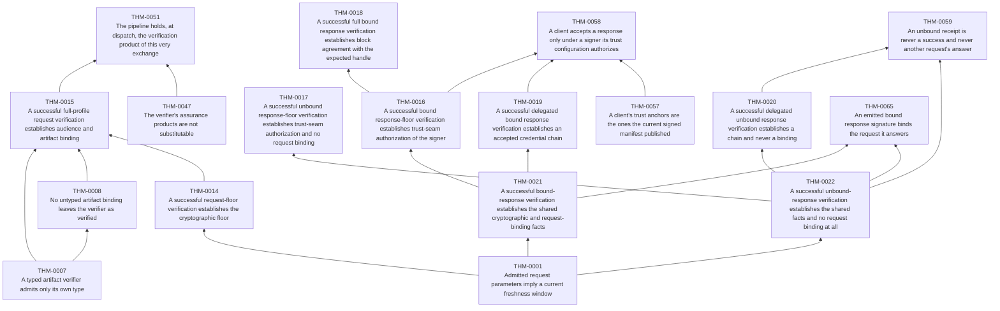

## Component 2

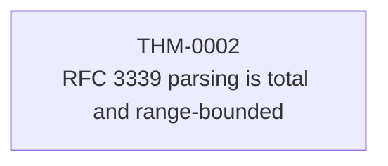

## Component 3


## Component 4


## Component 5

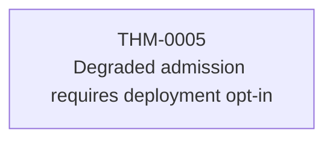

## Component 6


## Component 7

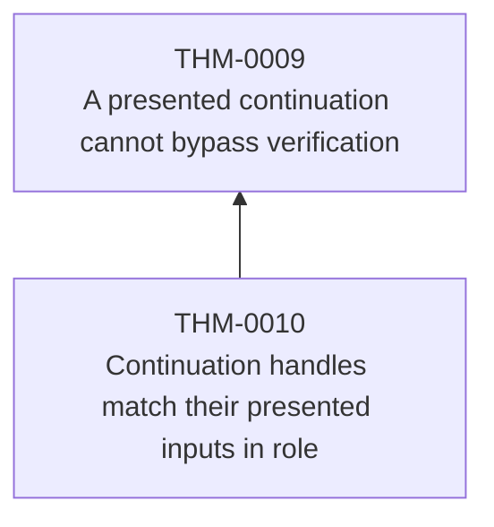

## Component 8

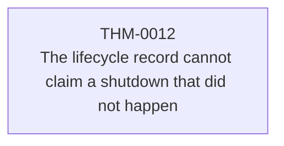

## Component 9

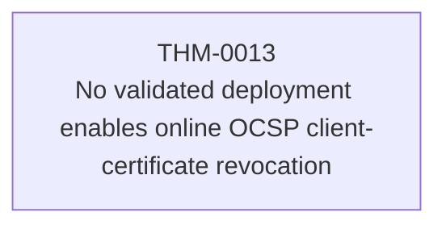

## Component 10

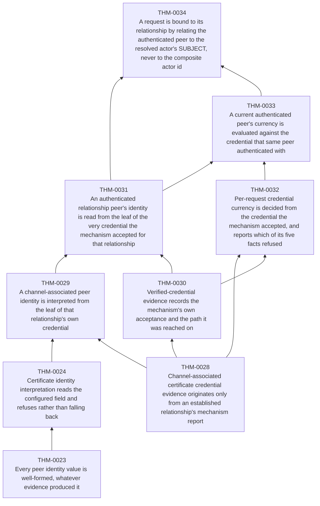

## Component 11

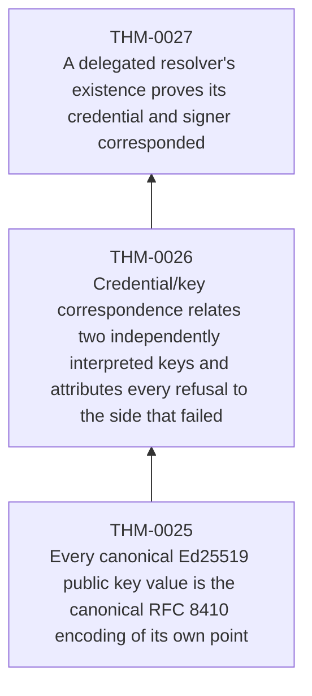

## Component 12

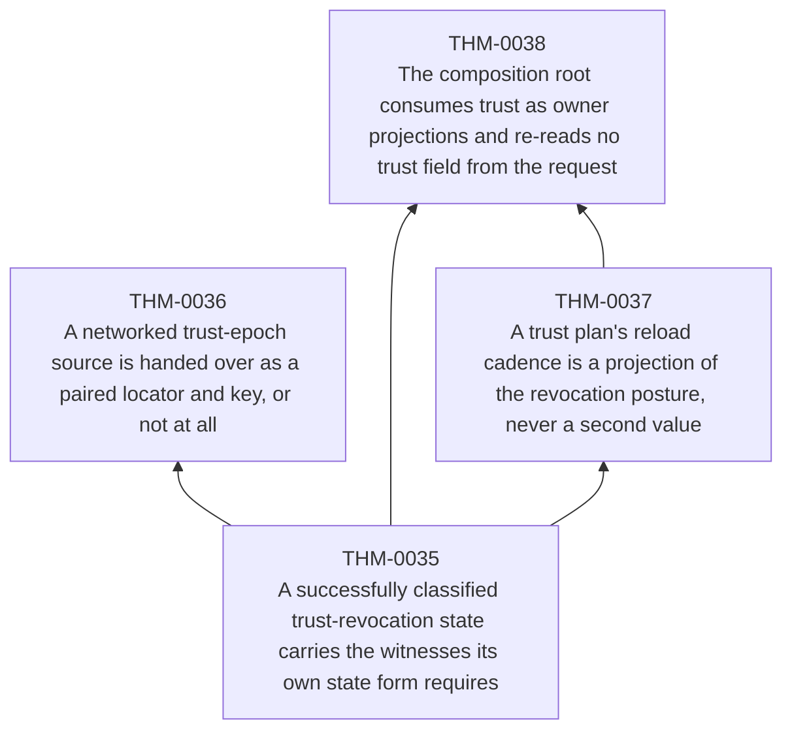

## Component 13

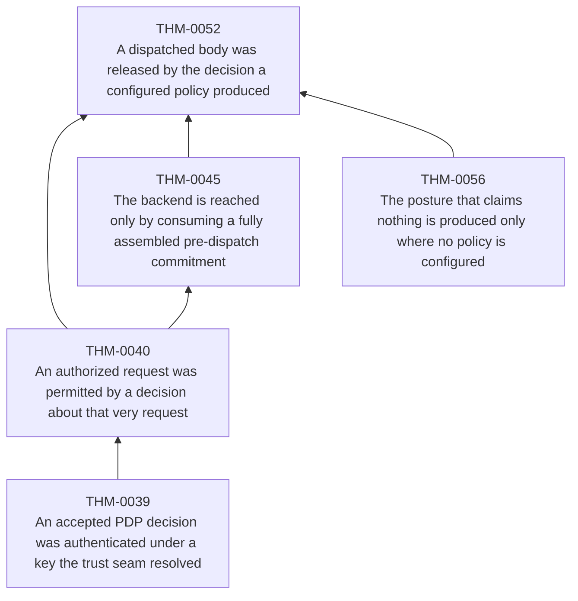

## Component 14

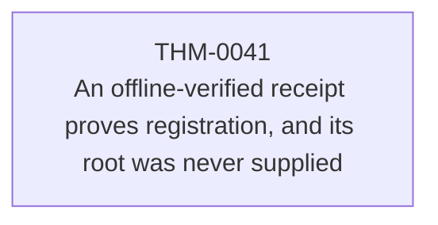

## Component 15

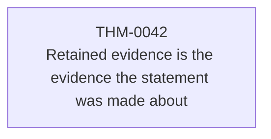

## Component 16

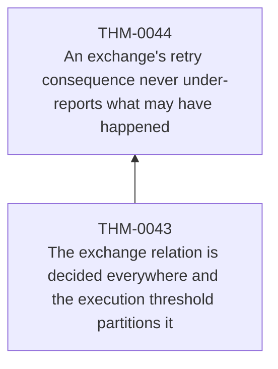

## Component 17

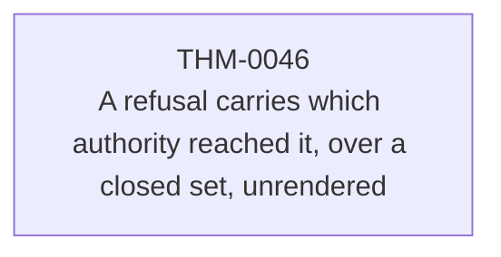

## Component 18

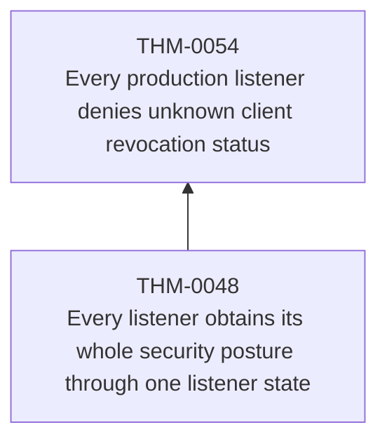

## Component 19

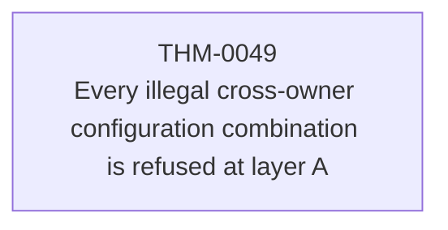

## Component 20

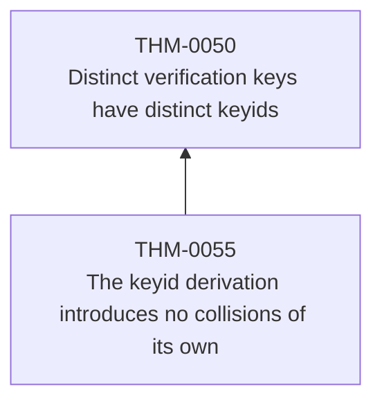

## Component 21

```mermaid
graph BT
    THM_0053["THM-0053<br/>A presented admission assertion is authentic, in its window, and for this audience"]
```

## Component 22

```mermaid
graph BT
    THM_0060["THM-0060<br/>The client's clock skew is bounded at construction and read once"]
```

## Component 23

```mermaid
graph BT
    THM_0061["THM-0061<br/>A receipt that says nothing is not a receipt that says nothing ran"]
```

## Component 24

```mermaid
graph BT
    THM_0062["THM-0062<br/>A response-signing credential exists only while a valid delegated key does"]
    THM_0063["THM-0063<br/>A signed response never advertises validity its credential does not authorize"]
    THM_0062 --> THM_0063
```

## Component 25

```mermaid
graph BT
    THM_0064["THM-0064<br/>A non-exporting custody selection keeps the private key off this process"]
```
