<!-- SPDX-License-Identifier: Apache-2.0 -->

# Theorem-architecture ratification packet — 2026-08-31

**Proposal artifact under ADR-MCPRE-059 §28.13.** Nothing here is authoritative. No `THM`
identity is allocated, no existing theorem statement is changed, no production code is
touched, no review unit is created. `R1`, `R1.2.3` … are temporary handles for this
conversation and never appear in the registry.

Measured against `main` @ `b3942874`: 41 theorems, 32 review units, 34 registered assumptions (32 live), 85 mutation probes.

---

## 0. How to read this, and what it found

The tree below decomposes six proposed system security promises down to terminals. Every
branch ends in exactly one of `PROVED` / `STRUCTURAL` / `ASSUMED` / `GAP` / `OUT_OF_SCOPE`
(§28.5), and every one of the 41 existing theorems is placed at the lowest node it honestly
establishes. No theorem was restated, and none was broadened to close a parent.

**The headline result: the registry is strong at the leaves and empty at the joints.**

All 41 theorems place under R1, R3, R4 and R5, and 39 of them sit at owner-local or
relation altitude. What is missing is almost entirely the same shape in five different
places — *the composition that makes a local fact reach the runtime that consumes it*:

| the local fact, proved | the composition that consumes it | status |
|---|---|---|
| THM-0031 — a peer is authenticated | serving derives transport identity only that way | source-text gate, no theorem |
| THM-0035–0038 — trust posture is classified | verification resolves actors through the *materialized* authority | **GAP** |
| THM-0014/0015 — a verified request exists | the dispatch path holds one, and one it verified | **GAP** |
| THM-0039/0040 — a decision authorizes a request | the stage runs on every dispatch path | **GAP** |
| THM-0041/0042 — a receipt and its evidence correspond | the record covers what actually happened | **GAP** |

That pattern is what a bottom-up registry produces, and it is exactly what §28 predicted.

**Seven of the 21 gaps already have a real owner and are registrable without any
architecture work** (§7a). Three of those are the units the T4 census recorded as yielding no
claim — `http_profile.verifier_result_separation`, `http_profile.keyid`,
`proxy.tls_listener_state`. That was the right answer when selection ran upward from units;
under §28.1 the question is whether a parent requires the proposition, and each does.

**The remaining fourteen fall into five clusters with no semantic authority that can
honestly own them** (§7b, A-1 … A-5). These are architecture gaps under §28.1. No synthetic
unit is proposed for any of them.

**One finding is an honesty correction rather than a gap:** ASM-0012 is an assumption over
*MCP-RE's own* admission-assertion verifier. As a Verus proof-cone device it is legitimate;
as a proof-tree terminal it is not, because the premise it supplies is code this project
writes and could prove. It is classified `GAP (currently absorbed by ASM-0012)` at R1.3.1.
The same reading applies to ASM-0019 and ASM-0021, which are noted where they occur.

---

## 1. Proposed system root claims

Six roots. Each is stated in the safety direction (§28.9) and quantified over the
obligations the **validated deployment selected** (§28.10). None is a liveness claim.

### R1 — No unearned dispatch

> If the serving path invokes the backend for an inbound request, then every security
> obligation the validated deployment selected for that request was established first, from
> evidence that request itself carried, and the values the pipeline acted on are the values
> those establishments returned.

*Consequence:* a caller cannot reach the backend by omitting evidence, by presenting
evidence for a different exchange, by presenting a fact the deployment did not select the
authority for, or by handing the pipeline a security value it constructed itself.

### R2 — No unearned response attribution

> Every response MCP-RE emits carries evidence attributable only to the signing authority
> the validated deployment materialized, under delegation, bound to the request it answers —
> or, where no request could be parsed, explicitly unbound and never readable as bound.

*Consequence:* a response cannot be attributed to the trust root directly, cannot be signed
by a key the deployment did not materialize a capability for, and a pre-parse receipt cannot
be replayed as an answer to a request.

### R3 — A client accepts only an answer to its own request, under a signer it trusts

> If `mcp-re-client-core` returns a response as verified, then that response was signed
> under a signer this client's trust configuration authorizes in the Response slot, over a
> signature base that resolved against the request this client sent, and the client's
> expectation of the exchange was derived from that same request.

*Consequence:* a response from another exchange, from another signer, or from a signer whose
authorization has been retired cannot be presented to an application as this call's answer.

### R4 — No deployment serves a posture nobody selected

> Every capability the serving runtime holds is a projection of an owner state the legality
> boundary classified from the deployment request; an illegal, unsupported or internally
> contradictory posture is refused at startup rather than degraded at runtime, and no
> runtime authority re-derives a security fact from the original request.

*Consequence:* an operator cannot obtain a weaker security posture by supplying a
combination nobody validated, and a serving component cannot disagree with the owner about
what was configured.

### R5 — The record cannot claim what did not happen

> Every accountability artifact MCP-RE emits — lifecycle record, audit event, transparency
> receipt, retained evidence — corresponds to work the system actually performed, and the
> vocabulary is total over the outcomes that can occur.

*Consequence:* an operator or auditor reading the record cannot be shown a shutdown that did
not drain, a receipt for a statement that was not registered, retained bytes that are not
what was committed to, or silence where a refusal occurred.

### R6 — Refusal is terminal and total

> Any exchange that does not establish R1 terminates in a refusal inside the exchange
> lifecycle, or in a declared pre-exchange transport refusal, and produces no dispatch, no
> signed response, and no partial effect.

*Consequence:* the complement of R1 is not "some other path"; it is a refusal that is
recorded and cannot fall through to the dispatch or response-signing stages.

**Why six and not one.** R1 and R6 are the two halves of the request pipeline and must stay
apart: R1 constrains what a successful dispatch implies, R6 constrains what a failure does.
Folding R6 into R1 as a biconditional would make it a liveness claim (§28.9). R2 and R3 are
the same exchange seen from two sides, and MCP-RE ships both sides; they do not compose into
one claim because a deployment may run either alone. R4 is the configuration lattice, which
ADR-MCPRE-061 §3.1 keeps as a separate graph. R5 is accountability, which survives even
where R1 refuses.

---

## 2. R1 — No unearned dispatch

```text
R1  dispatch ⇒ all selected obligations earned
├── R1.1  the request's own evidence verified                    [full profile]
│   ├── R1.1.1  cryptographic floor                              PROVED THM-0014
│   │   ├── R1.1.1.1  freshness admission                        PROVED THM-0001
│   │   │   ├── R1.1.1.1.1  timestamp parsing is total/bounded   PROVED THM-0002
│   │   │   ├── R1.1.1.1.2  the parser's stdlib primitives       ASSUMED ASM-0001..0004
│   │   │   └── R1.1.1.1.3  skew/validity are policy functions   ASSUMED ASM-0005..0010, 0025, 0026
│   │   ├── R1.1.1.2  signature verifies under an accepted alg   ASSUMED ASM-0027   (conjunct PROVED in THM-0014)
│   │   ├── R1.1.1.3  covered Content-Digest agrees with body    ASSUMED ASM-0028
│   │   └── R1.1.1.4  the Request-slot signer was resolved       PROVED THM-0014 (conjunct)
│   │       ├── R1.1.1.4.1  the seam answers its selector        ASSUMED ASM-0029
│   │       ├── R1.1.1.4.2  distinct keys have distinct keyids   **GAP-1**  owner: http_profile.keyid
│   │       └── R1.1.1.4.3  the seam is the materialized one     **GAP-6**  → R4.4
│   ├── R1.1.2  audience / route / @target-uri equality          PROVED THM-0015 (conjunct)
│   ├── R1.1.3  every declared artifact binding was enforced     PROVED THM-0008 → THM-0007
│   │   ├── R1.1.3.1  the digest matched the credential          ASSUMED ASM-0018
│   │   └── R1.1.3.2  ArtifactBinding::validate's own contract   ASSUMED ASM-0019  (see §8, note b)
│   ├── R1.1.4  a presented continuation was verified            PROVED THM-0009 → THM-0010
│   │   └── R1.1.4.1  labeled digest is a function of its args   ASSUMED ASM-0023, ASM-0024
│   └── R1.1.5  the pipeline holds a product THIS verifier made  **GAP-2**  owner: http_profile.verifier_result_separation
├── R1.2  the request is bound to its authenticated peer         [where transport binding selected]
│   ├── R1.2.1  request signer ≡ channel peer subject            PROVED THM-0034
│   │   ├── R1.2.1.1  the peer is authenticated                  PROVED THM-0031
│   │   │   ├── R1.2.1.1.1  identity read from that credential   PROVED THM-0029
│   │   │   │   ├── certificate identity interpretation          PROVED THM-0024 → THM-0023
│   │   │   │   │   └── the X.509 parser reports SANs/CN         ASSUMED ASM-0030
│   │   │   │   └── credential came from an established rel.     PROVED THM-0028
│   │   │   │       └── the mechanism reports peer/chain         ASSUMED ASM-0033, ASM-0034
│   │   │   └── R1.2.1.1.2  the mechanism accepted it, on a path PROVED THM-0030
│   │   │       └── path reporting; acceptance binds the peer    ASSUMED ASM-0035, ASM-0036
│   │   └── R1.2.1.2  its credential is still current            PROVED THM-0033 → THM-0032
│   └── R1.2.2  serving derives identity ONLY this way           STRUCTURAL + gated (§4, S-1)
├── R1.3  admission was satisfied                                [where selected]
│   ├── R1.3.1  the assertion is authentic, in-window, for us    **GAP-3**  (absorbed by ASM-0012)
│   ├── R1.3.2  the verdict describes the call it checked        PROVED THM-0003
│   ├── R1.3.3  the state is about THIS workload, at generation  PROVED THM-0004
│   ├── R1.3.4  the admitted actor is this presenter             PROVED THM-0006
│   │   └── the presenter argument is correctly resolved         → R1.1.1.4 (caller obligation, discharged there)
│   └── R1.3.5  degraded admission required opt-in               PROVED THM-0005  (also R4.5)
│       └── the degraded verdict is confined to window P         OUT_OF_SCOPE (THM-0005 scope: enforced in body, not a conjunct)
├── R1.4  the action was authorized                              [where selected]
│   ├── R1.4.1  the decision was authenticated                   PROVED THM-0039
│   ├── R1.4.2  the decision is ABOUT this request               PROVED THM-0040
│   └── R1.4.3  the stage runs on every dispatch path            **GAP-4**  owner: proxy.pdp_decision_relation (relation exists; the pipeline property does not)
└── R1.5  dispatch is reachable only from a legal machine state  **GAP-5**  no review unit (authority exists: exchange_state.rs)
    └── R1.5.1  a stage cannot omit the event it justifies       STRUCTURAL (§4, S-2) — excludes the five assembly-owned transitions
```

**Placement notes.**

- THM-0015 is placed at R1.1, not at R1: it characterizes a successful `verify_request`, and
  R1 additionally needs R1.1.5 (that the value the pipeline holds came from that call). The
  scope sentence of every verifier theorem says so explicitly. Broadening THM-0015 to cover
  possession is exactly the move §28.2 forbids.
- THM-0014 appears once, under R1.1.1, and is *not* repeated under R1.1.2–4; those are
  conjuncts of THM-0015 above it.
- R1.3.4's child resolves to R1.1.1.4 rather than terminating: THM-0006 names the caller
  obligation, and the caller's discharge is the floor's trust resolution. That is a real
  cross-branch edge and it is drawn, not silently assumed.

---

## 3. R2–R6

### R2 — No unearned response attribution

```text
R2  emitted response evidence is attributable only to the materialized signing authority
├── R2.1  the response is signed under delegation, never by the root   **GAP-7**  no review unit
│   └── R2.1.1  the deployment can express no direct-root mode          STRUCTURAL (§4, S-3)
├── R2.2  the signing key is the one the custody owner materialized     **GAP-8**  no review unit
│   ├── R2.2.1  a KMS-held private key never enters the process         **GAP-9**  blocked on representation
│   └── R2.2.2  response signing and TLS signing use different keys     STRUCTURAL (§4, S-4) — held by a construction site
├── R2.3  the emitted signature binds the request it answers            **GAP-10**  (verification side is R3)
├── R2.4  an unbound emission can never read as bound                   PROVED THM-0022, THM-0020 (verification side only) + **GAP-10**
└── R2.5  the channel the response leaves on was itself established     [where delegated TLS selected]
    ├── R2.5.1  resolver existence proves correspondence                PROVED THM-0027 → THM-0026 → THM-0025
    │   └── SPKI/algorithm parsing                                      ASSUMED ASM-0031, ASM-0032
    └── R2.5.2  every listener obtains anchors/store/budget one way     **GAP-11**  owner: proxy.tls_listener_state
```

R2 is the weakest root in the tree: **the emission side has no theorem at all.** Every
response theorem in the registry (THM-0016 … THM-0022) is stated over the *verifier*, and
verifying is what a client does. The proxy's own signing path is evidenced by tests and by
the `delegated-required` legality rule, not by a claim.

### R3 — A client accepts only an answer to its own request

```text
R3  a client-verified response answers this request under an authorized signer
├── R3.1  shared bound facts: digest, params, ;req-resolved base       PROVED THM-0021 → THM-0001
├── R3.2  trust-seam authorization in the Response slot                PROVED THM-0016 → THM-0021
├── R3.3  block agreement with the expected handle                     PROVED THM-0018 → THM-0016
│   └── R3.3.1  the handle is DERIVED from the request                 STRUCTURAL (§4, S-5)
│       └── R3.3.2  … except across the FFI seam                       OUT_OF_SCOPE (§6, O-4)
├── R3.4  delegated chain authorization (bound)                        PROVED THM-0019 → THM-0021
├── R3.5  unbound: shared facts, and never a binding                   PROVED THM-0022 → THM-0001
│   ├── R3.5.1  trust-seam authorization (unbound)                     PROVED THM-0017 → THM-0022
│   └── R3.5.2  delegated chain (unbound)                              PROVED THM-0020 → THM-0022
├── R3.6  an unexpected signer is refused on both paths                **GAP-12**  no review unit (mcp-re-client-core)
├── R3.7  anchor lifecycle: overlap, retirement-wins, expiry, revoked  **GAP-13**  no review unit
├── R3.8  no bound-then-unbound fallback; unbound is never success     **GAP-14**  no review unit
├── R3.9  a preflight receipt binds the received digest                **GAP-15**  no review unit
├── R3.10 skew clamping is equal across both windows                   **GAP-16**  no review unit
└── R3.11 `Unstated` ≠ `NotExecuted` in the execution/retry contract   **GAP-17**  no review unit
```

R3.6–R3.11 are the six properties `docs/architecture/components/client-response-verification.md`
§Q12 already recorded as gaps; this packet places them under a root rather than leaving them
in a blueprint table. They share one missing owner (§7, A-3).

### R4 — No deployment serves a posture nobody selected

```text
R4  every serving capability is a projection of a validated owner state
├── R4.1  trust posture carries its form's witnesses                   PROVED THM-0035
│   └── R4.1.1  a networked epoch source is paired or absent           PROVED THM-0036 → THM-0035
├── R4.2  the plan's reload cadence is a projection, not a copy        PROVED THM-0037 → THM-0035
├── R4.3  the composition root re-reads no TRUST field                 PROVED THM-0038 → THM-0035, THM-0037
│   └── R4.3.1  … and no other owner's fields either                   **GAP-18**  (THM-0038 is trust-only by its own scope)
├── R4.4  verification resolves actors only through the MATERIALIZED
│         trust authority                                              **GAP-6**  no review unit  ← the one already recorded
├── R4.5  no default deployment reaches degraded admission             PROVED THM-0005
├── R4.6  no validated deployment enables online OCSP                  PROVED THM-0013
│   └── R4.6.1  the retained RFC 6960 implementation's correctness     OUT_OF_SCOPE (§6, O-2)
└── R4.7  an illegal cross-owner combination is refused at layer A     STRUCTURAL (§4, S-6) — 6 cross-machine relations, no theorem
```

### R5 — The record cannot claim what did not happen

```text
R5  accountability artifacts correspond to work performed
├── R5.1  a recorded terminal state implies its whole path             PROVED THM-0012
│   └── R5.1.1  … and implies a request was refused                    OUT_OF_SCOPE (THM-0012 scope: admits_requests is descriptive)
├── R5.2  a verified receipt proves registration, root never supplied  PROVED THM-0041
│   ├── R5.2.1  the service is honest / the log is append-only         OUT_OF_SCOPE (§6, O-3)
│   └── R5.2.2  the receipt was issued by the PINNED service           **GAP-19**  owner: http_profile.scitt_receipt_offline
├── R5.3  retained evidence is what the statement committed to         PROVED THM-0042
│   └── R5.3.1  the retained bytes are themselves valid evidence       OUT_OF_SCOPE (THM-0042 scope)
└── R5.4  the audit vocabulary is total over the outcomes that occur   **GAP-20**  no review unit (issue #637)
```

### R6 — Refusal is terminal and total

```text
R6  a non-establishing exchange refuses, inside the lifecycle, with no partial effect
├── R6.1  every production refusal is inside the lifecycle, or is a
│         declared pre-exchange transport refusal                      **GAP-21**  no review unit
├── R6.2  an illegal (state, event) leaves the state unchanged         PROVED THM-0012 (relation half)
├── R6.3  a refusal cannot fall through to dispatch                    → R1.5 (GAP-5)
└── R6.4  the refusal reason has one authority                         STRUCTURAL (§4, S-7) — McpReError is the sole vocabulary
```

---

## 4. Structural leaves

Per §28.6 each names its owner, its closure, why the contrary state is unconstructible, and
the parent that consumes it. **None is proposed for a `THM` in this packet** — §28.6 promotes
a structural fact only where it is a reusable premise across a theorem boundary or needs its
own owner review. S-1, S-2 and S-5 are the three that come closest, and §9 says why each is
being left where it is for now.

| id | proposition | owner / closure | why unconstructible | consumed by |
|---|---|---|---|---|
| S-1 | serving derives transport identity only from the credential the mechanism accepted | `communication_assurance`; `AuthenticatedRelationshipPeerFacts` + `scripts/serving_identity_provenance_gate.py` | the authority is proved (THM-0031); at the call sites it is a **source-text gate**, not a type — so this is structural *by enforcement*, not by construction | R1.2.2 |
| S-2 | a stage cannot omit the event it justifies | `exchange_state.rs`; `Established<T>` is `#[must_use]`, `establish()` the only opener | dropping the witness warns at compile time | R1.5.1 |
| S-3 | no deployment can express direct-root response signing | `config_state` legality; the mode is not representable | the variant does not exist; negative fixtures only | R2.1.1 |
| S-4 | response signing and TLS handshake signing use different KMS keys | `cli.rs::build_key_source` + relation X2a | **held by a construction site**, not by the value — a known weakness, recorded in the KMS blueprint | R2.2.2 |
| S-5 | the response expectation's handle is derived from the request | `mcp-re-client-core::response_expectation`; private fields, `for_signed(&SignedRequest)` | the wrong pairing is unconstructible in-process | R3.3.1 |
| S-6 | an illegal cross-owner combination is refused at layer A | `config_state/cross_machine.rs`; X2a, X2b, X5, X6, X7, X9 | refusal is unconditional in the classifier | R4.7 |
| S-7 | a refusal reason has one authority | `McpReError`; `docs/spec/security-boundary.md` §9 + drift guard | a parallel vocabulary fails the gate | R6.4 |
| S-8 | fail-closed revocation is a property of the verifier type | `tls_listener_state`; a verifier admitting unknown status is unconstructible | no constructor produces it | R2.5.2 |
| S-9 | possession of a `TransportBinding` implies a recognised mode | `transport binding`; private representation, `pub(crate)` constructors | no public constructor | R1.2 |

**S-1 and S-4 are the two to read carefully.** Both are called structural and neither is
structural in the §28.6 sense: S-1 is enforced by a script over source text, S-4 by a
construction site. Under ADR-MCPRE-061 §11's operational test — *can the check be deleted
and still leave an invalid value unconstructible?* — both answer no. They are recorded here
as structural-by-enforcement so that the distinction is visible, not hidden inside a word.

---

## 5. Assumption dependencies

32 live `ASM` records — 34 registered, two withdrawn — all reached through a unit's assumption closure (§28.5 — no theorem
carries a direct assumption edge). Grouped by what they buy:

| group | ids | terminal quality |
|---|---|---|
| stdlib / language primitives | ASM-0001–0006, ASM-0010, ASM-0014, ASM-0020 | sound: properties of Rust, not of MCP-RE |
| policy accessors as functions | ASM-0007–0009, ASM-0025, ASM-0026 | sound: they name what an opaque accessor returns |
| cryptographic primitives | ASM-0027 (Ed25519), ASM-0028 (SHA-256), ASM-0018 (digest), ASM-0023/0024 (labeled digest) | sound, and correctly *not* claimed: these are the trusted-primitive boundary |
| foreign parsers | ASM-0030, ASM-0031, ASM-0032 (X.509/SPKI) | sound and correctly contained — DER-parser correctness stays outside the Rust theorems |
| foreign mechanism reports | ASM-0033, ASM-0034, ASM-0035, ASM-0036 (TLS/rustls) | sound: the mechanism is not ours to prove |
| trust seam selector | ASM-0029 | **sound but load-bearing** — it is what R1.1.1.4 rests on, and GAP-1/GAP-6 are its two unproved halves |
| opaque types with no ensures | ASM-0013, ASM-0011 | sound: representation opacity |
| **our own code, opaque to the proof** | **ASM-0012, ASM-0019, ASM-0021** | **see below** |

ASM-0012 (`verify_admission_assertion` contributes no postcondition), ASM-0019
(`ArtifactBinding::validate` is opaque) and ASM-0021 (`actor_id` accessors have no ensures)
are premises about code this project writes. As Verus proof-cone devices they are correct and
necessary. As proof-tree terminals they are different in kind from every other row: a foreign
parser cannot be proved here, and this code can. ASM-0012 is the consequential one — it
absorbs the whole authenticity of an admission assertion — so R1.3.1 is classified `GAP`
rather than `ASSUMED`, with ASM-0012 named as what currently stands in its place. ASM-0019
and ASM-0021 are narrower and are left `ASSUMED`, flagged here.

ASM-0015 is reserved-and-withdrawn; ASM-0022 is withdrawn, discharged by
`unit://http_profile.continuation_binding`. Neither is a live premise.

---

## 6. `OUT_OF_SCOPE` boundaries

What the roots deliberately do **not** require. Each is a boundary a reader might otherwise
expect the tree to close, and each already lives in a `scope` sentence or an accepted ADR —
the sentence stays authoritative (§28.5).

| id | boundary | where it is stated |
|---|---|---|
| O-1 | stdio and any non-HTTP carrier | ADR-MCPRE-050; MCP-RE is HTTP-profile only, adapters do stdio↔HTTP |
| O-2 | the correctness of the retained RFC 6960 OCSP implementation, responder trust chains, SSRF policy | THM-0013 scope — reachability and legality only |
| O-3 | a transparency service being honest, its log append-only, an entry unique | THM-0041 scope — offline verification cannot see any of it |
| O-4 | the FFI seam's `new(request, evidence)` re-pairing | THM-0018 scope; sealing past an external seam is theatre (`docs/dev/sealed-owners.md`) |
| O-5 | backend/application semantics — what the MCP tool does once dispatched | R1 ends at invocation |
| O-6 | liveness: that a valid request *is* served, that a reload *happens*, that revocation propagates | §28.9 — the roots are safety claims; THM-0037's scope says this explicitly for reload |
| O-7 | `ReceiptPositionProfile::Bound` semantics in production | no shipped pin selects it; kept unselectable by ruling |
| O-8 | ordinary validated parameters that cannot change a security decision | THM-0038's pinned inventory |
| O-9 | that the authoritative admission state held by the enforcement point is itself current | THM-0004 scope — currency is generation equality against the state held |
| O-10 | collision-resistant separation between continuation role labels | THM-0010 scope — stays at `boundary.crypto_primitives` |
| O-11 | that a degraded verdict is confined to the propagation window P | THM-0005 scope — enforced in the body, not a conjunct |
| O-12 | `RuntimeState::admits_requests` as a control | THM-0012 scope — descriptive, no production consumer |

---

## 7. GAPs

21 gaps. Split by whether a semantic authority exists that can honestly own the claim — the
§28.1 distinction that decides whether the node can be registered at all.

### 7a. Registrable now — a real review unit already owns the authority

| id | node | proposition | owner |
|---|---|---|---|
| GAP-2 | R1.1.5 | a verifier product the pipeline holds was produced by that verifier operation; products are not substitutable | `unit://http_profile.verifier_result_separation` |
| GAP-1 | R1.1.1.4.2 | distinct verification keys have distinct keyids — selector injectivity | `unit://http_profile.keyid` |
| GAP-11 | R2.5.2 | every construction path obtains a listener's anchors, epoch-bound store and signing budget through the one authority | `unit://proxy.tls_listener_state` |
| GAP-19 | R5.2.2 | the receipt was issued by the service this deployment pinned | `unit://http_profile.scitt_receipt_offline` |
| GAP-3 | R1.3.1 | the admission assertion is authentic, within its window, and for this audience | `unit://http_profile.admission_currency` (currently absorbed by ASM-0012) |
| GAP-4 | R1.4.3 | the authorization stage runs on every path that reaches dispatch | `unit://proxy.pdp_decision_relation` |
| GAP-18 | R4.3.1 | the composition root re-reads no owner's fields, not only trust's | `unit://proxy.trust_composition_root` is trust-only; a per-owner sibling is needed |

Three of these — GAP-1, GAP-2, GAP-11 — are the units the T4 census recorded as yielding no
claim. That was the honest answer *then*, when selection ran upward from units. Under §28.1
the question is different: does a parent require this? Each does, and each has a real owner,
so each is registrable without any new architecture. **GAP-18 is listed here with a caveat:**
the owner exists for trust, and the analogous claim for custody, replay, admission and TLS
would need sibling units, which is registry work but not architecture work.

### 7b. Architecture gaps — no semantic authority can honestly own the claim (§28.1)

**No synthetic unit is proposed for any of these.** Each is reported at this boundary.

| id | node | proposition | why there is no owner |
|---|---|---|---|
| **A-1** = GAP-6 | R4.4 | verification resolves actors only through the materialized trust authority | `resolve_actor: ActorResolver` is an injected seam; `app.rs` supplies one from `build_actor_resolver`; nothing owns *the wiring*. Recorded open in the trust blueprint and re-confirmed here |
| **A-2** = GAP-5 / GAP-21 / R6.1 | R1.5, R6.1 | dispatch is reachable only from a legal machine state; every production refusal is inside the lifecycle | the exchange machine exists (`exchange_state.rs`) and is a genuine authority, but it has **no review unit**. This is a registry gap wearing an architecture gap's clothes — see §9 |
| **A-3** = GAP-12…GAP-17 | R3.6–R3.11 | six client-side response propositions | `mcp-re-client-core` has **no review unit and no theorem**; the crate's own decisions are exactly the undeclared ones |
| **A-4** = GAP-7 / GAP-8 / GAP-9 / GAP-10 | R2.1–R2.3 | the response *emission* path: delegation-only, materialized key, request binding, key never in-process | no unit covers response signing. GAP-9 is additionally **blocked on the representation**: `KeySource` cannot express "the private key never enters this process" |
| **A-5** = GAP-20 | R5.4 | the audit vocabulary is total over the outcomes that occur | `AuditEvent` has no field for an authority or a stage; a fourth producer of `reason` is unscanned (issue #637). ADR-MCPS-035 freezes the vocabulary, so this is an exception-channel decision, not a registration |

A-2 deserves its distinction: unlike A-1, A-3, A-4 and A-5, the *authority* plainly exists
and is well factored. What is missing is a `[[unit]]`, which is registry work. It is listed
here rather than in 7a only because creating a unit is implementation and this packet
creates nothing.

---

## 8. The dependency DAG

Logical implication only (§28.4). Roots are the top row; every edge is *parent requires
child*. Existing `THM` ids are shown at the node they were placed at.

```mermaid
graph TD
    R1["R1 no unearned dispatch"]
    R2["R2 no unearned response attribution"]
    R3["R3 client accepts only its own answer"]
    R4["R4 no unselected posture"]
    R5["R5 the record cannot lie"]
    R6["R6 refusal is terminal and total"]

    R1 --> R11["R1.1 evidence verified<br/>THM-0015"]
    R1 --> R12["R1.2 request↔peer binding<br/>THM-0034"]
    R1 --> R13["R1.3 admission<br/>THM-0003/4/5/6"]
    R1 --> R14["R1.4 authorization<br/>THM-0040"]
    R1 --> R15["R1.5 legal machine state<br/>GAP-5"]
    R1 --> R115["R1.1.5 product provenance<br/>GAP-2"]

    R11 --> R111["R1.1.1 floor<br/>THM-0014"]
    R11 --> R113["R1.1.3 artifacts<br/>THM-0008"]
    R11 --> R114["R1.1.4 continuation<br/>THM-0009"]
    R111 --> R1111["R1.1.1.1 freshness<br/>THM-0001"]
    R1111 --> R11111["R1.1.1.1.1 time parsing<br/>THM-0002"]
    R111 --> R1114["R1.1.1.4 request-slot signer<br/>ASM-0029"]
    R1114 --> GAP1["GAP-1 keyid injectivity"]
    R1114 --> A1["A-1 materialized resolver<br/>GAP-6"]
    R113 --> T7["THM-0007"]
    R114 --> T10["THM-0010"]

    R12 --> R1211["R1.2.1.1 authenticated peer<br/>THM-0031"]
    R12 --> R1212["R1.2.1.2 currency<br/>THM-0033"]
    R1211 --> T29["THM-0029"]
    R1211 --> T30["THM-0030"]
    T29 --> T24["THM-0024"]
    T29 --> T28["THM-0028"]
    T24 --> T23["THM-0023"]
    T30 --> T28
    R1212 --> T32["THM-0032"]

    R14 --> T39["THM-0039"]
    R14 --> GAP4["GAP-4 stage always runs"]
    R13 --> GAP3["GAP-3 assertion authenticity"]

    R2 --> A4["A-4 response emission<br/>GAP-7/8/9/10"]
    R2 --> R25["R2.5 channel established<br/>THM-0027"]
    R25 --> T26["THM-0026 → THM-0025"]
    R25 --> GAP11["GAP-11 listener state"]

    R3 --> T18["THM-0018 → THM-0016 → THM-0021"]
    R3 --> T19["THM-0019"]
    R3 --> T20["THM-0020 → THM-0022"]
    R3 --> T17["THM-0017"]
    R3 --> A3["A-3 client-core<br/>GAP-12…17"]
    T21R["THM-0021/0022"] --> R1111
    T18 --> T21R
    T20 --> T21R

    R4 --> T35["THM-0035"]
    R4 --> T36["THM-0036"]
    R4 --> T37["THM-0037"]
    R4 --> T38["THM-0038"]
    R4 --> T13["THM-0013"]
    R4 --> T5["THM-0005"]
    R4 --> A1
    R4 --> GAP18["GAP-18 non-trust owners"]

    R5 --> T12["THM-0012"]
    R5 --> T41["THM-0041"]
    R5 --> T42["THM-0042"]
    R5 --> GAP19["GAP-19 pinned service"]
    R5 --> A5["A-5 audit totality<br/>GAP-20"]

    R6 --> A2["A-2 refusal totality<br/>GAP-21/GAP-5"]
    R6 --> T12
    R15 --> A2
```



Cross-root edges, drawn once and worth naming: **THM-0001 is shared by R1 and R3** (the same
freshness window admits request and response parameters); **A-1 is required by both R1 and
R4** (the runtime consumes what the lattice materialized); **THM-0012 serves R5 and R6**
(the record half and the relation half); **R1.5 and R6 meet at A-2**.

The graph is acyclic. No proposed edge inverts a declared `PROOF_DEPENDENCY`.

---

## 9. Proposed bottom-up closure order

Ordered so that each stage's evidence is available to the next, and so that the cheapest
honest gains come first. Nothing here is scheduled work; it is the order the tree implies.

**Stage 0 — register what already has an owner (no architecture).**
GAP-2, GAP-1, GAP-11, GAP-19. Four claims, four existing units, no new authority. GAP-2
first: R1's whole evidence branch currently rests on a proposition every verifier theorem
explicitly excludes, and it is the single highest-value node in the tree.

**Stage 1 — the two honesty corrections.**
GAP-3 (retire ASM-0012's role as a terminal by stating the admission-assertion proposition
the code already implements) and GAP-18 (the per-owner siblings of THM-0038). Both are
registry work over existing owners; neither needs an architecture decision.

**Stage 2 — give the exchange machine a review unit (A-2).**
This unblocks R1.5, R6.1 and R6.3 together, and the authority already exists and is well
factored. It is the largest single reduction in open surface in the tree.

**Stage 3 — the client-core authority (A-3).**
Six propositions, one missing owner, one crate. `mcp-re-client-core` has 22 tests in one
non-vacuous lane and zero theorems; the propositions are already written down in its
blueprint.

**Stage 4 — the response emission authority (A-4).**
R2 is the weakest root. GAP-7/8/10 are statable once an owner exists; GAP-9 stays blocked on
the `KeySource` representation and should be recorded as such rather than forced.

**Stage 5 — A-1, the materialized resolver.**
Deliberately last of the architecture gaps despite being the oldest: it is the one whose
owner does not exist *and* whose shape is genuinely undecided, and Stages 2–4 will have
established how a composition-altitude owner is expressed here.

**Stage 6 — A-5, audit totality.**
Exception-channel: ADR-MCPS-035 freezes the vocabulary, so this needs a decision before it
needs a theorem. Issue #637 holds the measurement.

**Stage 7 — compose the roots and run the whole-system adversarial missing-edge pass**
(#542 steps 10–11).

Root completeness reaches `COMPLETE` only after Stage 7. Until then
`tools/verification/review` reports `INCOMPLETE` and names the blocking nodes, which is the
truthful state and — per §28.8 — must not fail ordinary CI.

---

## 10. What this packet does not do

- allocate any `THM` id, or propose which specific ids the nodes should take;
- change any existing theorem's statement, consequence or scope;
- create, rename or widen any review unit;
- implement any gap, or change production architecture to close one;
- declare anything in `root_theorems` — that happens after ratification.

## 11. The ratification decision

What is being asked:

1. **Are R1–R6 the right system promises?** Six roots, safety-directed, quantified over
   selected obligations. Is one missing, and is one of these not actually a system promise?
2. **Is the decomposition right where it matters?** Specifically: R1.1.5 as a separate node
   rather than a conjunct of THM-0015; R1 and R6 kept apart rather than stated as a
   biconditional; R2 and R3 as two roots rather than one exchange claim.
3. **The five architecture gaps (A-1 … A-5)** — each needs an owner that does not exist. Are
   they accepted as architecture gaps, and is Stage 2 (giving the exchange machine a review
   unit) the right first move?
4. **GAP-3, and ASM-0012's role.** Is reclassifying an assumption over our own code from
   `ASSUMED` to `GAP` correct, and does the same reading apply to ASM-0019 and ASM-0021?
5. **S-1 and S-4** are recorded as structural-by-*enforcement*, not by construction. Is that
   the right disposition, or should either become a proposition?
